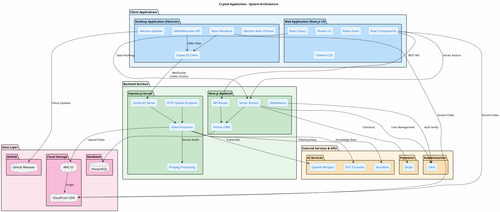

# Crystal Application - System Architecture

This document describes the architectural design of the Crystal application, a screen recording and video management platform with web and desktop components.

---

## Architecture Overview

The Crystal application follows a **multi-tier architecture** with clear separation of concerns:

| Tier | Components | Responsibility |
|------|------------|----------------|
| **Client Tier** | Web App, Desktop App | User interface and interaction |
| **Backend Tier** | Next.js API, Express Server | Business logic and processing |
| **External Services** | Clerk, Stripe, OpenAI, etc. | Third-party integrations |
| **Data Tier** | PostgreSQL, AWS S3 | Data persistence and storage |

---

## System Architecture Diagram



---

## Tier Descriptions

### 1. Client Tier

The client tier consists of two applications that provide the user interface:

#### Web Application (Next.js 14)

The primary user interface built with modern React technologies:

| Component | Technology | Purpose |
|-----------|------------|---------|
| **Framework** | Next.js 14 | React framework with App Router, SSR, and Server Actions |
| **UI Library** | React 18 | Component-based user interface |
| **Component Library** | Shadcn UI | Pre-built, customizable UI components |
| **Styling** | Tailwind CSS | Utility-first CSS framework |
| **Global State** | Redux Toolkit | Client-side state management for workspaces, folders |
| **Server State** | TanStack Query | Data fetching, caching, and synchronization |
| **Forms** | React Hook Form + Zod | Form handling with schema validation |

#### Desktop Application (Electron)

A cross-platform desktop app for screen recording:

| Component | Technology | Purpose |
|-----------|------------|---------|
| **Framework** | Electron | Cross-platform desktop application framework |
| **Build Tool** | Vite | Fast development and production builds |
| **Renderer** | React | UI components (same patterns as web app) |
| **Recording** | MediaRecorder API | Browser-based screen/audio capture |
| **Real-time** | Socket.IO Client | Stream video chunks to server |
| **Updates** | electron-updater | Automatic app updates from GitHub Releases |
| **Auth** | Clerk + Custom Protocol | Browser-based OAuth flow with deep linking |

---

### 2. Backend Tier

The backend consists of two servers handling different responsibilities:

#### Next.js Backend

Handles most application logic through Server Actions and API Routes:

| Component | Technology | Purpose |
|-----------|------------|---------|
| **Server Actions** | Next.js 14 | Type-safe server functions called from React |
| **API Routes** | Next.js App Router | RESTful endpoints for video processing callbacks |
| **ORM** | Prisma | Type-safe database queries and migrations |
| **Validation** | Zod | Schema validation for forms and API requests |
| **Middleware** | Clerk Middleware | Route protection and authentication |

**Key Server Actions:**
- `onAuthenticateUser` - User authentication and initialization
- `createWorkspace` - Workspace CRUD operations
- `inviteMembers` - Workspace invitation system
- `moveVideoLocation` - Video management
- `searchContent` - Global search functionality

#### Express.js Server

Dedicated server for video upload and processing:

| Component | Technology | Purpose |
|-----------|------------|---------|
| **Framework** | Express.js | HTTP server for file uploads |
| **Real-time** | Socket.IO | WebSocket server for streaming video chunks |
| **File Upload** | Multer | Multipart form data handling |
| **Media Processing** | FFmpeg | Audio extraction from video files |
| **Storage** | AWS SDK | Upload to S3 bucket |

**Processing Pipeline:**
1. Receive video (HTTP upload or WebSocket stream)
2. Store temporarily on server
3. Upload to AWS S3
4. Extract audio with FFmpeg (PRO users)
5. Transcribe with OpenAI Whisper
6. Generate title/summary with GPT-3.5
7. Update database via Next.js API callback

---

### 3. External Services & APIs

Third-party services integrated into the application:

#### Authentication - Clerk

| Feature | Usage |
|---------|-------|
| User sign-up/sign-in | OAuth and email/password |
| Session management | JWT tokens |
| User metadata | Profile sync to database |
| Desktop auth | Sign-in tickets via API |

#### Payments - Stripe

| Feature | Usage |
|---------|-------|
| Checkout sessions | PRO subscription purchase |
| Customer management | Store customer ID for billing |
| Webhook handling | Payment confirmation |

#### AI Services - OpenAI

| Service | Usage |
|---------|-------|
| **Whisper** | Audio-to-text transcription with timestamps |
| **GPT-3.5-turbo** | Generate video titles and summaries |

#### AI Agent - Voiceflow

| Feature | Usage |
|---------|-------|
| Knowledge base API | Store video transcripts for AI search |
| Chatbot integration | AI-powered video assistance |

---

### 4. Data Tier

Persistent storage for application data:

#### PostgreSQL Database

Relational database managed through Prisma ORM:

| Entity | Purpose |
|--------|---------|
| **User** | User accounts linked to Clerk |
| **WorkSpace** | Personal and public workspaces |
| **Folder** | Video organization |
| **Video** | Video metadata and transcripts |
| **Comment** | Video comments with replies |
| **Notification** | User notifications |
| **Subscription** | Payment plan tracking |
| **Invite** | Workspace invitations |
| **Member** | Workspace membership |

#### AWS S3 + CloudFront

Cloud storage for video files:

| Component | Purpose |
|-----------|---------|
| **S3 Bucket** | Object storage for video files |
| **CloudFront CDN** | Global video streaming distribution |

#### GitHub Releases

Desktop app distribution:

| Asset | Platform |
|-------|----------|
| `.exe` | Windows installer |
| `.dmg` | macOS installer |
| `.AppImage` | Linux portable |

---

## Data Flow Diagrams

### Video Upload Flow (Web App)

```
User → Web App → Express HTTP → S3 → CloudFront
                      ↓
                FFmpeg → Whisper → GPT → Database
```

### Video Recording Flow (Desktop App)

```
Screen → MediaRecorder → Socket.IO → Express → S3
                                        ↓
                              Video Processor → AI Pipeline
```

### Authentication Flow

```
Web App ←→ Clerk ←→ Next.js Middleware → Protected Routes
                         ↓
Desktop App → Browser → Clerk → Deep Link → Desktop Auth
```

---

## Technology Stack Summary

| Category | Technologies |
|----------|--------------|
| **Frontend** | Next.js 14, React 18, TypeScript, Tailwind CSS, Shadcn UI |
| **Desktop** | Electron, Vite, React, Socket.IO Client |
| **Backend** | Next.js Server Actions, Express.js, Socket.IO |
| **Database** | PostgreSQL, Prisma ORM |
| **Storage** | AWS S3, CloudFront CDN |
| **Auth** | Clerk |
| **Payments** | Stripe |
| **AI** | OpenAI (Whisper, GPT-3.5), Voiceflow |
| **DevOps** | GitHub Actions, electron-updater |

---

## Security Considerations

| Layer | Security Measure |
|-------|------------------|
| **Authentication** | Clerk-managed sessions, JWT verification |
| **Authorization** | Server Actions verify ownership before mutations |
| **API Protection** | Clerk middleware on protected routes |
| **Database** | Prisma parameterized queries (SQL injection prevention) |
| **File Upload** | File type validation, size limits |
| **CORS** | Configured for trusted origins |

---

## Scalability Considerations

| Component | Scaling Strategy |
|-----------|------------------|
| **Web App** | Vercel edge deployment, SSR caching |
| **Express Server** | Horizontal scaling, load balancing |
| **Database** | Connection pooling, read replicas |
| **Storage** | S3 unlimited scaling, CloudFront caching |
| **Real-time** | Socket.IO with Redis adapter for multiple instances |

