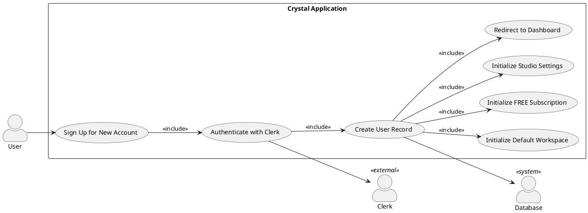
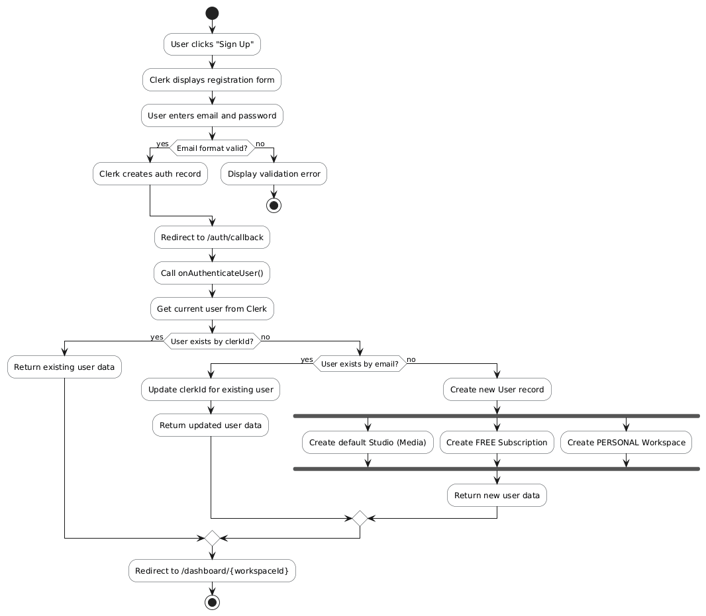
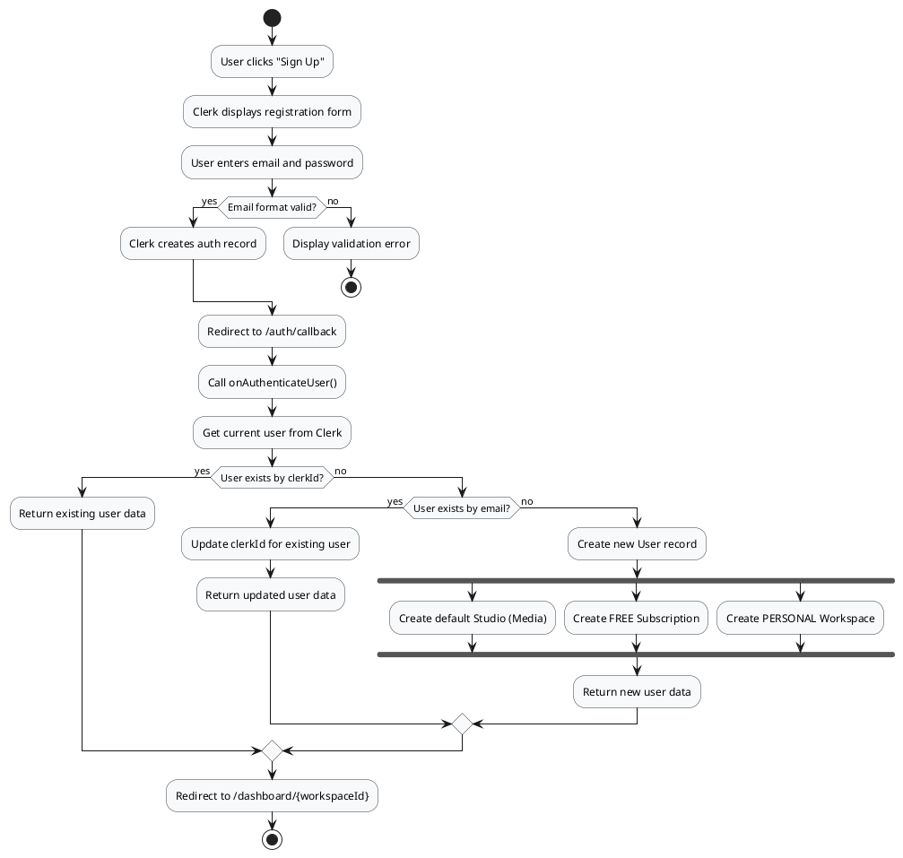
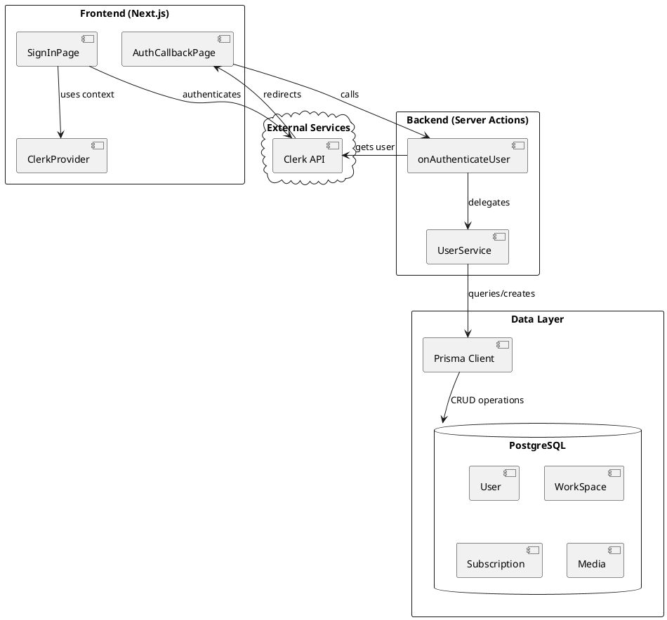
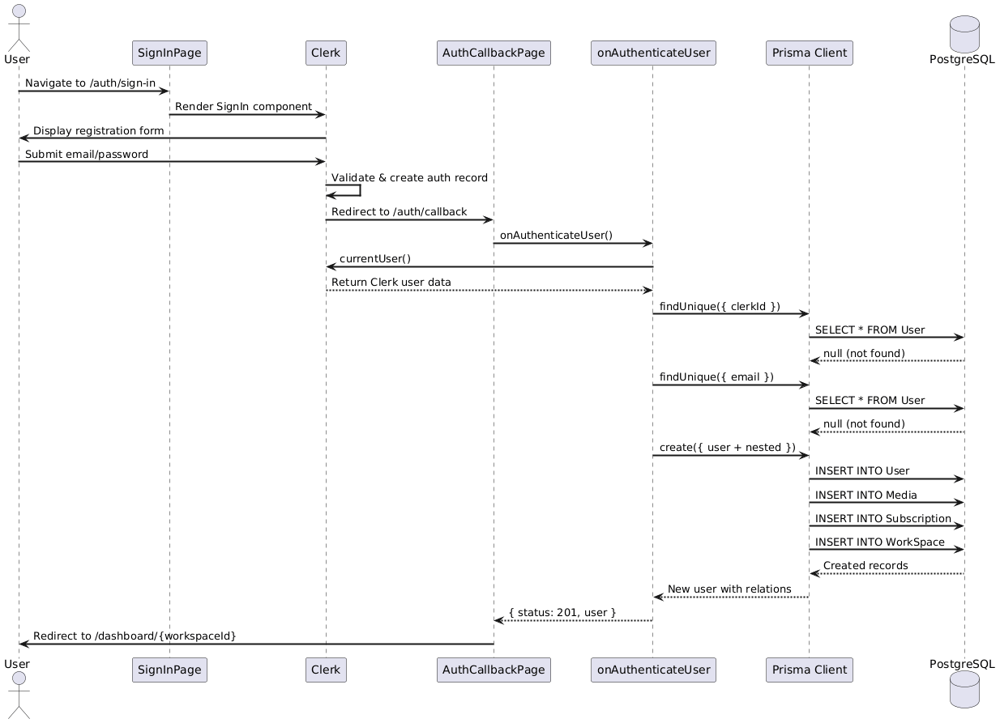
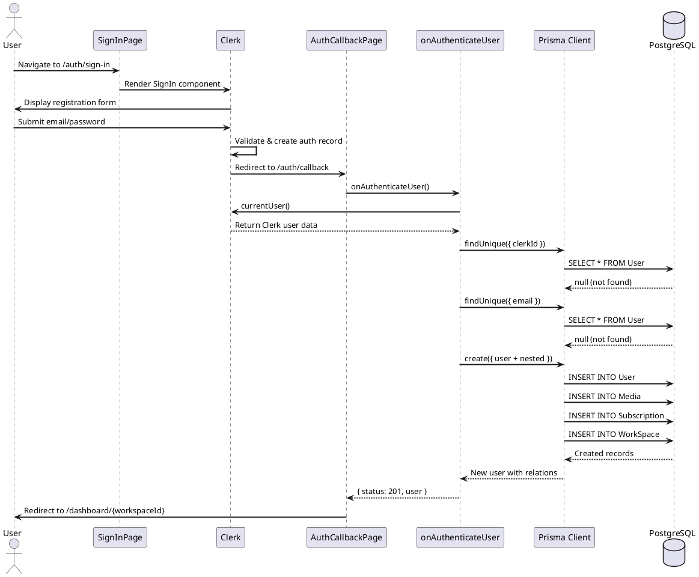
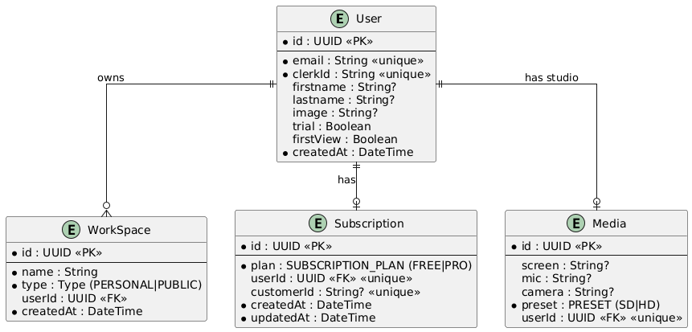
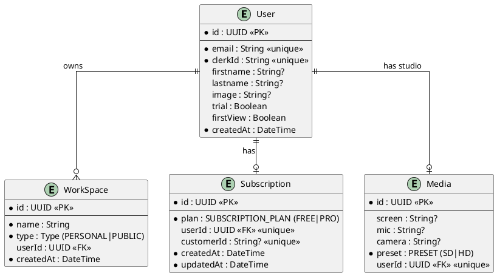

# Feature 1.1-1.3: User Sign Up and Account Initialization

## Features Covered

| #   | Feature                                                                                                | Actor  |
|-----|--------------------------------------------------------------------------------------------------------|--------|
| 1.1 | User can sign up for a new account                                                                     | User   |
| 1.2 | System creates user record in the database upon first sign-in                                          | System |
| 1.3 | System initializes new users with a default personal workspace, FREE subscription, and studio settings | System |

## Overview

This feature group covers the complete user registration flow. When a user signs up through Clerk authentication, the system automatically creates their database record along with all required default resources in a single atomic transaction.

---

## Use Case Diagram




---

## Use Case Description

| Field | Description |
|-------|-------------|
| **Use Case ID** | UC-1.1 |
| **Use Case Name** | User Sign Up and Account Initialization |
| **Actor(s)** | User, Clerk (external), System |
| **Description** | A new user creates an account through Clerk authentication, which triggers the system to create a user record with default workspace, subscription, and studio settings. |
| **Preconditions** | User has a valid email address; User is not already registered |
| **Trigger** | User clicks "Sign Up" and completes Clerk registration form |
| **Main Flow** | 1. User navigates to the sign-up page<br>2. Clerk presents the registration form<br>3. User enters email and password<br>4. Clerk validates and creates authentication record<br>5. Clerk redirects to callback page<br>6. System calls `onAuthenticateUser` to check for existing user<br>7. System creates new User record with clerkId and profile data<br>8. System creates default personal workspace (PERSONAL type)<br>9. System creates FREE subscription record<br>10. System creates empty studio settings (Media record)<br>11. System redirects user to their new workspace dashboard |
| **Alternative Flows** | **A1: Email already exists**<br>3a. Clerk displays error message<br>3b. User is prompted to sign in instead<br><br>**A2: User record exists by email (dev/prod migration)**<br>6a. System finds existing user by email<br>6b. System updates clerkId to new value<br>6c. System returns existing user data |
| **Postconditions** | User account created in Clerk; User record exists in database with workspace, subscription, and studio settings; User is authenticated and viewing their dashboard |
| **Exceptions** | Database connection failure; Clerk service unavailable; Invalid email format |

---

## Activity Diagram





---

## Component List

### Frontend Components

| Component | Description | Purpose | Type |
|-----------|-------------|---------|------|
| `SignInPage` | Renders Clerk's SignIn component | Display the registration/sign-in form provided by Clerk | Next.js Page Component |
| `ClerkProvider` | Wraps the entire application | Provides Clerk authentication context to all components | React Context Provider |
| `AuthCallbackPage` | Handles post-authentication routing | Process auth result and redirect to appropriate workspace | Next.js Server Component |

### Backend Components

| Component | Description | Purpose | Type |
|-----------|-------------|---------|------|
| `onAuthenticateUser` | Main authentication handler | Creates/updates user records and initializes default resources | Server Action |
| `UserService.create` | User creation service method | Encapsulates user creation logic with nested relations | Service Function |
| `UserService.findByClerkId` | User lookup by Clerk ID | Query user by their Clerk authentication ID | Service Function |
| `UserService.findByEmail` | User lookup by email | Query user by email for migration scenarios | Service Function |
| `client.user.create` | Prisma client method | Execute database INSERT with nested creates | Prisma Client |

### External Services

| Service | Description | Purpose | Type |
|---------|-------------|---------|------|
| `Clerk` | Authentication provider | Handle user identity, passwords, and session management | External SaaS |
| `PostgreSQL` | Database | Store user records and related data | Database |

---

## Component/Module Diagram




---

## Sequence Diagram





---

## ERD and Schema

### Entity Relationship Diagram





### Prisma Schema

```prisma
model User {
  id           String         @id @default(dbgenerated("gen_random_uuid()")) @db.Uuid
  email        String         @unique
  firstname    String?
  lastname     String?
  createdAt    DateTime       @default(now())
  clerkId      String         @unique
  image        String?
  trial        Boolean        @default(false)
  firstView    Boolean        @default(false)
  
  // Relations
  studio       Media?
  workspace    WorkSpace[]
  subscription Subscription?
}

model WorkSpace {
  id        String   @id @default(dbgenerated("gen_random_uuid()")) @db.Uuid
  type      Type
  name      String
  User      User?    @relation(fields: [userId], references: [id])
  userId    String?  @db.Uuid
  createdAt DateTime @default(now())
}

model Subscription {
  id         String            @id @default(dbgenerated("gen_random_uuid()")) @db.Uuid
  User       User?             @relation(fields: [userId], references: [id])
  userId     String?           @unique @db.Uuid
  createdAt  DateTime          @default(now())
  plan       SUBSCRIPTION_PLAN @default(FREE)
  updatedAt  DateTime          @default(now())
  customerId String?           @unique
}

model Media {
  id     String  @id @default(dbgenerated("gen_random_uuid()")) @db.Uuid
  screen String?
  mic    String?
  camera String?
  preset PRESET  @default(SD)
  User   User?   @relation(fields: [userId], references: [id])
  userId String? @unique @db.Uuid
}

enum Type {
  PERSONAL
  PUBLIC
}

enum PRESET {
  SD
  HD
}

enum SUBSCRIPTION_PLAN {
  PRO
  FREE
}
```

---

## Code References

### Main Server Action

**File:** `crystal-web-app/src/actions/user.ts`

```typescript
export const onAuthenticateUser = async () => {
  try {
    const user = await currentUser()
    if (!user) return { status: 403 }
    
    const userExist = await client.user.findUnique({
      where: { clerkId: user.id },
      include: { workspace: true },
    })
    
    if (userExist) return { status: 200, user: userExist }
    
    // Check by email for dev/prod migration
    const userByEmail = await client.user.findUnique({
      where: { email: user.emailAddresses[0].emailAddress },
      include: { workspace: true },
    })
    
    if (userByEmail) {
      const updatedUser = await client.user.update({
        where: { email: user.emailAddresses[0].emailAddress },
        data: {
          clerkId: user.id,
          firstname: user.firstName,
          lastname: user.lastName,
          image: user.imageUrl,
        },
        include: {
          workspace: true,
          subscription: { select: { plan: true } },
        },
      })
      return { status: 200, user: updatedUser }
    }
    
    // Create new user with all defaults
    const newUser = await client.user.create({
      data: {
        clerkId: user.id,
        email: user.emailAddresses[0].emailAddress,
        firstname: user.firstName,
        lastname: user.lastName,
        image: user.imageUrl,
        studio: { create: {} },           // Feature 1.3: Studio settings
        subscription: { create: {} },     // Feature 1.3: FREE subscription
        workspace: {                      // Feature 1.3: Personal workspace
          create: {
            name: `${user.firstName}'s Workspace`,
            type: 'PERSONAL',
          },
        },
      },
      include: {
        workspace: true,
        subscription: { select: { plan: true } },
      },
    })
    
    return newUser 
      ? { status: 201, user: newUser } 
      : { status: 400, message: 'User creation failed' }
  } catch (error) {
    console.error('Auth error:', error)
    return { status: 500, error: error instanceof Error ? error.message : 'Unknown error' }
  }
}
```

### Auth Callback Page

**File:** `crystal-web-app/src/app/auth/callback/page.tsx`

```typescript
const AuthCallbackPage = async () => {
  const auth = await onAuthenticateUser()
  
  if (auth.status === 200 || auth.status === 201) {
    if (!auth.user?.workspace?.[0]?.id) {
      return redirect('/auth/sign-in')
    }
    return redirect(`/dashboard/${auth.user.workspace[0].id}`)
  }
  
  return redirect('/auth/sign-in')
}
```

