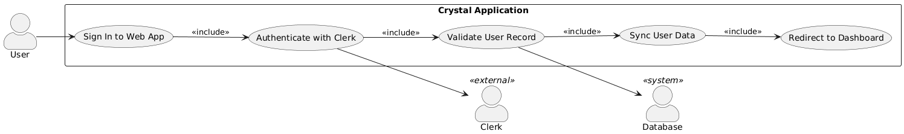
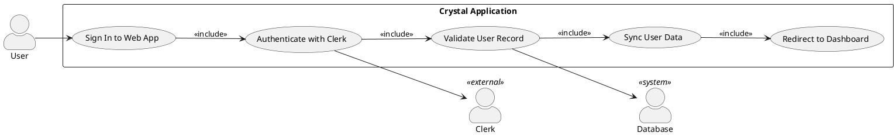
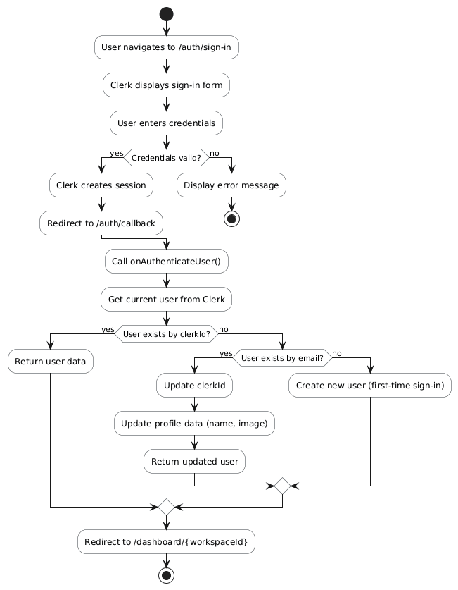
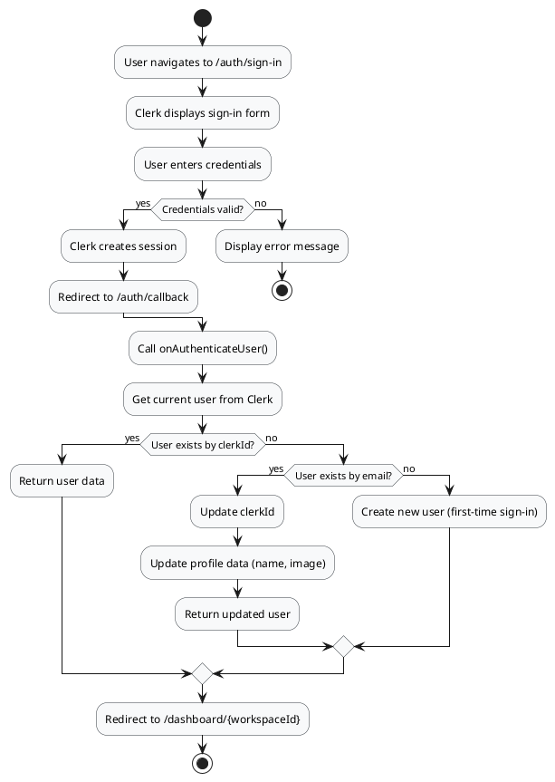
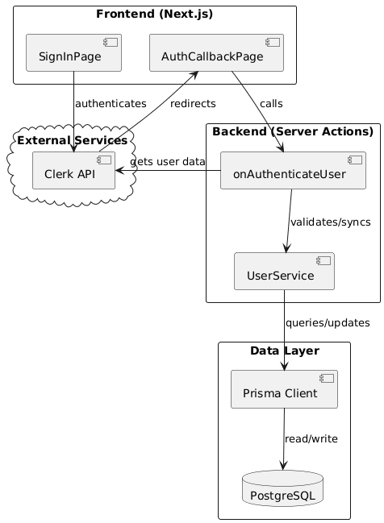
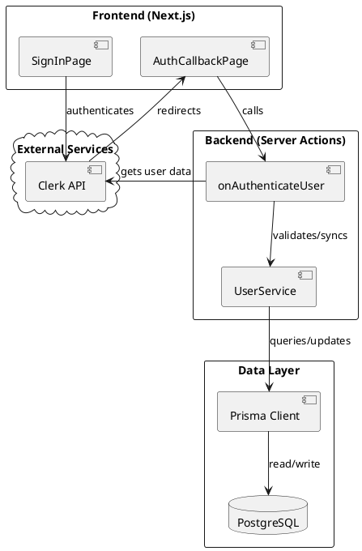
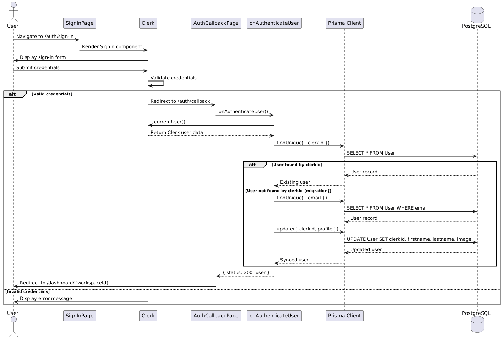
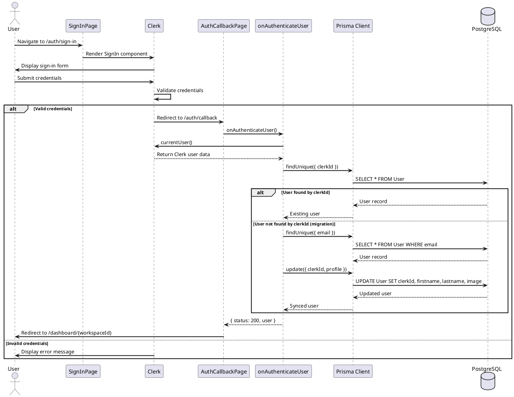

# Feature 1.4 & 1.8: User Sign In and Data Sync

## Features Covered

| #   | Feature                                                       | Actor  |
|-----|---------------------------------------------------------------|--------|
| 1.4 | User can sign in to the web application                       | User   |
| 1.8 | System validates and syncs user data between Clerk and database | System |

## Overview

This feature group covers the web application sign-in flow. When an existing user signs in through Clerk authentication, the system automatically validates their database record and synchronizes any profile changes (such as updated name or profile picture) from Clerk to the database.

---

## Use Case Diagram





---

## Use Case Description

| Field | Description |
|-------|-------------|
| **Use Case ID** | UC-1.4 |
| **Use Case Name** | User Sign In to Web Application |
| **Actor(s)** | User, Clerk (external), System |
| **Description** | An existing user signs into the web application using Clerk authentication, and the system validates and syncs their data. |
| **Preconditions** | User has an existing Clerk account |
| **Trigger** | User clicks "Sign In" and submits credentials |
| **Main Flow** | 1. User navigates to sign-in page<br>2. Clerk presents sign-in form<br>3. User enters email and password<br>4. Clerk validates credentials<br>5. Clerk creates session and redirects to callback<br>6. System calls `onAuthenticateUser`<br>7. System finds user by clerkId<br>8. System returns user data with workspaces<br>9. System redirects to first workspace dashboard |
| **Alternative Flows** | **A1: Invalid credentials**<br>4a. Clerk displays error message<br>4b. User retries or resets password<br><br>**A2: ClerkId mismatch (dev/prod migration)**<br>7a. User not found by clerkId<br>7b. System finds user by email<br>7c. System updates clerkId and profile data<br>7d. System returns updated user |
| **Postconditions** | User is authenticated; Session is established; User data is synced; User views dashboard |
| **Exceptions** | Invalid credentials; Account locked; Database unavailable |

---

## Activity Diagram





---

## Component List

### Frontend Components

| Component | Description | Purpose | Type |
|-----------|-------------|---------|------|
| `SignInPage` | Renders Clerk's SignIn component | Display the sign-in form | Next.js Page Component |
| `AuthCallbackPage` | Post-authentication handler | Process auth and route user | Next.js Server Component |
| `ClerkProvider` | Authentication context wrapper | Provide Clerk context | React Context Provider |

### Backend Components

| Component | Description | Purpose | Type |
|-----------|-------------|---------|------|
| `onAuthenticateUser` | Authentication processor | Validate and sync user data | Server Action |
| `UserService.findByClerkId` | User lookup | Find user by Clerk ID | Service Function |
| `UserService.updateClerkId` | Sync handler | Update clerkId for migrations | Service Function |

### External Services

| Service | Description | Purpose | Type |
|---------|-------------|---------|------|
| `Clerk` | Authentication provider | Handle identity and sessions | External SaaS |
| `PostgreSQL` | Database | Store user data | Database |

---

## Component/Module Diagram





---

## Sequence Diagram





---

## ERD and Schema

*This feature uses the same User table as Feature 1.1-1.3. See that documentation for the complete ERD.*

### Relevant Fields for Data Sync

```prisma
model User {
  id        String   @id @default(dbgenerated("gen_random_uuid()")) @db.Uuid
  clerkId   String   @unique    // Updated during sync
  email     String   @unique    // Used as fallback lookup
  firstname String?             // Synced from Clerk
  lastname  String?             // Synced from Clerk
  image     String?             // Synced from Clerk
}
```

---

## Code References

### Data Sync Logic in onAuthenticateUser

**File:** `crystal-web-app/src/actions/user.ts`

```typescript
// If user exists with same email but different clerkId, update the clerkId
if (userByEmail) {
  const updatedUser = await client.user.update({
    where: { email: user.emailAddresses[0].emailAddress },
    data: {
      clerkId: user.id,           // Sync new clerkId
      firstname: user.firstName,   // Sync profile data
      lastname: user.lastName,
      image: user.imageUrl,
    },
    include: {
      workspace: true,
      subscription: { select: { plan: true } },
    },
  })
  return { status: 200, user: updatedUser }
}
```

