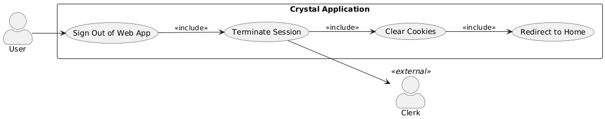
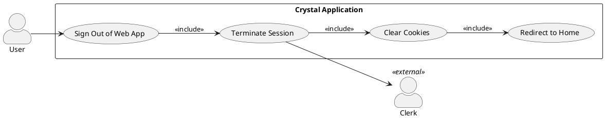
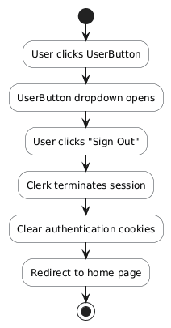
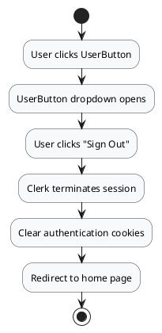
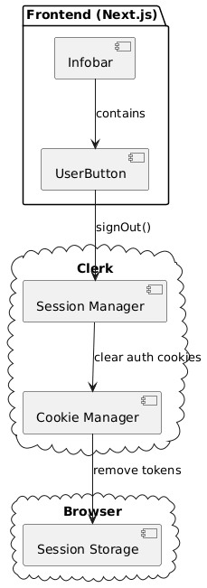
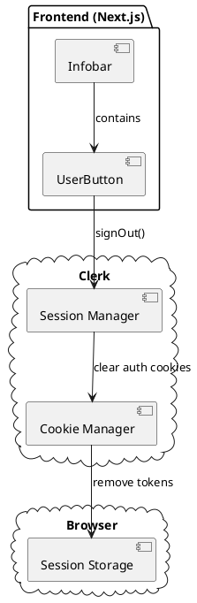
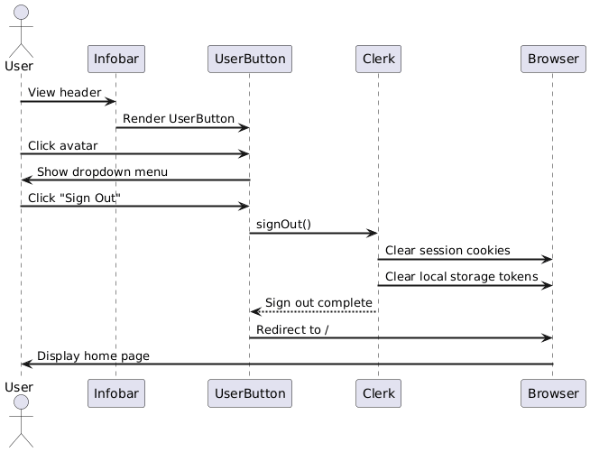
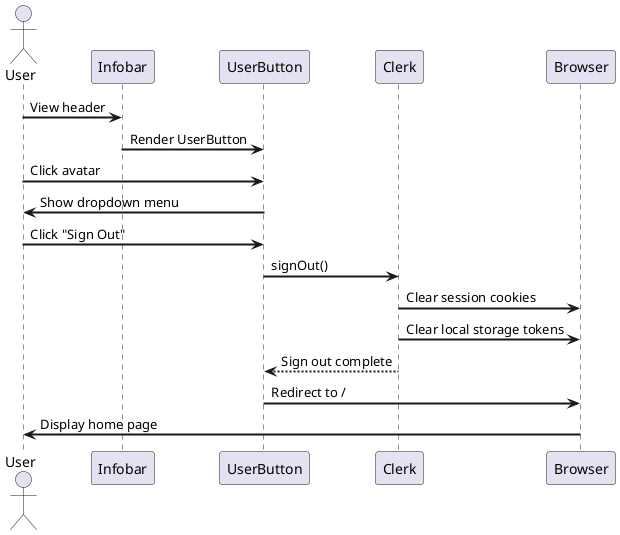

# Feature 1.5: User Sign Out

## Features Covered

| #   | Feature                              | Actor |
|-----|--------------------------------------|-------|
| 1.5 | User can sign out of the web application | User  |

## Overview

This feature allows authenticated users to sign out of the web application. The sign-out process terminates the user's session and clears authentication cookies, returning them to a public state.

---

## Use Case Diagram





---

## Use Case Description

| Field | Description |
|-------|-------------|
| **Use Case ID** | UC-1.5 |
| **Use Case Name** | User Sign Out of Web Application |
| **Actor(s)** | User, Clerk (external) |
| **Description** | An authenticated user signs out of the web application, terminating their session. |
| **Preconditions** | User is currently authenticated |
| **Trigger** | User clicks the sign-out option in the UserButton menu |
| **Main Flow** | 1. User clicks UserButton in the header<br>2. User selects "Sign Out" from dropdown<br>3. Clerk terminates the user session<br>4. Clerk clears authentication cookies<br>5. User is redirected to home/sign-in page |
| **Postconditions** | User session terminated; Authentication cookies cleared; User on public page |
| **Exceptions** | Network error during sign-out (session may remain on server) |

---

## Activity Diagram





---

## Component List

### Frontend Components

| Component | Description | Purpose | Type |
|-----------|-------------|---------|------|
| `UserButton` | Clerk's user menu component | Display user avatar with sign-out option | Clerk React Component |
| `Infobar` | Top navigation bar | Contains the UserButton | React Client Component |

### External Services

| Service | Description | Purpose | Type |
|---------|-------------|---------|------|
| `Clerk` | Authentication provider | Handle session termination | External SaaS |

---

## Component/Module Diagram





---

## Sequence Diagram





---

## ERD and Schema

*This feature does not interact with the database. Session management is handled entirely by Clerk.*

---

## Code References

### Infobar with UserButton

**File:** `crystal-web-app/src/components/global/infobar.tsx`

```typescript
import { UserButton } from "@clerk/nextjs";

function Infobar() {
  return (
    <header className="...">
      <div className="flex items-center gap-4">
        {/* Other buttons */}
        <UserButton />  {/* Sign-out is built into this component */}
      </div>
    </header>
  )
}
```

The `UserButton` component from Clerk automatically provides:
- User avatar display
- Dropdown menu with account options
- "Sign Out" action that handles session termination
- Redirect after sign-out

