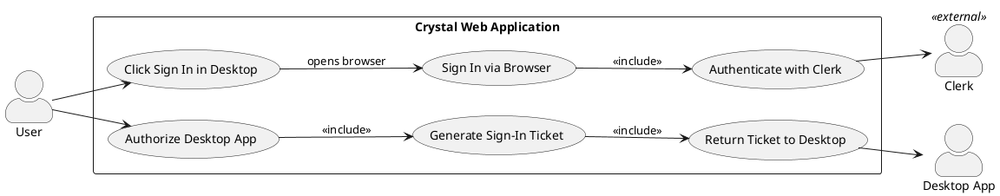
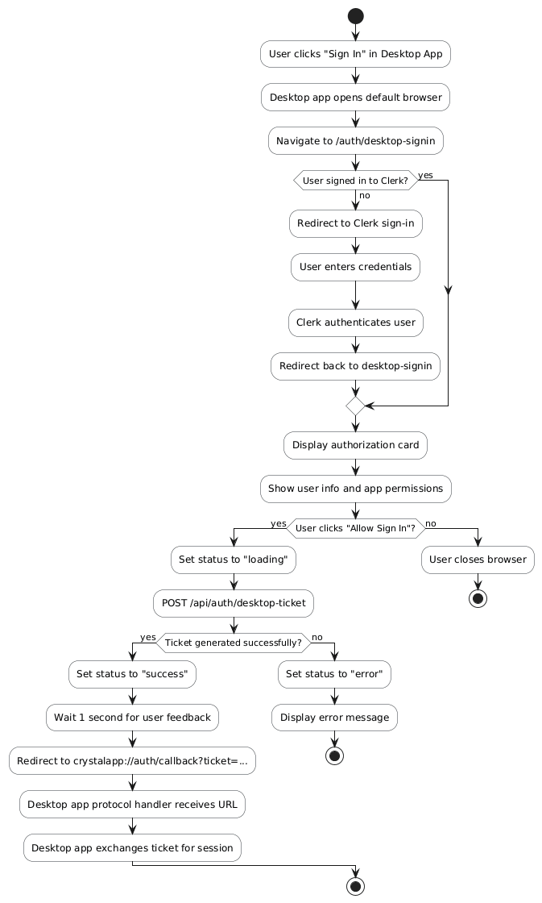
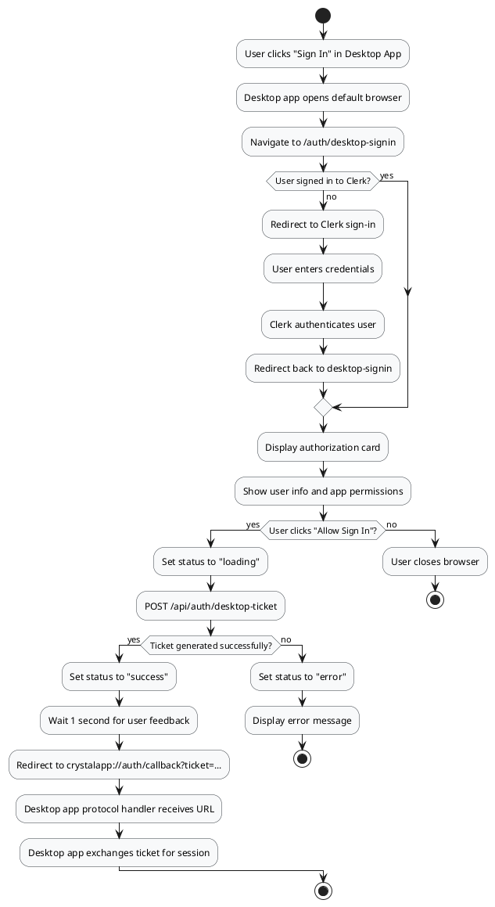
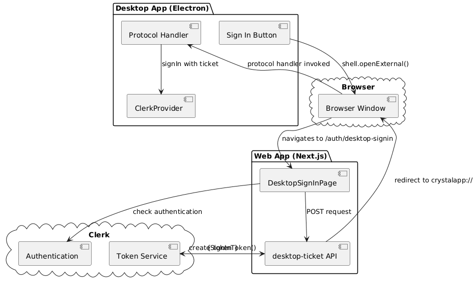
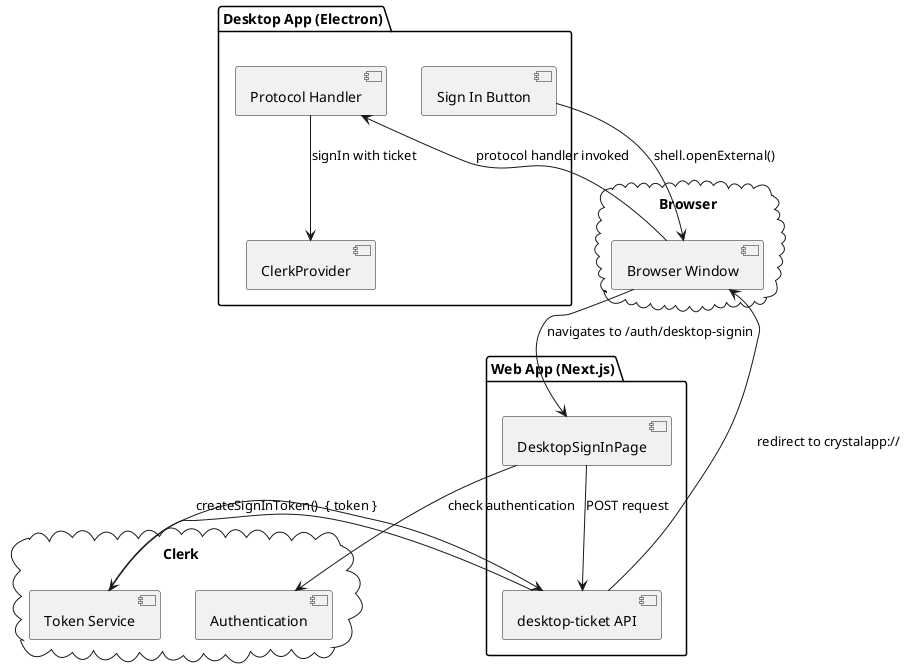
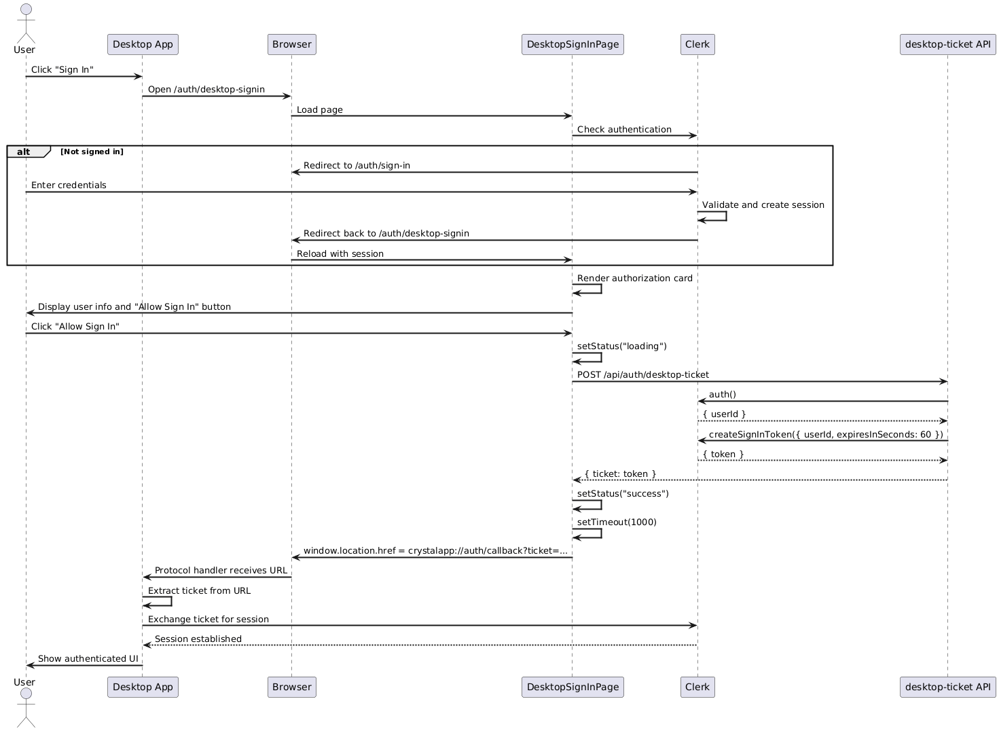
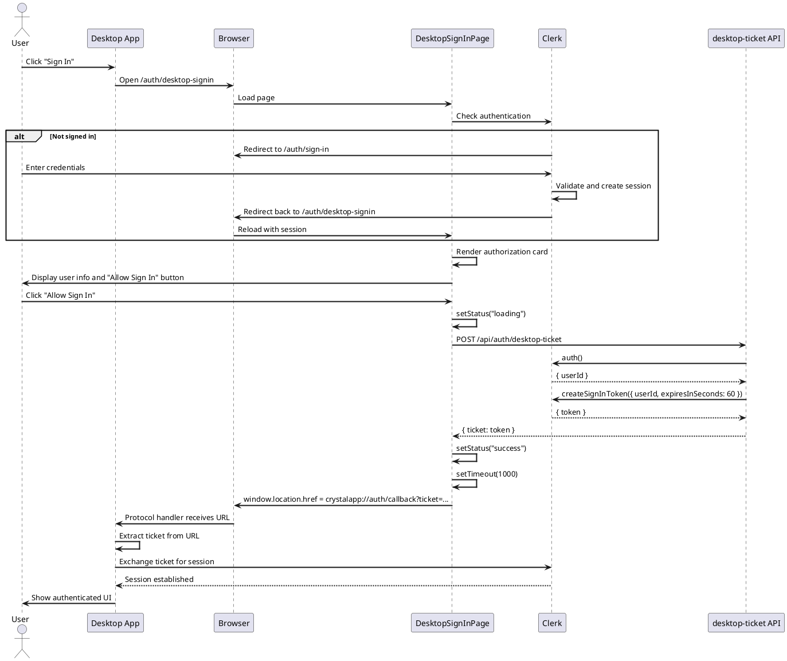

# Feature 1.6 & 1.7: Desktop App Authentication

## Features Covered

| #   | Feature                                                     | Actor  |
|-----|-------------------------------------------------------------|--------|
| 1.6 | User can sign in to the desktop app via browser-based authentication | User   |
| 1.7 | System generates a sign-in ticket for desktop app authentication | System |

## Overview

This feature group covers the desktop application authentication flow. Since the Electron desktop app cannot directly handle OAuth flows, users authenticate through their web browser. The system generates a short-lived sign-in ticket that the desktop app uses to establish a session via a custom protocol handler (`crystalapp://`).

---

## Use Case Diagram




---

## Use Case Description

| Field | Description |
|-------|-------------|
| **Use Case ID** | UC-1.6 |
| **Use Case Name** | Desktop App Authentication via Browser |
| **Actor(s)** | User, Desktop App, Clerk (external), System |
| **Description** | A user authenticates the desktop application through a browser-based flow, receiving a sign-in ticket that the desktop app uses to establish a session. |
| **Preconditions** | Desktop app is installed; User has a Clerk account |
| **Trigger** | User clicks "Sign In" in the desktop app |
| **Main Flow** | 1. User clicks "Sign In" in desktop app<br>2. Desktop app opens browser to /auth/desktop-signin<br>3. If not signed in, redirect to Clerk sign-in<br>4. User signs in through Clerk<br>5. User sees authorization confirmation page<br>6. User clicks "Allow Sign In"<br>7. System calls /api/auth/desktop-ticket<br>8. System generates short-lived sign-in token via Clerk (60 seconds)<br>9. System redirects to crystalapp://auth/callback?ticket=...<br>10. Desktop app receives ticket and establishes session |
| **Alternative Flows** | **A1: User already signed in**<br>3a. Skip Clerk sign-in<br>3b. Show authorization confirmation directly<br><br>**A2: User cancels**<br>6a. User closes browser window<br>6b. Desktop app remains signed out |
| **Postconditions** | Desktop app has valid session; User can access recording features |
| **Exceptions** | Ticket generation fails; Ticket expires before use; Protocol handler not registered |

---

## Activity Diagram





---

## Component List

### Frontend Components (Web App)

| Component | Description | Purpose | Type |
|-----------|-------------|---------|------|
| `DesktopSignInPage` | Authorization confirmation page | Display user info and authorize button | Next.js Client Component |
| `Card` | UI container | Display authorization prompt | Shadcn UI Component |
| `Button` | Action button | Trigger authorization flow | Shadcn UI Component |
| `SignedIn` / `SignedOut` | Clerk conditionals | Show/hide content based on auth state | Clerk React Components |
| `RedirectToSignIn` | Clerk redirect | Send unauthenticated users to sign-in | Clerk React Component |

### Backend Components (Web App)

| Component | Description | Purpose | Type |
|-----------|-------------|---------|------|
| `POST /api/auth/desktop-ticket` | API route | Generate sign-in ticket | Next.js API Route |
| `clerkClient.signInTokens.createSignInToken` | Clerk SDK method | Create short-lived token | Clerk SDK |
| `auth()` | Clerk helper | Get current user ID | Clerk Next.js Helper |

### Desktop App Components

| Component | Description | Purpose | Type |
|-----------|-------------|---------|------|
| `ClerkProvider` | Auth context | Provide Clerk context to desktop app | Clerk React Component |
| Protocol Handler | System registration | Handle crystalapp:// URLs | Electron Main Process |

### External Services

| Service | Description | Purpose | Type |
|---------|-------------|---------|------|
| `Clerk` | Authentication provider | Generate and validate tokens | External SaaS |

---

## Component/Module Diagram





---

## Sequence Diagram





---

## ERD and Schema

*This feature does not directly interact with the database. The sign-in ticket is managed entirely by Clerk and stored temporarily in their infrastructure.*

---

## Code References

### Desktop Sign-In Page

**File:** `crystal-web-app/src/app/auth/desktop-signin/page.tsx`

```typescript
export default function DesktopSignInPage() {
  const { user, isLoaded } = useUser();
  const [status, setStatus] = useState<"idle" | "loading" | "success" | "error">("idle");

  const handleAuthorize = async () => {
    setStatus("loading");

    try {
      const response = await fetch("/api/auth/desktop-ticket", {
        method: "POST",
        headers: { "Content-Type": "application/json" },
      });

      if (!response.ok) throw new Error("Failed to generate ticket");

      const { ticket } = await response.json();
      setStatus("success");

      setTimeout(() => {
        window.location.href = `crystalapp://auth/callback?ticket=${encodeURIComponent(ticket)}`;
      }, 1000);
    } catch (err) {
      setStatus("error");
    }
  };

  return (
    <>
      <SignedOut>
        <RedirectToSignIn />
      </SignedOut>
      <SignedIn>
        <Card>
          <CardHeader>
            <CardTitle>Sign in to Crystal Desktop</CardTitle>
          </CardHeader>
          <CardContent>
            {/* User info display */}
          </CardContent>
          <CardFooter>
            <Button onClick={handleAuthorize}>
              Allow Sign In
            </Button>
          </CardFooter>
        </Card>
      </SignedIn>
    </>
  );
}
```

### Desktop Ticket API Route

**File:** `crystal-web-app/src/app/api/auth/desktop-ticket/route.ts`

```typescript
export async function POST() {
  try {
    const { userId } = await auth();
    if (!userId) {
      return NextResponse.json({ error: "Unauthorized" }, { status: 401 });
    }

    const client = await clerkClient();
    const ticket = await client.signInTokens.createSignInToken({
      userId,
      expiresInSeconds: 60,  // Short-lived for security
    });

    return NextResponse.json({ ticket: ticket.token });
  } catch (error) {
    return NextResponse.json({ error: "Failed to generate ticket" }, { status: 500 });
  }
}
```

