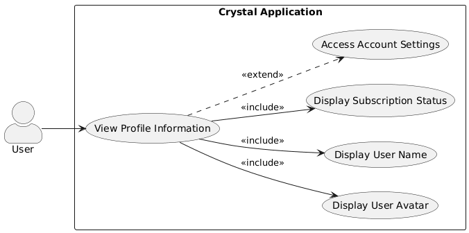
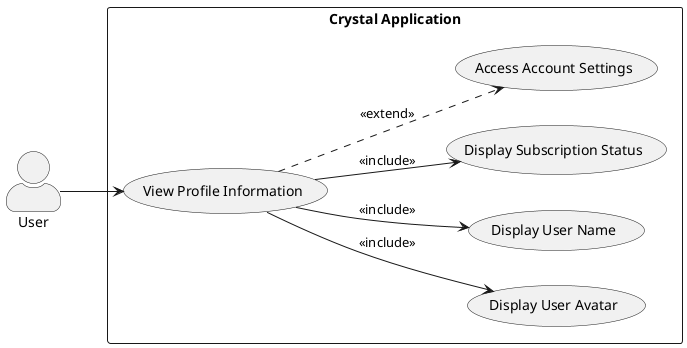
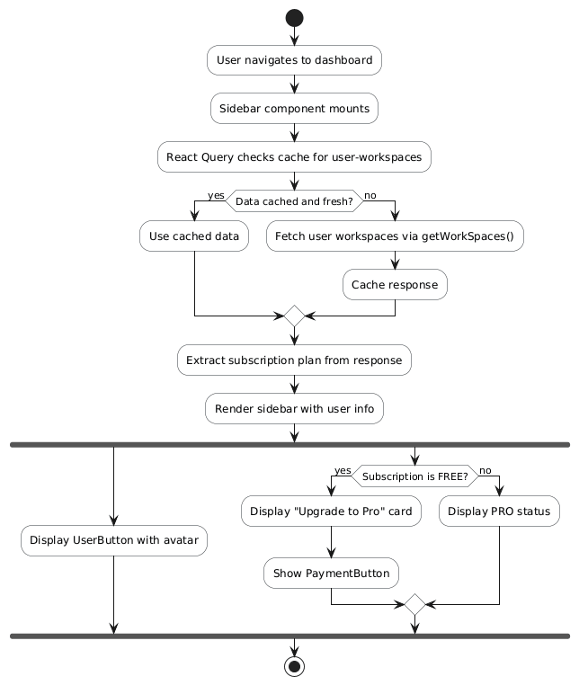
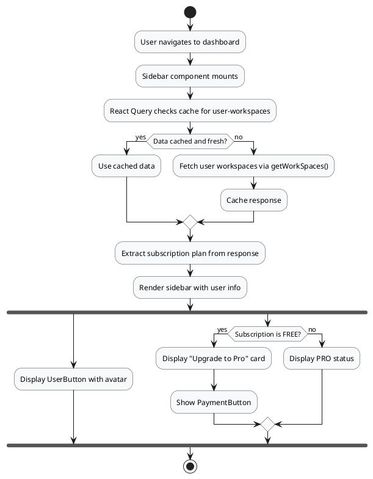
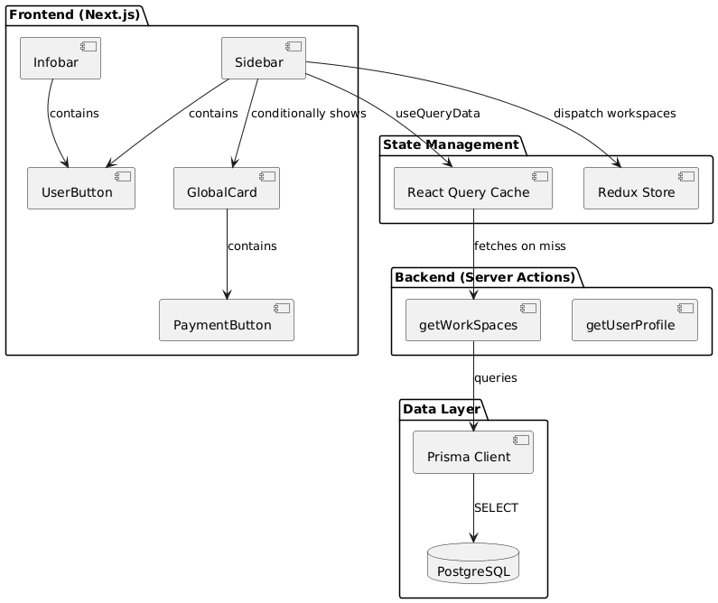
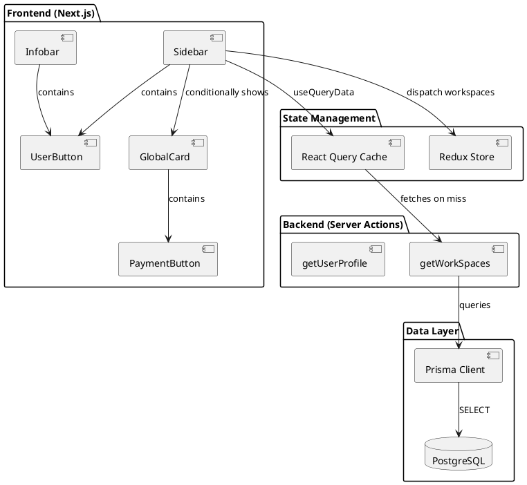
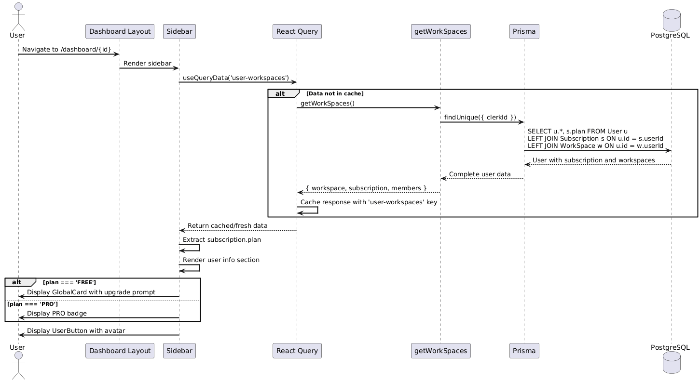
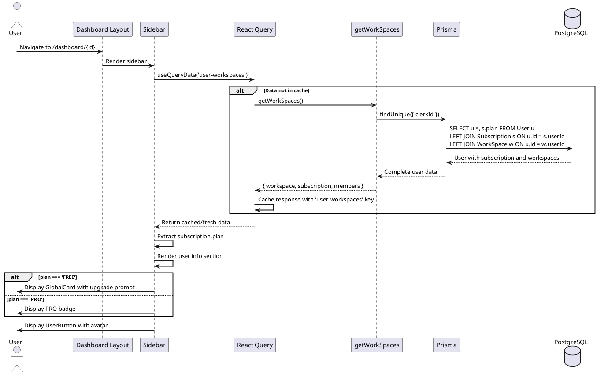

# Feature 1.9: View Profile Information

## Features Covered

| #   | Feature                                | Actor |
|-----|----------------------------------------|-------|
| 1.9 | User can view their profile information | User  |

## Overview

This feature allows authenticated users to view their profile information within the application. Profile data is displayed in the sidebar (user avatar, name, subscription status) and through the Clerk UserButton component which provides access to detailed account settings.

---

## Use Case Diagram





---

## Use Case Description

| Field | Description |
|-------|-------------|
| **Use Case ID** | UC-1.9 |
| **Use Case Name** | View Profile Information |
| **Actor(s)** | User |
| **Description** | An authenticated user views their profile information displayed in the sidebar, including their avatar, name, and subscription status. |
| **Preconditions** | User is authenticated and on a dashboard page |
| **Trigger** | User views the sidebar or clicks on UserButton |
| **Main Flow** | 1. User navigates to any dashboard page<br>2. Sidebar component loads<br>3. System fetches user workspaces (includes subscription data)<br>4. Sidebar displays user information section<br>5. User sees their avatar (via UserButton) and subscription plan<br>6. If FREE plan, upgrade prompt is shown |
| **Alternative Flows** | **A1: User clicks UserButton**<br>5a. Clerk account modal opens<br>5b. User can view/edit profile details |
| **Postconditions** | User profile information displayed in sidebar |
| **Exceptions** | Data fetch failure (cached data may be shown) |

---

## Activity Diagram





---

## Component List

### Frontend Components

| Component | Description | Purpose | Type |
|-----------|-------------|---------|------|
| `Sidebar` | Main navigation sidebar | Display workspaces and user info | React Client Component |
| `UserButton` | Clerk user menu | Show avatar and account options | Clerk React Component |
| `GlobalCard` | Upgrade prompt card | Display upgrade CTA for FREE users | React Component |
| `PaymentButton` | Stripe checkout trigger | Initiate subscription upgrade | React Component |
| `Infobar` | Top navigation bar | Contains UserButton for quick access | React Client Component |

### Backend Components

| Component | Description | Purpose | Type |
|-----------|-------------|---------|------|
| `getWorkSpaces` | Workspace fetcher | Return user workspaces with subscription | Server Action |
| `getUserProfile` | Profile data fetcher | Return user profile for comments | Server Action |
| `UserService.getProfile` | Profile service | Query minimal profile data | Service Function |

### External Services

| Service | Description | Purpose | Type |
|---------|-------------|---------|------|
| `Clerk` | Authentication provider | Provide user avatar and account UI | External SaaS |
| `PostgreSQL` | Database | Store subscription data | Database |

---

## Component/Module Diagram





---

## Sequence Diagram





---

## ERD and Schema

*This feature reads from the User and Subscription tables. See Feature 1.1-1.3 for the complete ERD.*

### Relevant Query

```prisma
// Query used by getWorkSpaces to fetch profile data
const user = await client.user.findUnique({
  where: { clerkId: clerkUser.id },
  select: {
    workspace: true,
    subscription: {
      select: { plan: true }
    },
    members: {
      select: {
        WorkSpace: true
      }
    }
  }
})
```

---

## Code References

### Sidebar Profile Display

**File:** `crystal-web-app/src/components/global/sidebar/sidebar.tsx`

```typescript
export default function Sidebar({ activeWorkspaceId }: Props) {
  const { data: workspace } = useQueryData(['user-workspaces'], getWorkSpaces);
  
  const SidebarSection = (
    <div className="...">
      {/* Navigation items */}
      
      <Separator />
      
      {/* Upgrade card for FREE users */}
      {workspace.subscription?.plan === 'FREE' && (
        <GlobalCard
          title="Upgrade to Pro"
          description="Unlock AI features like transcription, AI summary, and more."
          footer={<PaymentButton />}
        />
      )}
    </div>
  );
  
  return (
    <div>
      <Infobar />  {/* Contains UserButton */}
      {SidebarSection}
    </div>
  );
}
```

### UserButton in Infobar

**File:** `crystal-web-app/src/components/global/infobar.tsx`

```typescript
import { UserButton } from "@clerk/nextjs";

function Infobar() {
  return (
    <header className="...">
      <div className="flex items-center gap-4">
        {/* Action buttons */}
        <UserButton />  {/* Displays avatar and provides profile access */}
      </div>
    </header>
  );
}
```

### getUserProfile Server Action

**File:** `crystal-web-app/src/actions/user.ts`

```typescript
export const getUserProfile = async () => {
  return withAuth(async (clerkUser) => {
    const profile = await UserService.getProfile(clerkUser.id)
    if (!profile) throw new Error('Profile not found')
    return profile
  })
}
```

