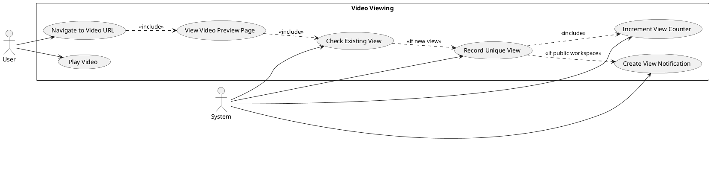
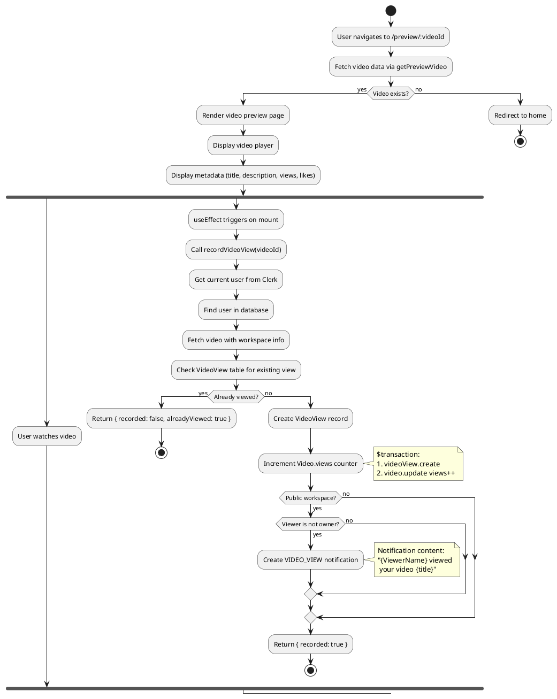
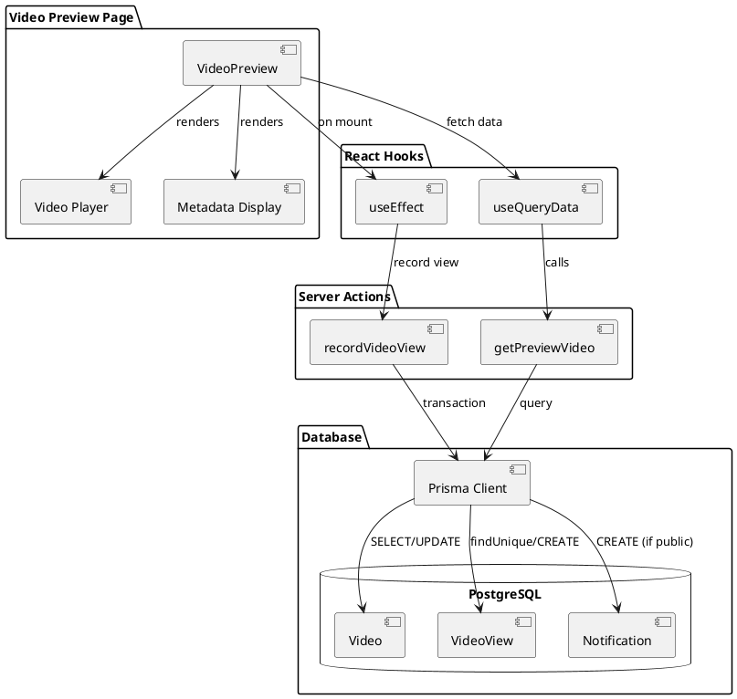
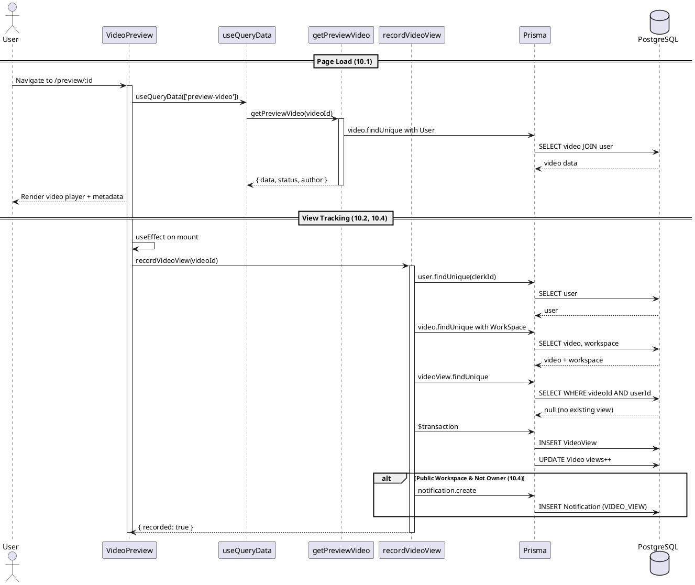
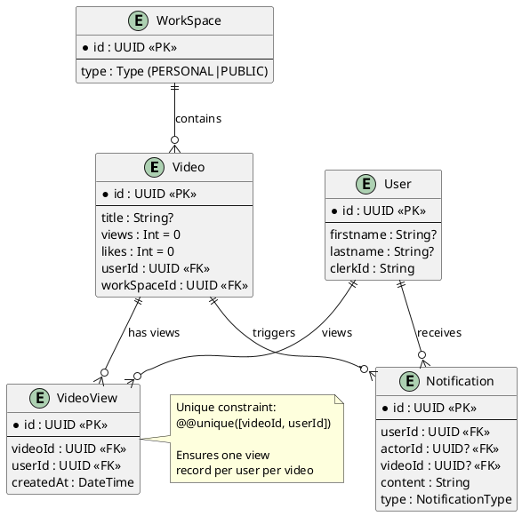

# Features 10.1-10.2, 10.4: Video Viewing & View Tracking

## Features Covered
| #    | Feature/Transaction                                                         | Actor  |
|------|-----------------------------------------------------------------------------|--------|
| 10.1 | User can view video preview page                                            | User   |
| 10.2 | System records unique video view per user and increments video view counter | System |
| 10.4 | System creates notification for video owner on view (public workspaces)     | System |

---

## Use Case Diagram

---

## Use Case Description

| Field | Description |
|-------|-------------|
| **Use Case ID** | UC-10.1-10.2-10.4 |
| **Use Case Name** | Video Preview with View Tracking |
| **Actor(s)** | User, System |
| **Description** | User views video preview page. System automatically tracks unique views per user, increments view counter, and notifies video owner for public workspaces. |
| **Preconditions** | 1. User is authenticated 2. Video exists |
| **Postconditions** | 1. Video page displayed 2. View recorded (if first view) 3. Notification sent (if public workspace) |
| **Main Flow** | 1. User navigates to /preview/:videoId 2. System loads video data via getPreviewVideo 3. System displays video player and metadata 4. useEffect triggers recordVideoView 5. System checks VideoView table for existing view 6. If no existing view: create VideoView + increment counter 7. If public workspace & not owner: create notification |
| **Alternative Flows** | A1: Already viewed → Skip recording |
| **Exceptions** | E1: Video not found → Redirect to home |

---

## Activity Diagram

---

## Component List

### Frontend Components

| Component | File Path | Description | Type |
|-----------|-----------|-------------|------|
| VideoPreview | `src/components/global/videos/video-preview.tsx` | Main preview page | Page Component |
| video element | Native HTML | Video player | HTML Element |

### Backend Components

| Component | File Path | Description | Type |
|-----------|-----------|-------------|------|
| getPreviewVideo | `src/actions/workspace.ts` | Fetches video data | Server Action |
| recordVideoView | `src/actions/workspace.ts` | Records unique view | Server Action |

---

## Component/Module Diagram

---

## Sequence Diagram

---

## ERD and Schema

### View Tracking Logic

| Condition | Action |
|-----------|--------|
| VideoView exists | Return `{ recorded: false, alreadyViewed: true }` |
| First view | Create VideoView + increment counter |
| Public workspace & not owner | Create VIDEO_VIEW notification |

