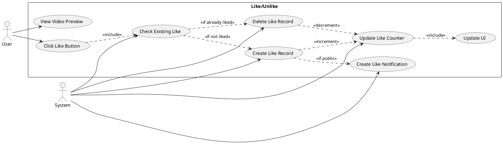
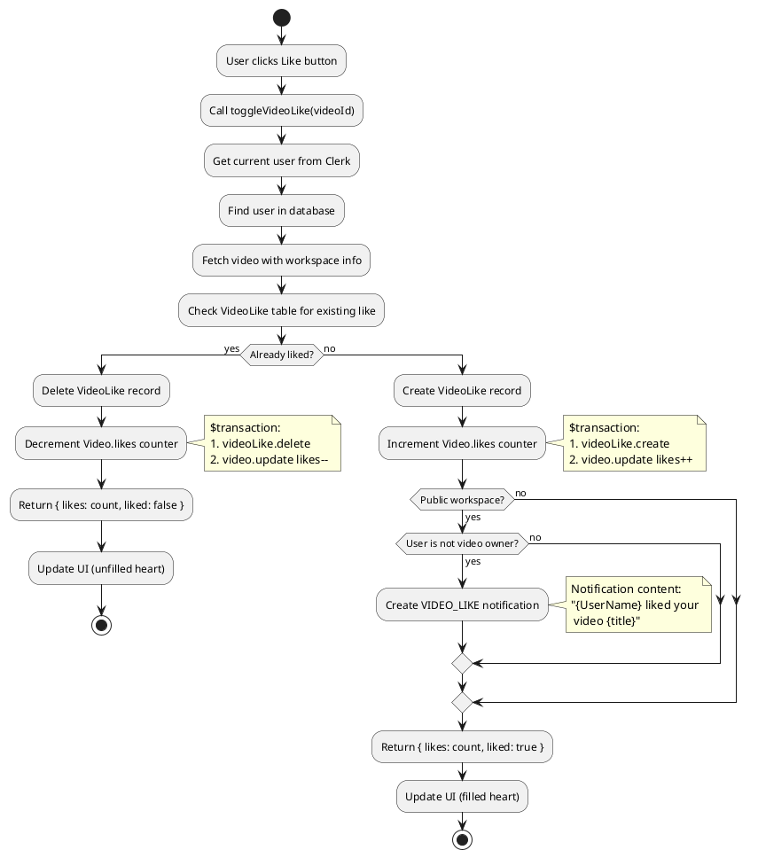
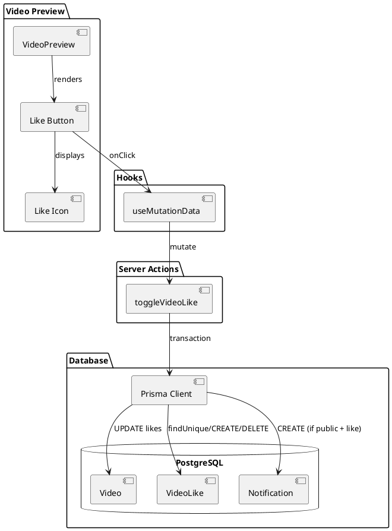
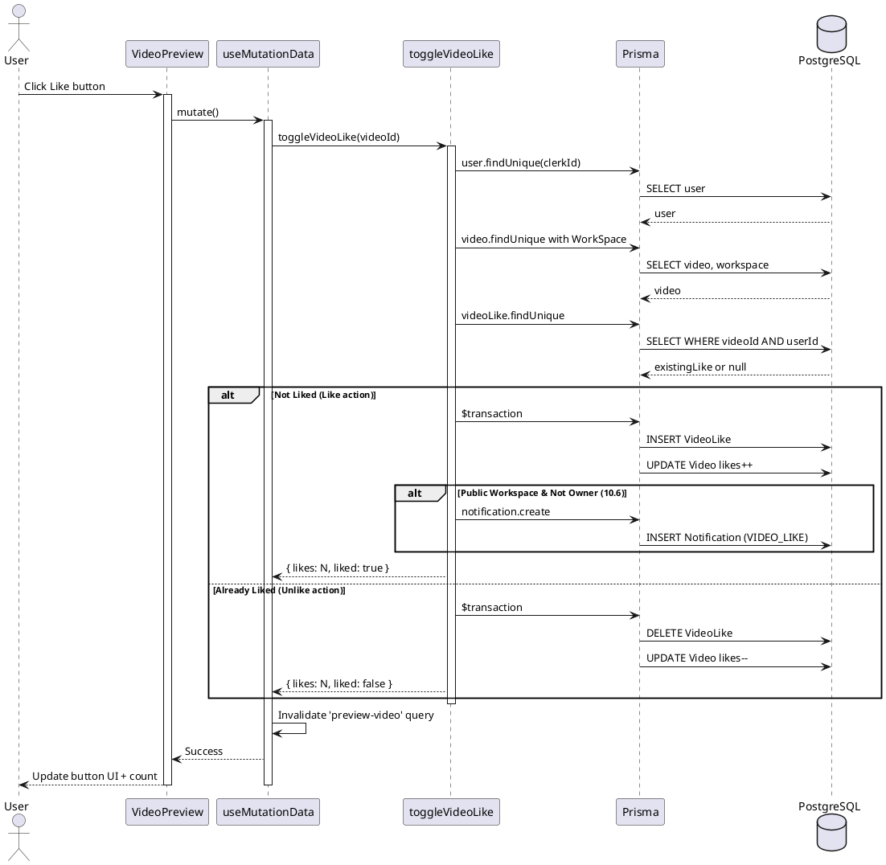
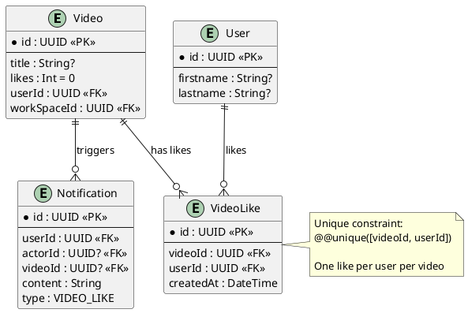

# Features 10.5-10.6: Like/Unlike

## Features Covered
| #    | Feature/Transaction                                                     | Actor  |
|------|-------------------------------------------------------------------------|--------|
| 10.5 | User can like or unlike a video                                         | User   |
| 10.6 | System creates notification for video owner on like (public workspaces) | System |

---

## Use Case Diagram

---

## Use Case Description

| Field | Description |
|-------|-------------|
| **Use Case ID** | UC-10.5-10.6 |
| **Use Case Name** | Toggle Video Like |
| **Actor(s)** | User, System |
| **Description** | User toggles like status on a video. System creates/deletes like record, updates counter, and notifies owner for public workspaces. |
| **Preconditions** | 1. User is authenticated 2. Video exists |
| **Postconditions** | 1. Like status toggled 2. Counter updated 3. Notification sent (on like, public workspace) |
| **Main Flow** | 1. User clicks like button 2. System checks existing VideoLike record 3. If not liked: create record, increment counter 4. If public & not owner: create notification 5. Update UI with new count 6. If already liked: delete record, decrement counter |
| **Alternative Flows** | A1: Unlike → Delete like, decrement (no notification) |
| **Exceptions** | E1: Database error → Return error status |

---

## Activity Diagram

---

## Component List

### Frontend Components

| Component | File Path | Description | Type |
|-----------|-----------|-------------|------|
| VideoPreview | `src/components/global/videos/video-preview.tsx` | Contains like button | Page Component |
| Like (icon) | `src/components/global/like.tsx` | Heart icon component | Icon Component |
| Button | `src/components/ui/button.tsx` | Like button wrapper | UI Component |

### Hooks

| Hook | File Path | Description |
|------|-----------|-------------|
| useMutationData | `src/hooks/useMutationData.ts` | Handles like mutation with cache invalidation |

### Backend Components

| Component | File Path | Description | Type |
|-----------|-----------|-------------|------|
| toggleVideoLike | `src/actions/workspace.ts` | Toggles like status | Server Action |

---

## Component/Module Diagram

---

## Sequence Diagram

---

## ERD and Schema

### Like Toggle Logic

| Current State | Action | DB Operations | Notification |
|---------------|--------|---------------|--------------|
| Not liked | Like | CREATE VideoLike, likes++ | Yes (if public & not owner) |
| Liked | Unlike | DELETE VideoLike, likes-- | No |

