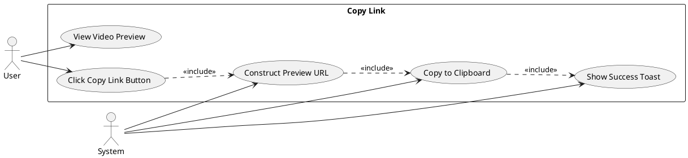
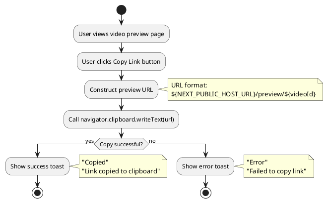
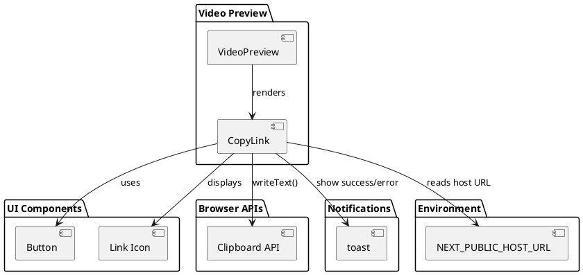
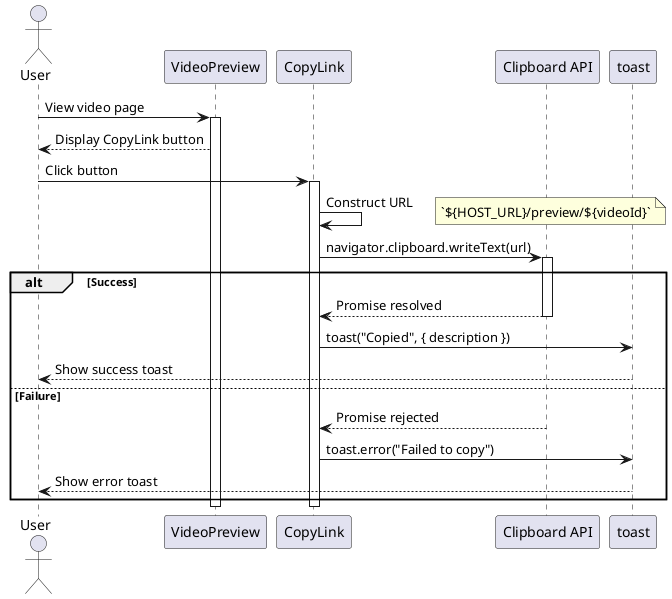
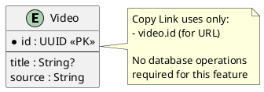

# Feature 10.7: Copy Link

## Features Covered
| #    | Feature/Transaction                             | Actor |
|------|-------------------------------------------------|-------|
| 10.7 | User can copy video preview link to clipboard   | User  |

---

## Use Case Diagram



---

## Use Case Description

| Field | Description |
|-------|-------------|
| **Use Case ID** | UC-10.7 |
| **Use Case Name** | Copy Video Link |
| **Actor(s)** | User |
| **Description** | User copies the video preview URL to clipboard for sharing. |
| **Preconditions** | 1. User is on video preview page<br>2. Clipboard API available |
| **Postconditions** | 1. URL copied to clipboard<br>2. Success toast shown |
| **Main Flow** | 1. User views video preview page<br>2. User clicks Copy Link button<br>3. System constructs preview URL<br>4. System copies URL to clipboard<br>5. System shows success toast |
| **Exceptions** | E1: Clipboard API fails → Show error toast |

---

## Activity Diagram



---

## Component List

### Frontend Components

| Component | File Path | Description | Type |
|-----------|-----------|-------------|------|
| CopyLink | `src/components/global/copy-link.tsx` | Copy link button | Button Component |
| VideoPreview | `src/components/global/videos/video-preview.tsx` | Parent page | Page Component |
| Button | `src/components/ui/button.tsx` | Button wrapper | UI Component |
| Link Icon | lucide-react | Link icon | Icon |

### Browser APIs

| API | Purpose |
|-----|---------|
| navigator.clipboard.writeText | Copies text to clipboard |

---

## Component/Module Diagram



---

## Sequence Diagram



---

## ERD and Schema



### URL Structure

```typescript
const url = `${process.env.NEXT_PUBLIC_HOST_URL}/preview/${videoId}`

// Example:
// https://crystal.app/preview/abc123-def456-ghi789
```

### CopyLink Component Props

| Prop | Type | Description |
|------|------|-------------|
| videoId | string | Video ID for URL construction |
| className | string? | Additional CSS classes |
| variant | string? | Button variant (e.g., "secondary") |

### Toast Messages

| Scenario | Title | Description |
|----------|-------|-------------|
| Success | "Copied" | "Link copied to clipboard" |
| Error | "Error" | "Failed to copy link" |

