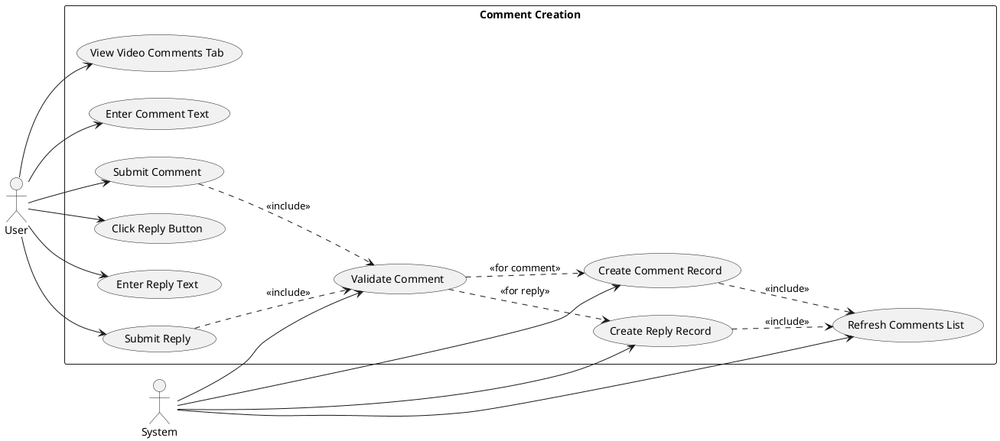
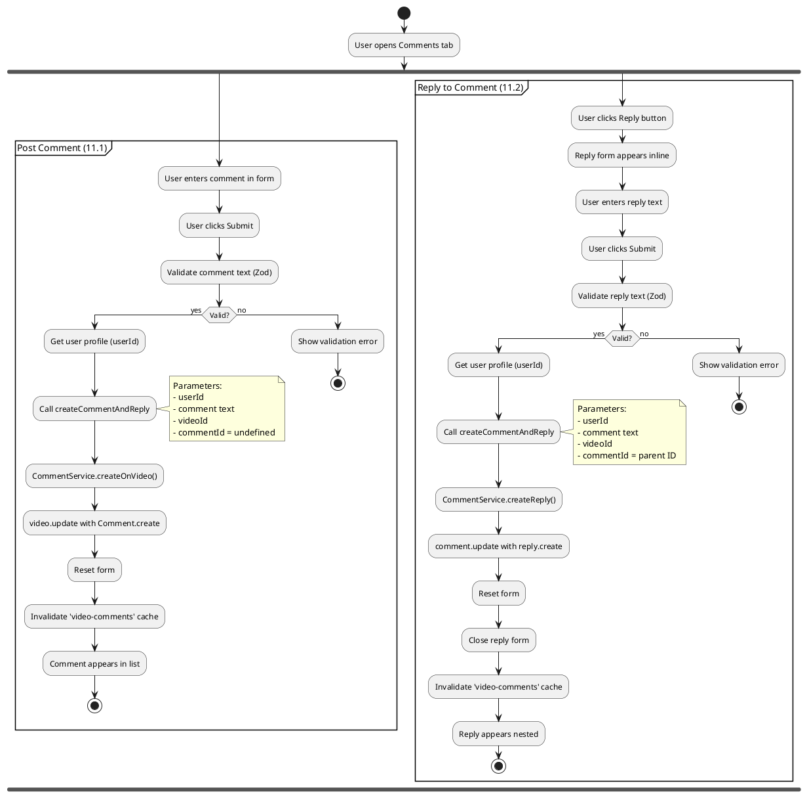
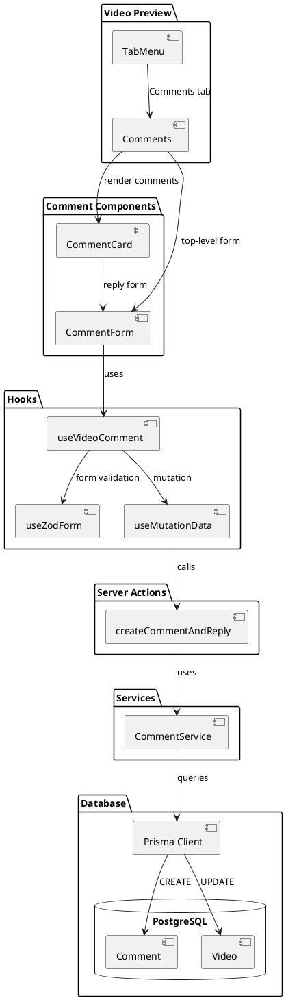
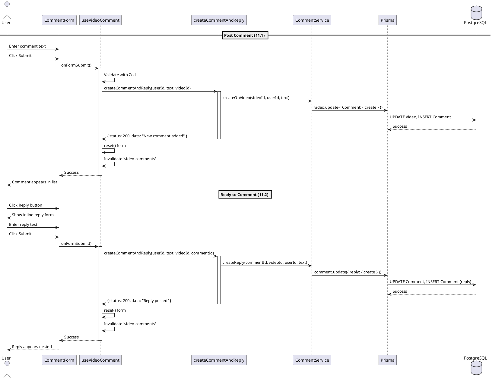
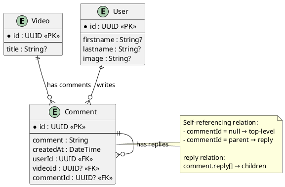

# Features 11.1-11.2: Comment Creation

## Features Covered
| #    | Feature/Transaction                        | Actor |
|------|--------------------------------------------|-------|
| 11.1 | User can post a comment on a video         | User  |
| 11.2 | User can reply to an existing comment      | User  |

---

## Use Case Diagram



---

## Use Case Description

### UC-11.1: Post Comment

| Field | Description |
|-------|-------------|
| **Use Case ID** | UC-11.1 |
| **Use Case Name** | Post Comment on Video |
| **Actor(s)** | User |
| **Description** | User posts a new top-level comment on a video. |
| **Preconditions** | 1. User is authenticated<br>2. Video exists<br>3. User is on Comments tab |
| **Postconditions** | 1. Comment record created<br>2. Comment appears in list |
| **Main Flow** | 1. User opens Comments tab<br>2. User enters comment text<br>3. User clicks Submit<br>4. System validates comment<br>5. System creates comment via CommentService<br>6. System invalidates cache<br>7. Comment appears in list |

### UC-11.2: Reply to Comment

| Field | Description |
|-------|-------------|
| **Use Case ID** | UC-11.2 |
| **Use Case Name** | Reply to Existing Comment |
| **Actor(s)** | User |
| **Description** | User posts a reply to an existing comment. |
| **Preconditions** | 1. User is authenticated<br>2. Parent comment exists |
| **Postconditions** | 1. Reply record created<br>2. Reply appears under parent |
| **Main Flow** | 1. User clicks Reply button on comment<br>2. Reply form appears inline<br>3. User enters reply text<br>4. User clicks Submit<br>5. System creates reply via CommentService<br>6. Reply appears nested under parent |

---

## Activity Diagram



---

## Component List

### Frontend Components

| Component | File Path | Description | Type |
|-----------|-----------|-------------|------|
| Comments | `src/components/global/video-tools/activities.tsx` | Comments tab container | Tab Component |
| CommentForm | `src/components/forms/comment-form/index.tsx` | Comment input form | Form Component |
| CommentCard | `src/components/global/comment-card.tsx` | Comment display with reply | Card Component |

### Hooks

| Hook | File Path | Description |
|------|-----------|-------------|
| useVideoComment | `src/hooks/useVideo.ts` | Comment form and mutation logic |
| useMutationData | `src/hooks/useMutationData.ts` | Handles mutation with cache |

### Backend Components

| Component | File Path | Description | Type |
|-----------|-----------|-------------|------|
| createCommentAndReply | `src/actions/user.ts` | Creates comment or reply | Server Action |
| CommentService | `src/services/comment.service.ts` | Database operations | Service |

---

## Component/Module Diagram



---

## Sequence Diagram



---

## ERD and Schema



### Prisma Schema

```prisma
model Comment {
  id        String     @id @default(dbgenerated("gen_random_uuid()")) @db.Uuid
  comment   String
  createdAt DateTime   @default(now())
  userId    String?    @db.Uuid
  videoId   String?    @db.Uuid
  commentId String?    @db.Uuid
  User      User?      @relation(fields: [userId], references: [id])
  Video     Video?     @relation(fields: [videoId], references: [id], onDelete: Cascade)
  Comment   Comment?   @relation("reply", fields: [commentId], references: [id], onDelete: Cascade)
  reply     Comment[]  @relation("reply")
}
```

### Comment Types

| Type | commentId | Description |
|------|-----------|-------------|
| Top-level | null | Direct comment on video |
| Reply | parent ID | Nested under parent comment |

