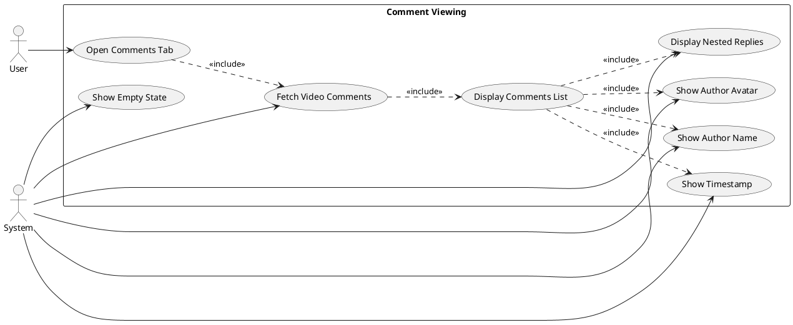
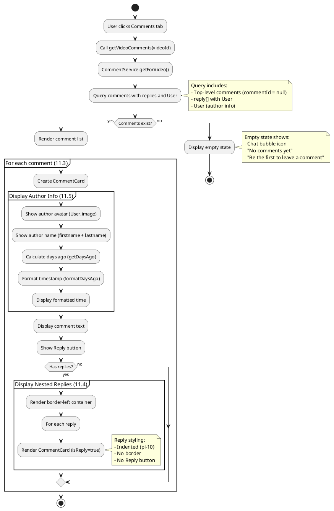
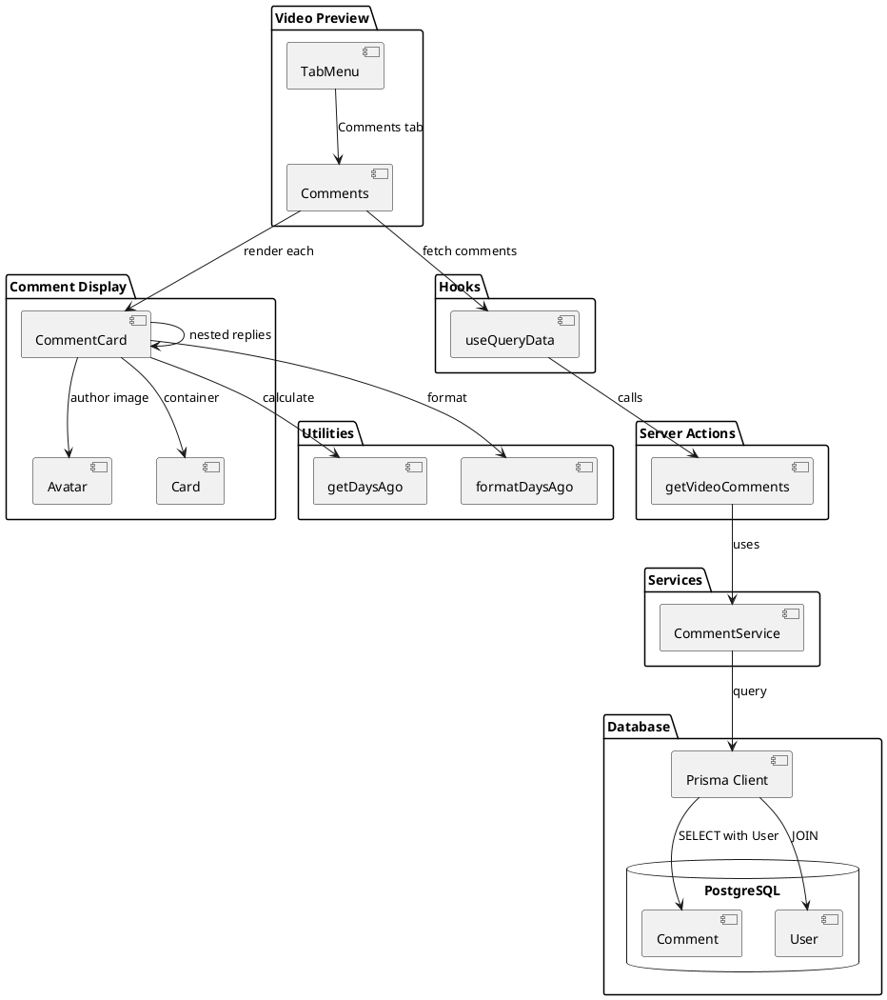
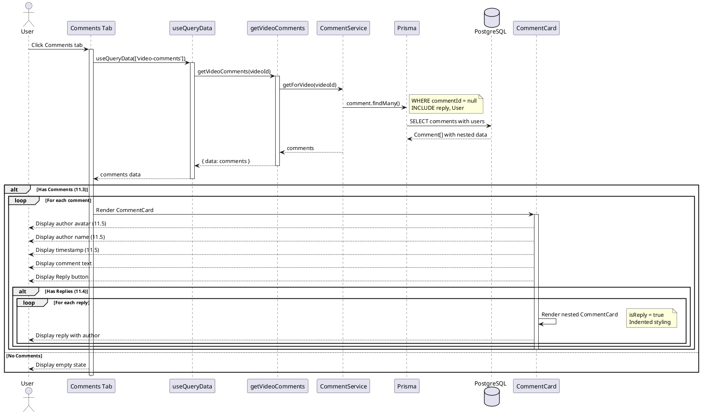
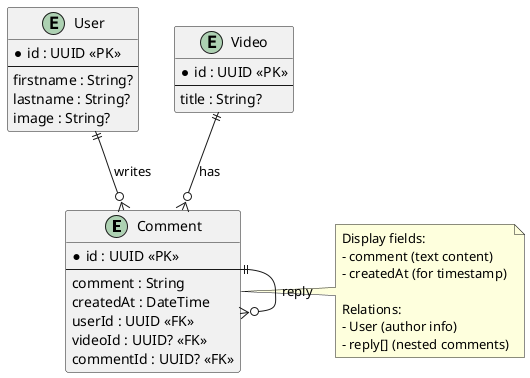

# Features 11.3-11.5: Comment Viewing

## Features Covered
| #    | Feature/Transaction                                      | Actor  |
|------|----------------------------------------------------------|--------|
| 11.3 | User can view all comments on a video                    | User   |
| 11.4 | User can view nested replies in a comment thread         | User   |
| 11.5 | System displays comment author information and timestamp | System |

---

## Use Case Diagram



---

## Use Case Description

| Field | Description |
|-------|-------------|
| **Use Case ID** | UC-11.3-11.5 |
| **Use Case Name** | View Video Comments |
| **Actor(s)** | User, System |
| **Description** | User views all comments on a video with nested replies, author information, and timestamps. |
| **Preconditions** | 1. User is on video preview page<br>2. Video exists |
| **Postconditions** | 1. Comments displayed with metadata |
| **Main Flow** | 1. User clicks Comments tab<br>2. System fetches comments via getVideoComments<br>3. System renders comment cards with author info (11.5)<br>4. System renders nested replies (11.4)<br>5. Each comment shows avatar, name, text, timestamp |
| **Alternative Flows** | A1: No comments → Show empty state with icon |

---

## Activity Diagram



---

## Component List

### Frontend Components

| Component | File Path | Description | Type |
|-----------|-----------|-------------|------|
| Comments | `src/components/global/video-tools/activities.tsx` | Comments tab container | Tab Component |
| CommentCard | `src/components/global/comment-card.tsx` | Individual comment display | Card Component |
| Avatar | `src/components/ui/avatar.tsx` | Author avatar | UI Component |
| Card | `src/components/ui/card.tsx` | Comment container | UI Component |

### Hooks

| Hook | File Path | Description |
|------|-----------|-------------|
| useQueryData | `src/hooks/useQueryData.ts` | Fetches comments with caching |

### Backend Components

| Component | File Path | Description | Type |
|-----------|-----------|-------------|------|
| getVideoComments | `src/actions/user.ts` | Fetches video comments | Server Action |
| CommentService.getForVideo | `src/services/comment.service.ts` | Database query | Service |

---

## Component/Module Diagram



---

## Sequence Diagram



---

## ERD and Schema



### Comment Query Structure

```typescript
// CommentService.getForVideo query
client.comment.findMany({
  where: {
    OR: [{ videoId }, { commentId: videoId }],
    commentId: null,  // Only top-level
  },
  include: {
    reply: {
      include: {
        User: true,  // Reply author
      },
    },
    User: true,  // Comment author
  },
})
```

### Timestamp Formatting

| Days Ago | Display |
|----------|---------|
| 0 | "Today" |
| 1 | "1d ago" |
| 7 | "7d ago" or "1w ago" |
| 30+ | "1mo ago" |

### CommentCard Props

| Prop | Type | Description |
|------|------|-------------|
| comment | string | Comment text content |
| author | { image, firstname, lastname } | Author info |
| videoId | string | Video reference |
| commentId | string? | Parent comment ID |
| reply | CommentRepliesProps[] | Nested replies |
| isReply | boolean | Styling flag |
| createdAt | Date | Timestamp |

