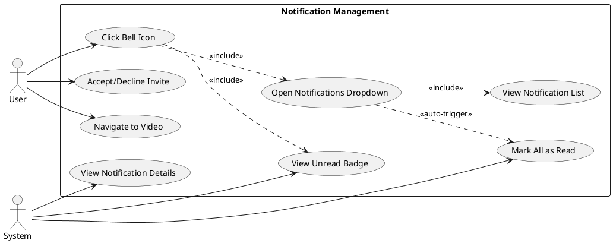
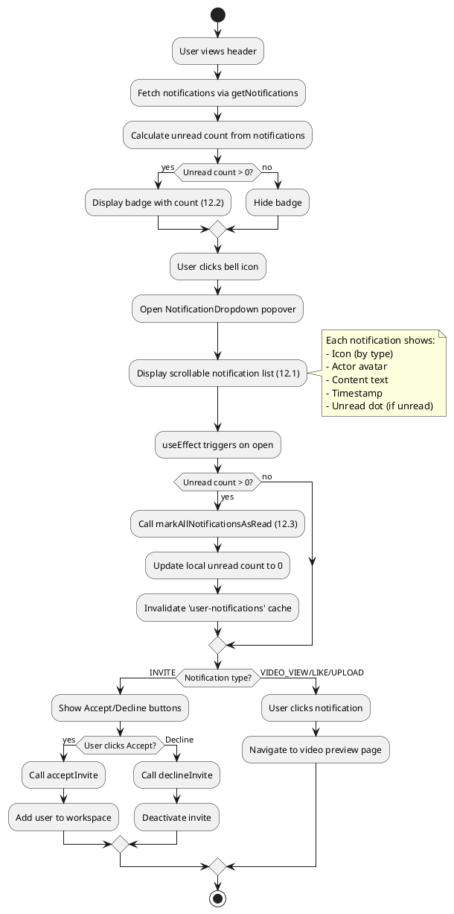
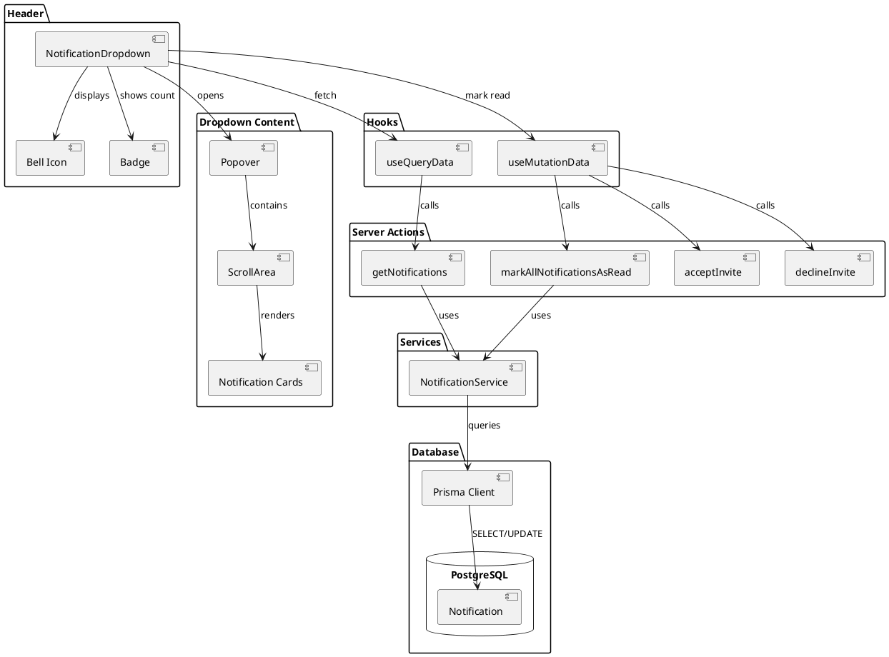
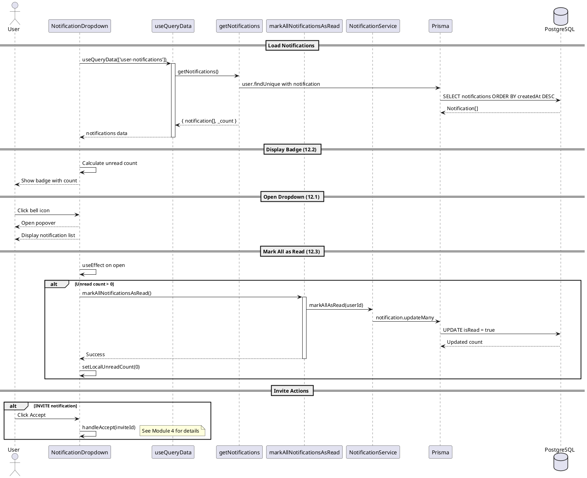
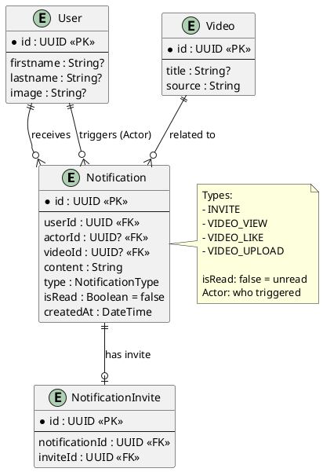

# Features 12.1-12.3: Notification Viewing & Management

## Features Covered
| #    | Feature/Transaction                         | Actor |
|------|---------------------------------------------|-------|
| 12.1 | User can view all their notifications       | User  |
| 12.2 | User can view unread notification count     | User  |
| 12.3 | User can mark all notifications as read     | User  |

---

## Use Case Diagram



---

## Use Case Description

| Field | Description |
|-------|-------------|
| **Use Case ID** | UC-12.1-12.3 |
| **Use Case Name** | View and Manage Notifications |
| **Actor(s)** | User, System |
| **Description** | User views notifications via dropdown, sees unread count, and marks all as read automatically on open. |
| **Preconditions** | 1. User is authenticated<br>2. User has notifications |
| **Postconditions** | 1. Notifications displayed<br>2. Unread count updated |
| **Main Flow** | 1. User sees bell icon with unread badge (12.2)<br>2. User clicks bell icon<br>3. Dropdown opens with notification list (12.1)<br>4. System auto-marks all as read (12.3)<br>5. User can view details, accept invites, or navigate |
| **Alternative Flows** | A1: No notifications → Show empty state |

---

## Activity Diagram



---

## Component List

### Frontend Components

| Component | File Path | Description | Type |
|-----------|-----------|-------------|------|
| NotificationDropdown | `src/components/global/notifications/notification-dropdown.tsx` | Bell icon with dropdown | Popover Component |
| Bell Icon | `src/components/icons` | Notification bell icon | Icon |
| Popover | `src/components/ui/popover.tsx` | Dropdown container | UI Component |
| ScrollArea | `src/components/ui/scroll-area.tsx` | Scrollable notification list | UI Component |
| Avatar | `src/components/ui/avatar.tsx` | Actor avatar | UI Component |

### Hooks

| Hook | File Path | Description |
|------|-----------|-------------|
| useQueryData | `src/hooks/useQueryData.ts` | Fetches notifications |
| useMutationData | `src/hooks/useMutationData.ts` | Marks as read, accepts/declines |

### Backend Components

| Component | File Path | Description | Type |
|-----------|-----------|-------------|------|
| getNotifications | `src/actions/user.ts` | Fetches all notifications | Server Action |
| markAllNotificationsAsRead | `src/actions/user.ts` | Marks all as read | Server Action |
| NotificationService | `src/services/notification.service.ts` | Database operations | Service |

---

## Component/Module Diagram



---

## Sequence Diagram



---

## ERD and Schema



### Notification Type Icons

| Type | Icon | Color |
|------|------|-------|
| INVITE | UserPlus | Default |
| VIDEO_VIEW | Eye | Default |
| VIDEO_LIKE | Heart | Red |
| VIDEO_UPLOAD | Upload | Default |

### Unread Badge Logic

```typescript
// Calculate from notification list
const unreadCount = notificationList.filter(n => !n.isRead).length

// Badge displays when > 0
{badgeCount > 0 && (
  <span className="badge">{badgeCount}</span>
)}
```

