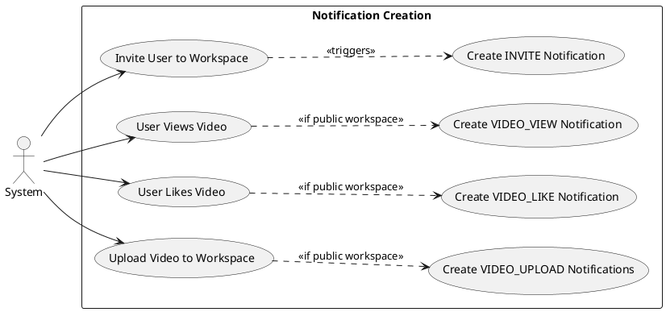
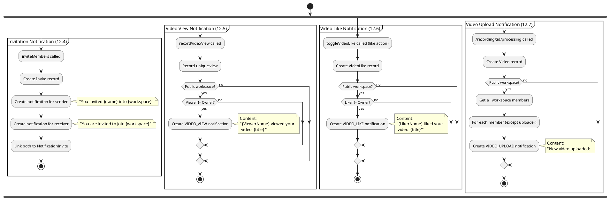
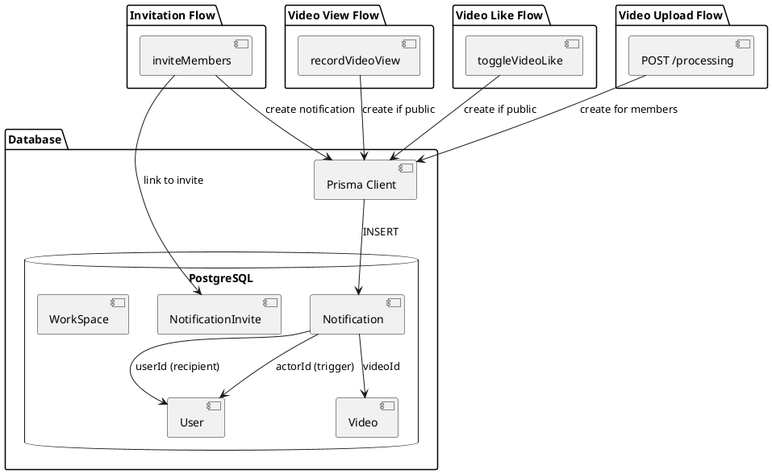
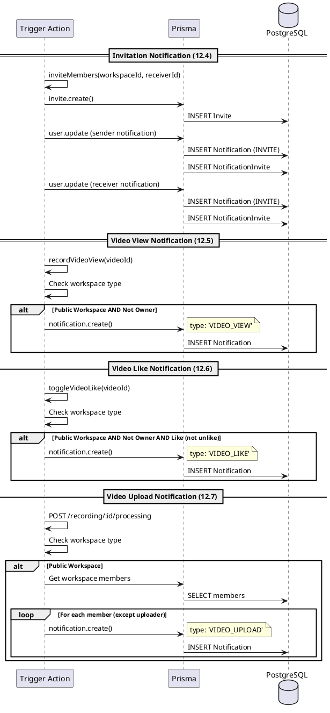
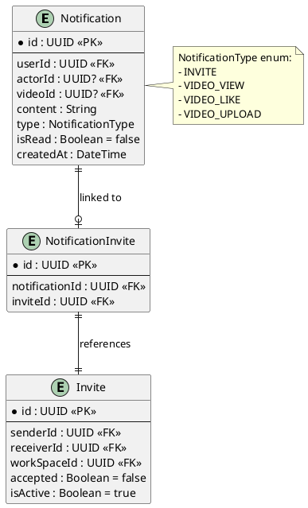

# Features 12.4-12.7: Notification Creation

## Features Covered
| #    | Feature/Transaction                                                      | Actor  |
|------|--------------------------------------------------------------------------|--------|
| 12.4 | System creates invitation notification when user is invited to workspace | System |
| 12.5 | System creates video view notification for video owner                   | System |
| 12.6 | System creates video like notification for video owner                   | System |
| 12.7 | System creates video upload notification for workspace members           | System |

---

## Use Case Diagram

---

## Use Case Description

### UC-12.4: Invitation Notification

| Field | Description |
|-------|-------------|
| **Use Case ID** | UC-12.4 |
| **Use Case Name** | Create Invitation Notification |
| **Trigger** | inviteMembers action |
| **Description** | When user invites another to workspace, notifications created for both sender and receiver. |

### UC-12.5: Video View Notification

| Field | Description |
|-------|-------------|
| **Use Case ID** | UC-12.5 |
| **Use Case Name** | Create Video View Notification |
| **Trigger** | recordVideoView action |
| **Condition** | Public workspace AND viewer is not owner |
| **Description** | When user views video in public workspace, owner is notified. |

### UC-12.6: Video Like Notification

| Field | Description |
|-------|-------------|
| **Use Case ID** | UC-12.6 |
| **Use Case Name** | Create Video Like Notification |
| **Trigger** | toggleVideoLike action (on like, not unlike) |
| **Condition** | Public workspace AND liker is not owner |
| **Description** | When user likes video in public workspace, owner is notified. |

### UC-12.7: Video Upload Notification

| Field | Description |
|-------|-------------|
| **Use Case ID** | UC-12.7 |
| **Use Case Name** | Create Video Upload Notification |
| **Trigger** | /recording/:id/processing API route |
| **Condition** | Public workspace |
| **Description** | When video uploaded to public workspace, all members are notified. |

---

## Activity Diagram

---

## Component List

### Trigger Actions

| Notification Type | Trigger Location | File Path |
|-------------------|------------------|-----------|
| INVITE | inviteMembers | `src/actions/user.ts` |
| VIDEO_VIEW | recordVideoView | `src/actions/workspace.ts` |
| VIDEO_LIKE | toggleVideoLike | `src/actions/workspace.ts` |
| VIDEO_UPLOAD | POST /recording/:id/processing | `src/app/api/recording/[id]/processing/route.ts` |

### Backend Components

| Component | File Path | Description | Type |
|-----------|-----------|-------------|------|
| NotificationService.create | `src/services/notification.service.ts` | Creates notification | Service |
| Prisma notification.create | Direct Prisma calls | Database creation | ORM |

---

## Component/Module Diagram

---

## Sequence Diagram

---

## ERD and Schema

### Notification Content Templates

| Type | Content Template | Variables |
|------|------------------|-----------|
| INVITE (sender) | "You invited {name} into {workspace}" | receiver name, workspace name |
| INVITE (receiver) | "You are invited to join {workspace} Workspace" | workspace name |
| VIDEO_VIEW | "{name} viewed your video \"{title}\"" | viewer name, video title |
| VIDEO_LIKE | "{name} liked your video \"{title}\"" | liker name, video title |
| VIDEO_UPLOAD | "New video uploaded: \"{title}\"" | video title |

### Notification Creation Conditions

| Type | Condition |
|------|-----------|
| INVITE | Always created for both sender and receiver |
| VIDEO_VIEW | Public workspace AND viewer ≠ owner |
| VIDEO_LIKE | Public workspace AND liker ≠ owner AND action is like (not unlike) |
| VIDEO_UPLOAD | Public workspace → all members except uploader |

