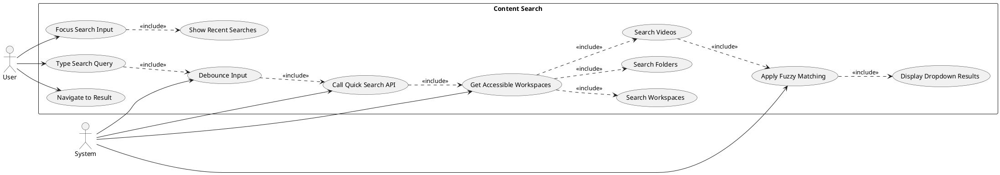
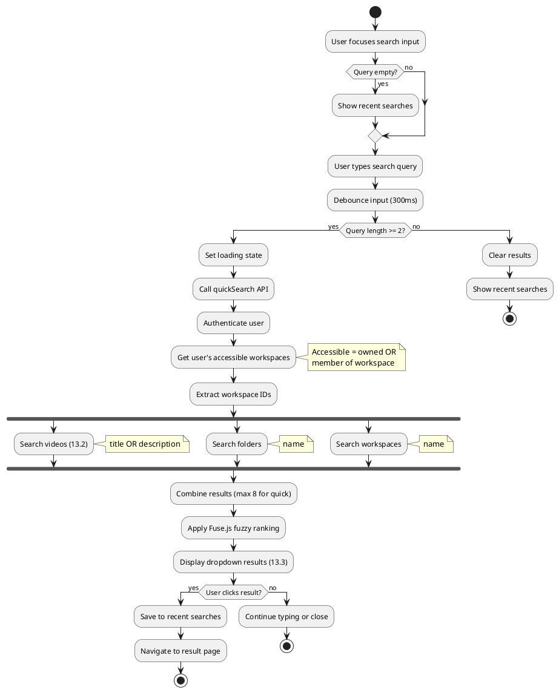
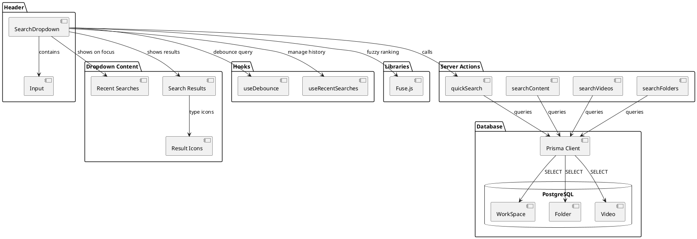
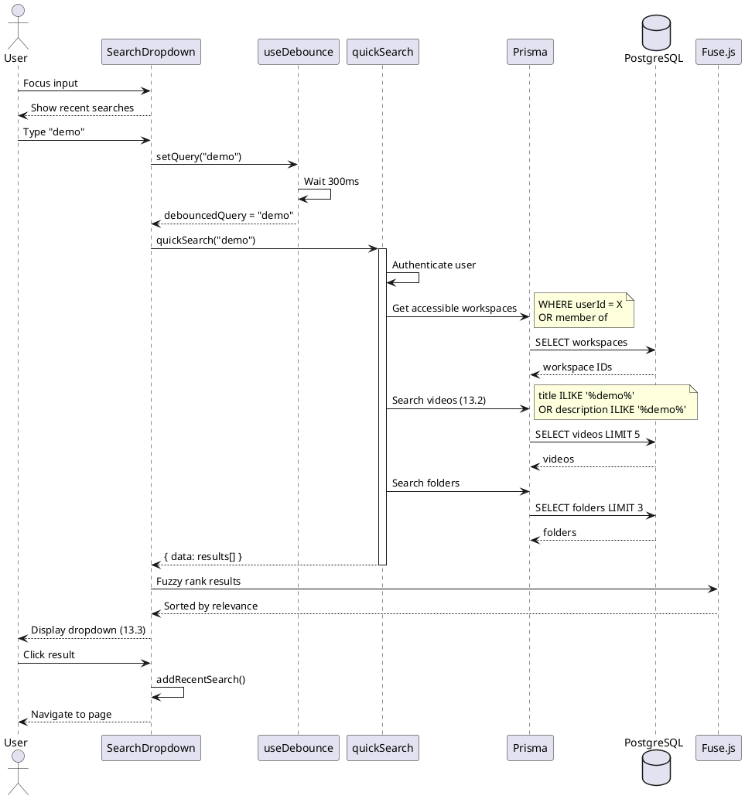
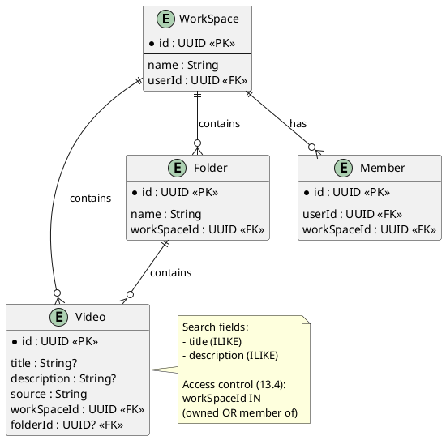

# Features 13.1-13.4: Content Search

## Features Covered
| #    | Feature/Transaction                                               | Actor  |
|------|-------------------------------------------------------------------|--------|
| 13.1 | User can search across all content (workspaces, folders, videos)  | User   |
| 13.2 | User can search videos by title or description                    | User   |
| 13.3 | User can perform quick search with real-time dropdown suggestions | User   |
| 13.4 | System limits search results to user-accessible content           | System |

---

## Use Case Diagram



---

## Use Case Description

| Field | Description |
|-------|-------------|
| **Use Case ID** | UC-13.1-13.4 |
| **Use Case Name** | Content Search with Access Control |
| **Actor(s)** | User, System |
| **Description** | User searches across workspaces, folders, and videos. System limits results to user-accessible content and provides real-time suggestions. |
| **Preconditions** | 1. User is authenticated<br>2. User has workspaces/content |
| **Postconditions** | 1. Relevant results displayed<br>2. User can navigate to result |
| **Main Flow** | 1. User focuses search input<br>2. System shows recent searches<br>3. User types query (min 2 chars)<br>4. System debounces input (300ms)<br>5. System calls quickSearch API (13.3)<br>6. System gets user's accessible workspaces (13.4)<br>7. System searches workspaces, folders, videos (13.1)<br>8. System applies Fuse.js fuzzy matching<br>9. System displays dropdown with results<br>10. User clicks result to navigate |
| **Alternative Flows** | A1: Query < 2 chars → Show recent searches<br>A2: No results → Show empty state |

---

## Activity Diagram



---

## Component List

### Frontend Components

| Component | File Path | Description | Type |
|-----------|-----------|-------------|------|
| SearchDropdown | `src/components/global/search/search-dropdown.tsx` | Search input with dropdown | Search Component |
| Input | `src/components/ui/input.tsx` | Text input | UI Component |

### Hooks

| Hook | File Path | Description |
|------|-----------|-------------|
| useDebounce | `src/hooks/useDebounce.ts` | Debounces search input |
| useRecentSearches | `src/hooks/useRecentSearches.ts` | Manages recent search history |

### Backend Components

| Component | File Path | Description | Type |
|-----------|-----------|-------------|------|
| quickSearch | `src/actions/search.ts` | Fast search with limit | Server Action |
| searchContent | `src/actions/search.ts` | Full content search | Server Action |
| searchVideos | `src/actions/search.ts` | Video-only search | Server Action |
| searchFolders | `src/actions/search.ts` | Folder-only search | Server Action |
| searchWorkspaces | `src/actions/search.ts` | Workspace-only search | Server Action |

---

## Component/Module Diagram



---

## Sequence Diagram



---

## ERD and Schema



### Search Result Types

| Type | Icon | Fields Searched |
|------|------|-----------------|
| workspace | Building2 | name |
| folder | Folder | name |
| video | Video | title, description |

### Quick Search Limits

| Type | Max Results |
|------|-------------|
| Videos | 5 |
| Folders | 3 |
| Workspaces | 3 |
| **Total** | **8** |

### Access Control Logic (13.4)

```typescript
// Get user's accessible workspaces
const userWorkspaces = await client.workSpace.findMany({
  where: {
    OR: [
      { userId: auth.user.id },  // Owned
      { 
        members: {
          some: {
            userId: auth.user.id,
            member: true           // Member of
          }
        }
      }
    ]
  }
})
```

