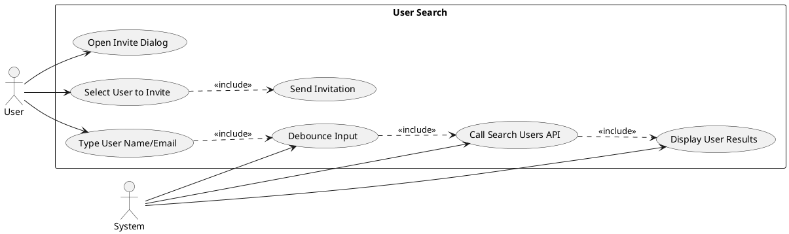
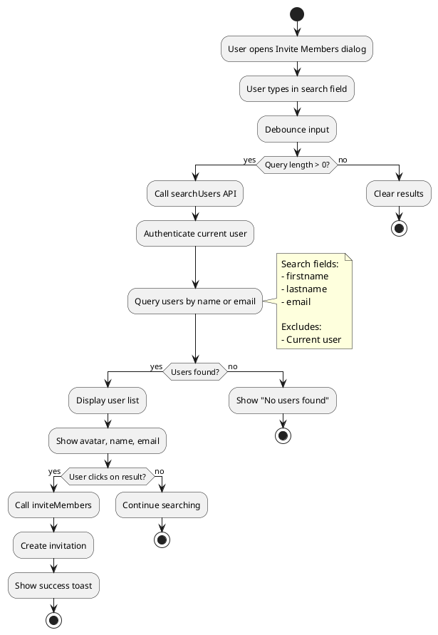
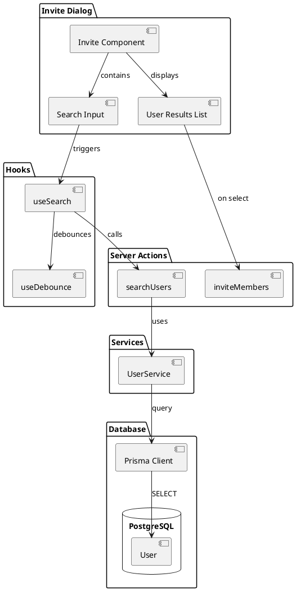
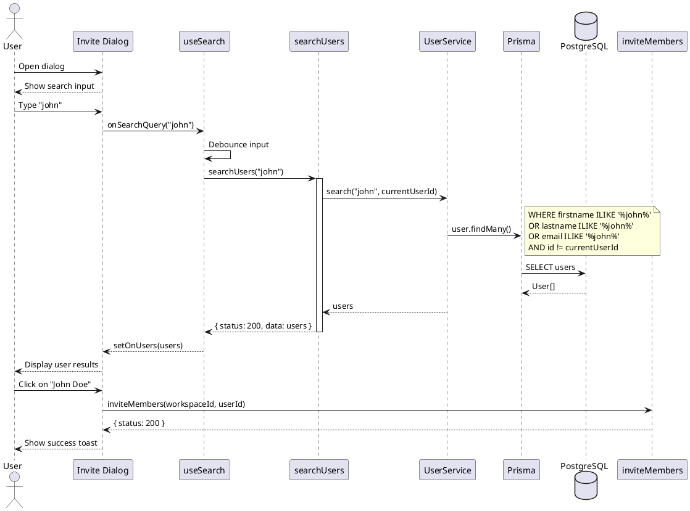
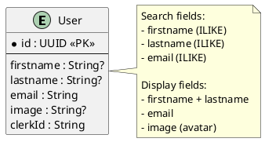

# Feature 13.5: User Search

## Features Covered
| #    | Feature/Transaction                        | Actor |
|------|--------------------------------------------|-------|
| 13.5 | User can search for other users to invite  | User  |

---

## Use Case Diagram



---

## Use Case Description

| Field | Description |
|-------|-------------|
| **Use Case ID** | UC-13.5 |
| **Use Case Name** | Search Users for Invitation |
| **Actor(s)** | User |
| **Description** | User searches for other users by name or email to invite them to a workspace. |
| **Preconditions** | 1. User is authenticated<br>2. User owns a public workspace<br>3. User has invite dialog open |
| **Postconditions** | 1. Matching users displayed<br>2. User can select and invite |
| **Main Flow** | 1. User opens invite members dialog<br>2. User types name or email in search<br>3. System debounces input<br>4. System calls searchUsers API<br>5. System displays matching users<br>6. User clicks on user to invite<br>7. System sends invitation |
| **Alternative Flows** | A1: No results → Show "No users found" |
| **Exceptions** | E1: User already member → Prevent invite |

---

## Activity Diagram



---

## Component List

### Frontend Components

| Component | File Path | Description | Type |
|-----------|-----------|-------------|------|
| Invite Dialog | `src/components/global/invite/index.tsx` | Invite members dialog | Dialog Component |
| Search Input | `src/components/ui/input.tsx` | User search input | UI Component |
| User List | Inline | Displays search results | List Component |

### Hooks

| Hook | File Path | Description |
|------|-----------|-------------|
| useSearch | `src/hooks/useSearch.ts` | Manages user search with debounce |

### Backend Components

| Component | File Path | Description | Type |
|-----------|-----------|-------------|------|
| searchUsers | `src/actions/user.ts` | Searches users | Server Action |
| UserService.search | `src/services/user.service.ts` | Database query | Service |

---

## Component/Module Diagram



---

## Sequence Diagram



---

## ERD and Schema



### useSearch Hook

```typescript
export const useSearch = (key: string, type: 'USERS') => {
  const [query, setQuery] = useState('')
  const [debounce, setDebounce] = useState('')
  const [onUsers, setOnUsers] = useState<User[] | undefined>()

  // Debounce the query
  useEffect(() => {
    const timer = setTimeout(() => setDebounce(query), 500)
    return () => clearTimeout(timer)
  }, [query])

  // Fetch when debounce changes
  useEffect(() => {
    if (debounce) {
      searchUsers(debounce).then(res => {
        if (res.status === 200) setOnUsers(res.data)
      })
    } else {
      setOnUsers(undefined)
    }
  }, [debounce])

  return { query, setQuery, onUsers }
}
```

### User Search Exclusions

| Exclusion | Reason |
|-----------|--------|
| Current user | Can't invite yourself |
| Existing members | Already in workspace (checked at invite time) |
| Pending invites | Already invited (checked at invite time) |

