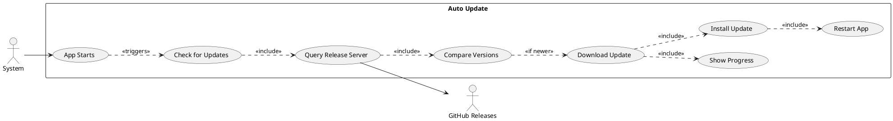
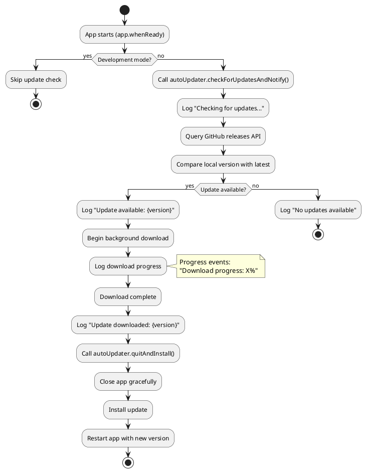
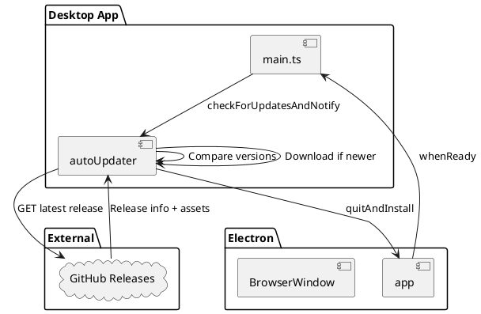
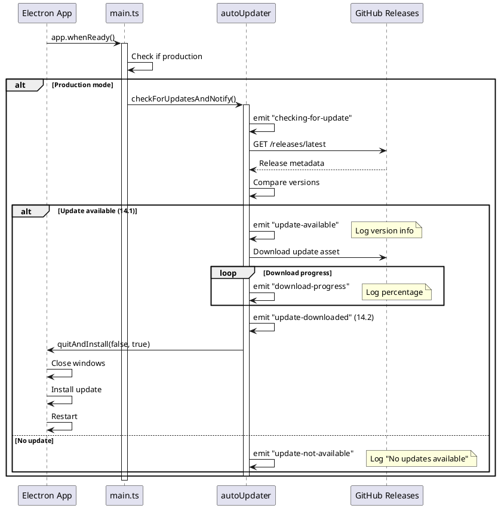
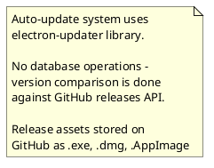

# Features 14.1-14.2: Auto Update System

## Features Covered
| #    | Feature/Transaction                                     | Actor  |
|------|---------------------------------------------------------|--------|
| 14.1 | System checks for desktop app updates                   | System |
| 14.2 | System downloads and installs app updates automatically | System |

---

## Use Case Diagram



---

## Use Case Description

### UC-14.1: Check for Updates

| Field | Description |
|-------|-------------|
| **Use Case ID** | UC-14.1 |
| **Use Case Name** | Check for Desktop App Updates |
| **Actor(s)** | System |
| **Trigger** | App startup (production mode only) |
| **Description** | System checks GitHub releases for a newer app version. |
| **Preconditions** | 1. App running in production<br>2. Internet connection available |
| **Postconditions** | 1. Update status logged<br>2. Download initiated if update available |

### UC-14.2: Download and Install

| Field | Description |
|-------|-------------|
| **Use Case ID** | UC-14.2 |
| **Use Case Name** | Download and Install Update |
| **Actor(s)** | System |
| **Description** | System downloads update in background and installs on completion. |
| **Preconditions** | 1. Update available<br>2. Sufficient disk space |
| **Postconditions** | 1. New version installed<br>2. App restarted |

---

## Activity Diagram



---

## Component List

### Electron Main Process

| Component | File Path | Description | Type |
|-----------|-----------|-------------|------|
| autoUpdater | electron-updater | Auto update manager | Library |
| main.ts | `crystal-desktop-app/electron/main.ts` | Main process entry | Electron Main |

### External Services

| Service | Purpose |
|---------|---------|
| GitHub Releases | Hosts update packages |
| electron-updater | Manages update lifecycle |

---

## Component/Module Diagram



---

## Sequence Diagram



---

## ERD and Schema



### electron-updater Configuration

```typescript
// In main.ts
import { autoUpdater } from "electron-updater";

// Check for updates on startup (production only)
app.whenReady().then(() => {
  if (!VITE_DEV_SERVER_URL) {
    autoUpdater.checkForUpdatesAndNotify();
  }
});

// Event handlers
autoUpdater.on("checking-for-update", () => {
  console.log("[AutoUpdater] Checking for updates...");
});

autoUpdater.on("update-available", (info) => {
  console.log("[AutoUpdater] Update available:", info.version);
});

autoUpdater.on("update-not-available", () => {
  console.log("[AutoUpdater] No updates available.");
});

autoUpdater.on("download-progress", (progress) => {
  console.log(`[AutoUpdater] Download progress: ${progress.percent.toFixed(1)}%`);
});

autoUpdater.on("update-downloaded", (info) => {
  console.log("[AutoUpdater] Update downloaded:", info.version);
  autoUpdater.quitAndInstall(false, true);
});

autoUpdater.on("error", (err) => {
  console.error("[AutoUpdater] Error:", err.message);
});
```

### Update Lifecycle Events

| Event | Description |
|-------|-------------|
| checking-for-update | Started version check |
| update-available | Newer version found |
| update-not-available | Already on latest |
| download-progress | Download percentage |
| update-downloaded | Ready to install |
| error | Update failed |

