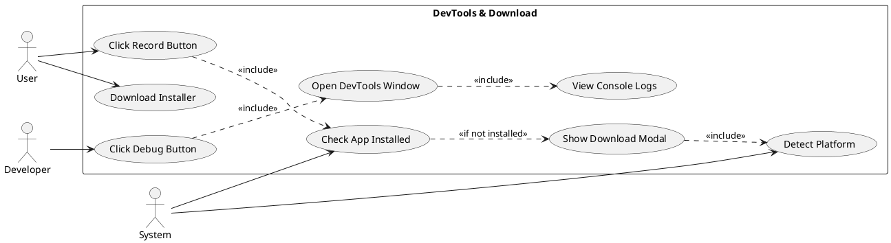
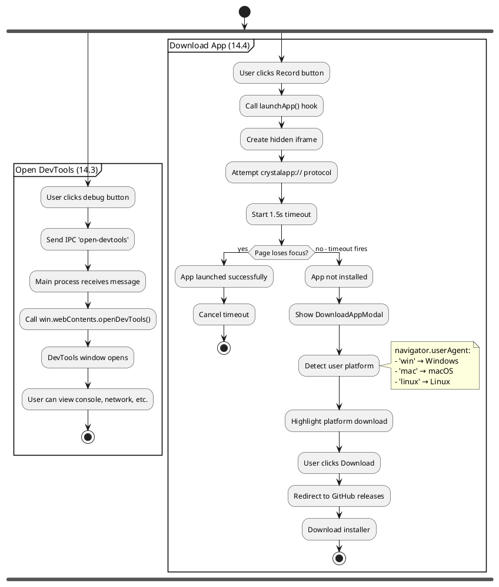
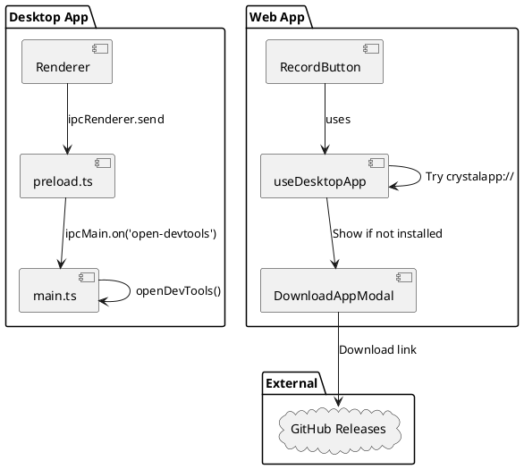
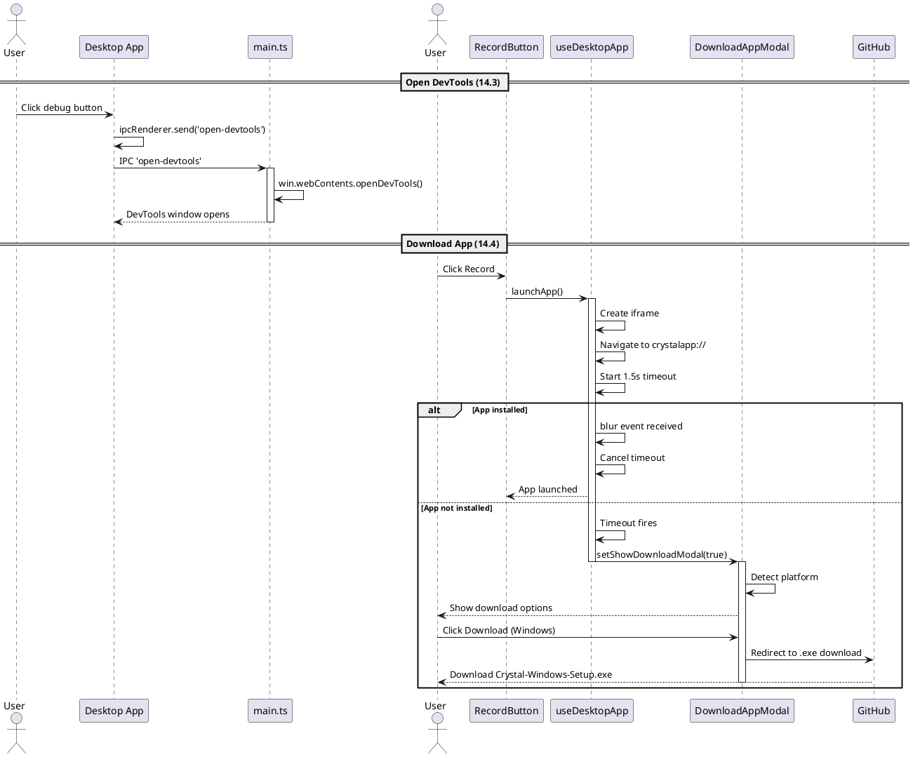
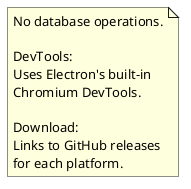

# Features 14.3-14.4: Developer Tools and App Download

## Features Covered
| #    | Feature/Transaction                                 | Actor |
|------|-----------------------------------------------------|-------|
| 14.3 | User can open DevTools for debugging                | User  |
| 14.4 | User can download the desktop app from the web app  | User  |

---

## Use Case Diagram



---

## Use Case Description

### UC-14.3: Open DevTools

| Field | Description |
|-------|-------------|
| **Use Case ID** | UC-14.3 |
| **Use Case Name** | Open DevTools for Debugging |
| **Actor(s)** | Developer/User |
| **Description** | User opens Chromium DevTools to view console logs and debug the app. |
| **Preconditions** | 1. Desktop app running |
| **Postconditions** | 1. DevTools window opened |
| **Main Flow** | 1. User clicks debug/settings button<br>2. App sends IPC message to main process<br>3. Main process calls openDevTools() |

### UC-14.4: Download Desktop App

| Field | Description |
|-------|-------------|
| **Use Case ID** | UC-14.4 |
| **Use Case Name** | Download Desktop App from Web |
| **Actor(s)** | User |
| **Description** | User downloads the desktop app installer from the web application. |
| **Preconditions** | 1. User on web app<br>2. Wants to record screen |
| **Postconditions** | 1. Installer downloaded |
| **Main Flow** | 1. User clicks Record button<br>2. System attempts crystalapp:// protocol<br>3. If app not installed, show download modal<br>4. Modal detects user platform<br>5. User clicks Download<br>6. Installer downloads from GitHub |

---

## Activity Diagram



---

## Component List

### Desktop App Components

| Component | File Path | Description | Type |
|-----------|-----------|-------------|------|
| IPC Handler | `crystal-desktop-app/electron/main.ts` | open-devtools handler | IPC Handler |

### Web App Components

| Component | File Path | Description | Type |
|-----------|-----------|-------------|------|
| DownloadAppModal | `src/components/global/download-app-modal.tsx` | Download dialog | Modal Component |
| useDesktopApp | `src/hooks/useDesktopApp.ts` | App detection hook | Hook |
| RecordButton | `src/components/global/record-button.tsx` | Triggers launch | Button Component |

---

## Component/Module Diagram



---

## Sequence Diagram



---

## ERD and Schema



### IPC Handler for DevTools

```typescript
// In main.ts
ipcMain.on("open-devtools", () => {
  win?.webContents.openDevTools();
});
```

### Download Links

| Platform | File | URL |
|----------|------|-----|
| Windows | .exe | `github.com/.../Crystal-Windows-Setup.exe` |
| macOS | .dmg | `github.com/.../Crystal-Mac-Installer.dmg` |
| Linux | .AppImage | `github.com/.../Crystal-Linux.AppImage` |

### useDesktopApp Hook

```typescript
export const useDesktopApp = () => {
  const [showDownloadModal, setShowDownloadModal] = useState(false)
  const [isLaunching, setIsLaunching] = useState(false)

  const launchApp = useCallback(() => {
    // Create hidden iframe for protocol attempt
    const iframe = document.createElement('iframe')
    iframe.style.display = 'none'
    iframe.contentWindow?.location.replace('crystalapp://')
    
    // Timeout-based detection
    setTimeout(() => {
      if (!appLaunched) {
        setShowDownloadModal(true)
      }
    }, 1500)
  }, [])

  return {
    launchApp,
    isLaunching,
    showDownloadModal,
    closeDownloadModal,
    openDownloadModal
  }
}
```

### Platform Detection

```typescript
useEffect(() => {
  const userAgent = navigator.userAgent.toLowerCase()
  if (userAgent.indexOf('win') !== -1) setPlatform('windows')
  else if (userAgent.indexOf('mac') !== -1) setPlatform('mac')
  else if (userAgent.indexOf('linux') !== -1) setPlatform('linux')
}, [])
```

