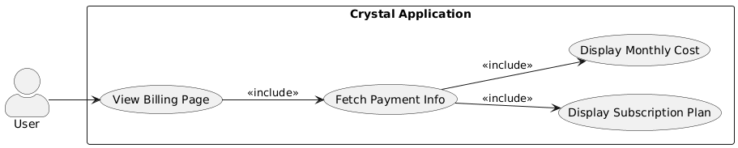
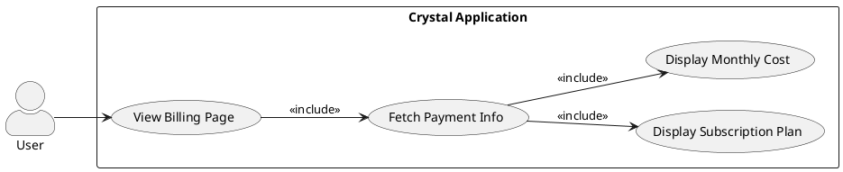
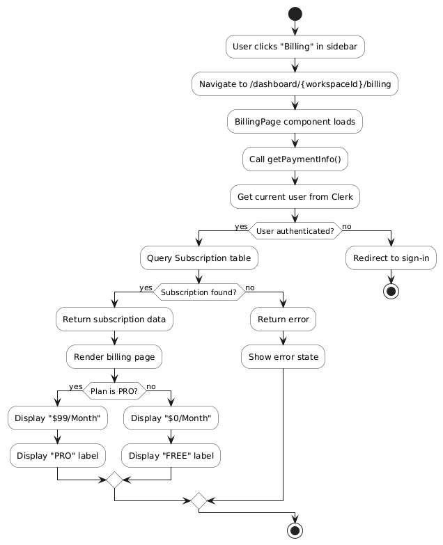
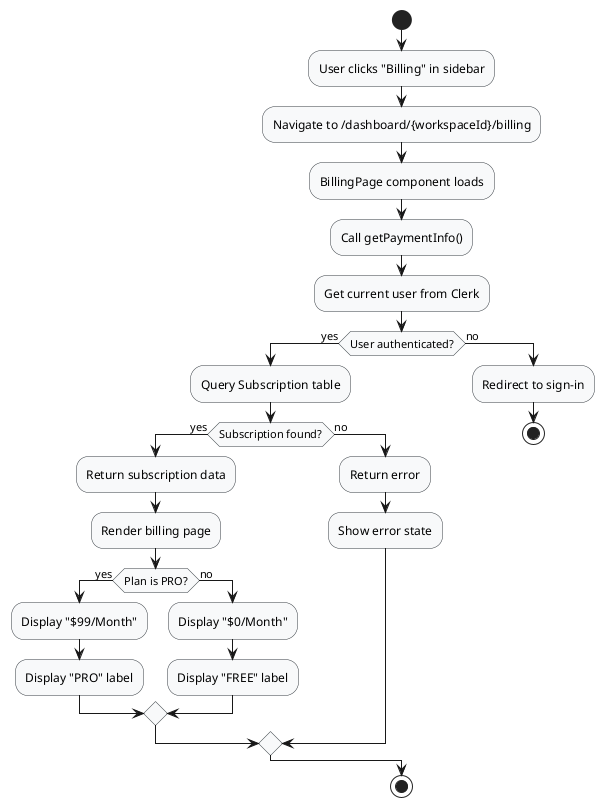
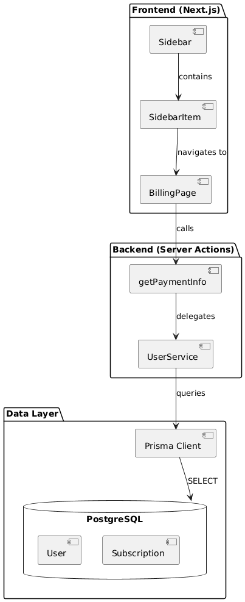
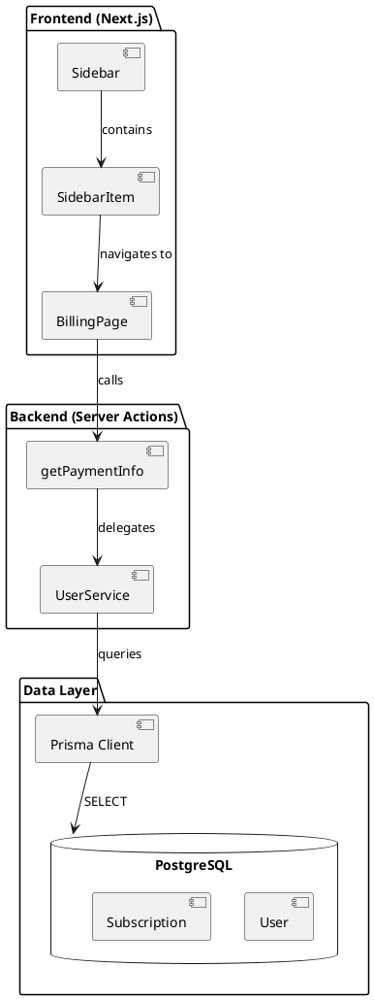
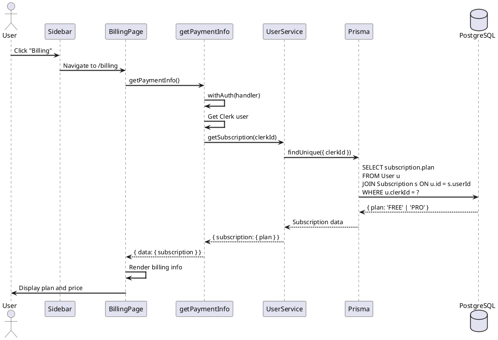
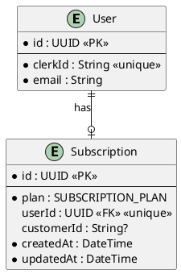

# Feature 2.1: View Subscription Plan and Billing Information

## Features Covered

| #   | Feature                                                       | Actor |
|-----|---------------------------------------------------------------|-------|
| 2.1 | User can view their subscription plan and billing information | User  |

## Overview

This feature allows authenticated users to view their current subscription plan and billing information. The billing page displays the subscription type (FREE or PRO) and the associated monthly cost.

---

## Use Case Diagram





---

## Use Case Description

| Field | Description |
|-------|-------------|
| **Use Case ID** | UC-2.1 |
| **Use Case Name** | View Subscription Plan and Billing Information |
| **Actor(s)** | User |
| **Description** | An authenticated user views their current subscription plan and billing details on the billing page. |
| **Preconditions** | User is authenticated and has a subscription record |
| **Trigger** | User clicks "Billing" in the sidebar navigation |
| **Main Flow** | 1. User clicks "Billing" in sidebar menu<br>2. System navigates to /dashboard/{workspaceId}/billing<br>3. System calls getPaymentInfo server action<br>4. System queries user's subscription data<br>5. Page renders with subscription plan and monthly cost<br>6. User sees their plan (FREE or PRO) and price ($0 or $99) |
| **Alternative Flows** | **A1: No subscription found**<br>4a. System returns error<br>4b. Page shows error or default state |
| **Postconditions** | User sees their current subscription status |
| **Exceptions** | Database unavailable; User not authenticated |

---

## Activity Diagram





---

## Component List

### Frontend Components

| Component | Description | Purpose | Type |
|-----------|-------------|---------|------|
| `BillingPage` | Billing information page | Display subscription and pricing | Next.js Server Component |
| `Sidebar` | Navigation sidebar | Provides link to billing page | React Client Component |
| `SidebarItem` | Navigation menu item | Billing menu entry | React Component |

### Backend Components

| Component | Description | Purpose | Type |
|-----------|-------------|---------|------|
| `getPaymentInfo` | Payment info fetcher | Query user's subscription | Server Action |
| `UserService.getSubscription` | Subscription query | Get subscription plan from DB | Service Function |

### External Services

| Service | Description | Purpose | Type |
|---------|-------------|---------|------|
| `PostgreSQL` | Database | Store subscription data | Database |

---

## Component/Module Diagram





---

## Sequence Diagram




---

## ERD and Schema

### Relevant Tables



### Prisma Schema

```prisma
model Subscription {
  id         String            @id @default(dbgenerated("gen_random_uuid()")) @db.Uuid
  User       User?             @relation(fields: [userId], references: [id])
  userId     String?           @unique @db.Uuid
  createdAt  DateTime          @default(now())
  plan       SUBSCRIPTION_PLAN @default(FREE)
  updatedAt  DateTime          @default(now())
  customerId String?           @unique
}

enum SUBSCRIPTION_PLAN {
  PRO
  FREE
}
```

---

## Code References

### Billing Page

**File:** `crystal-web-app/src/app/dashboard/[workspaceid]/billing/page.tsx`

```typescript
const BillingPage = async () => {
  const payment = await getPaymentInfo()

  return (
    <div className="bg-[#1D1D1D] flex flex-col gap-y-8 p-5 rounded-xl">
      <div>
        <h2 className="text-2xl">Current Plan</h2>
        <p className="text-[#9D9D9D]">Your Payment History</p>
      </div>
      <div>
        <h2 className="text-2xl">
          ${payment?.data?.subscription?.plan === 'PRO' ? '99' : '0'}/Month
        </h2>
        <p className="text-[#9D9D9D]">{payment?.data?.subscription?.plan}</p>
      </div>
    </div>
  )
}
```

### getPaymentInfo Server Action

**File:** `crystal-web-app/src/actions/user.ts`

```typescript
export const getPaymentInfo = async () => {
  return withAuth(async (clerkUser) => {
    const payment = await UserService.getSubscription(clerkUser.id)
    if (!payment) throw new Error('Payment info not found')
    return payment
  })
}
```

### UserService.getSubscription

**File:** `crystal-web-app/src/services/user.service.ts`

```typescript
async getSubscription(clerkId: string) {
  return client.user.findUnique({
    where: { clerkId },
    select: {
      subscription: {
        select: { plan: true },
      },
    },
  })
}
```

