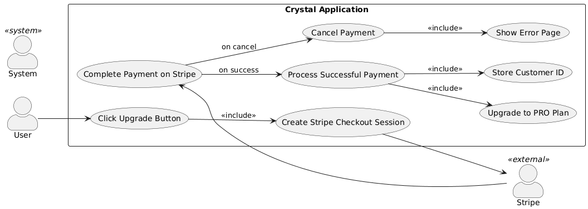
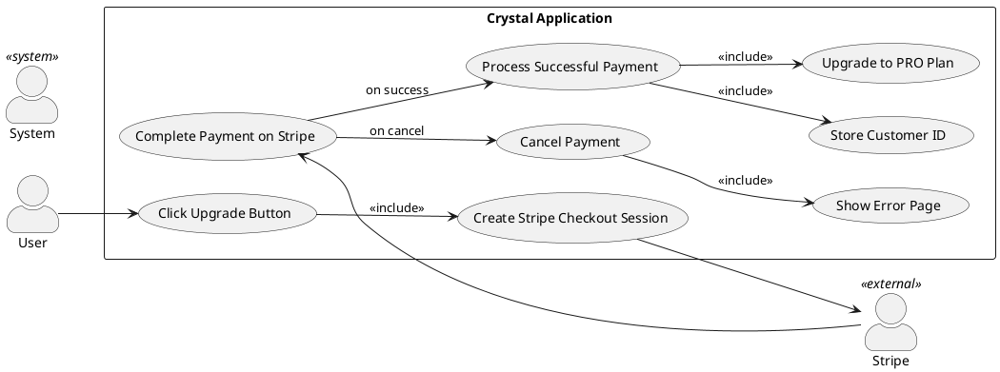
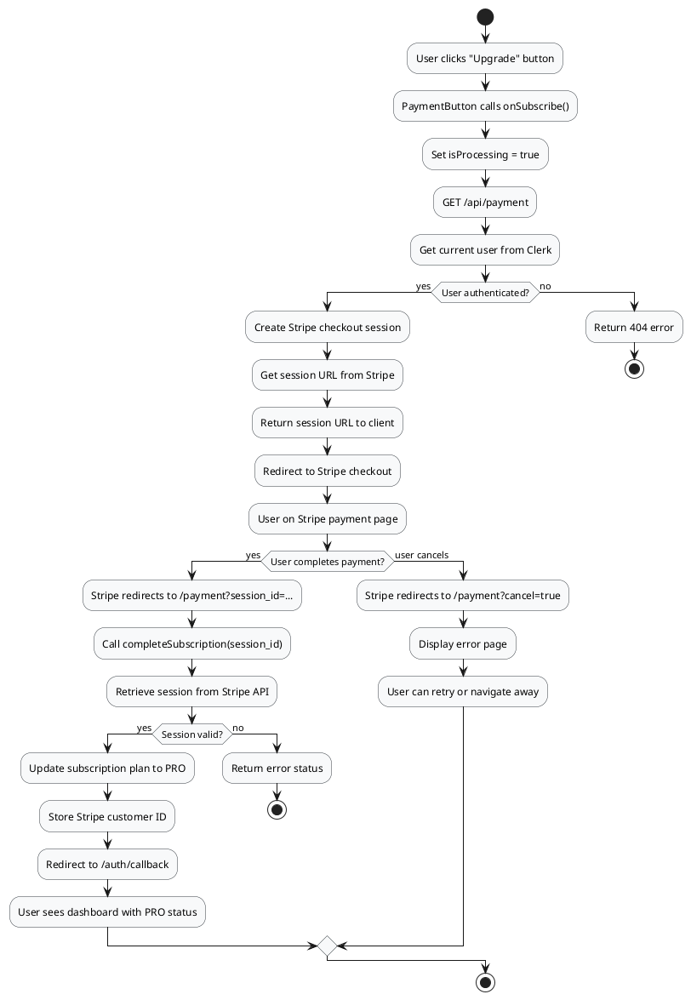
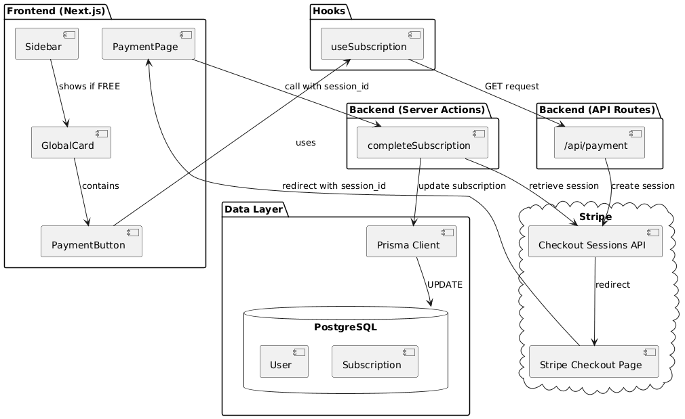
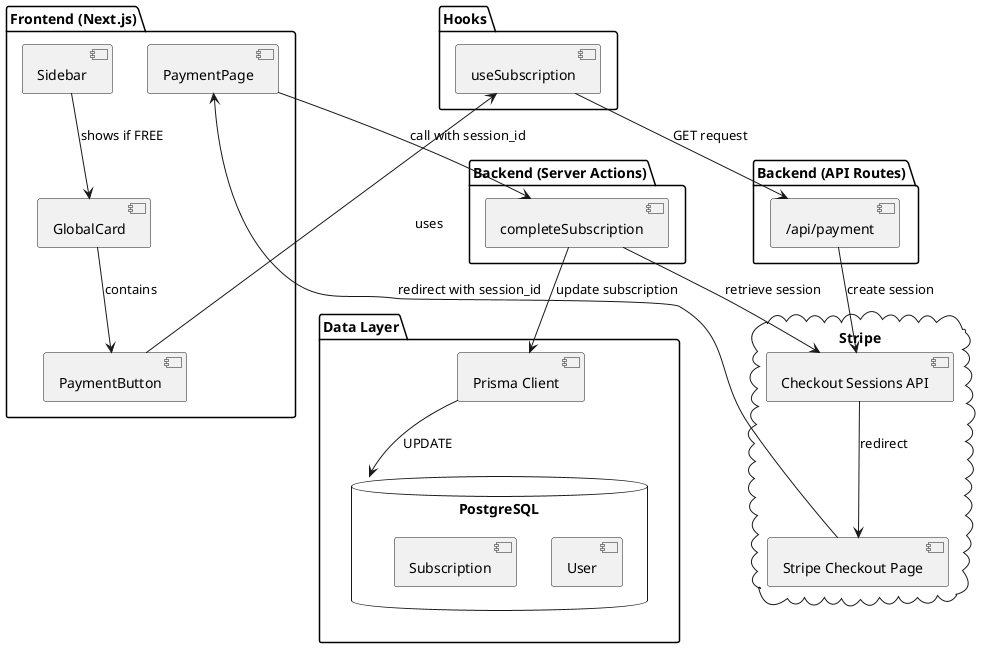
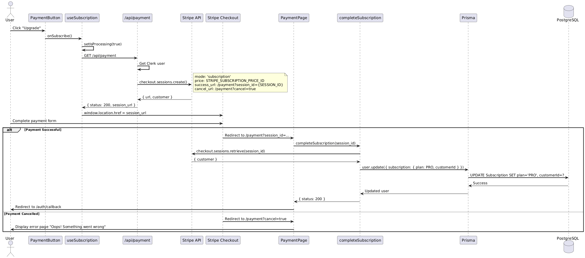
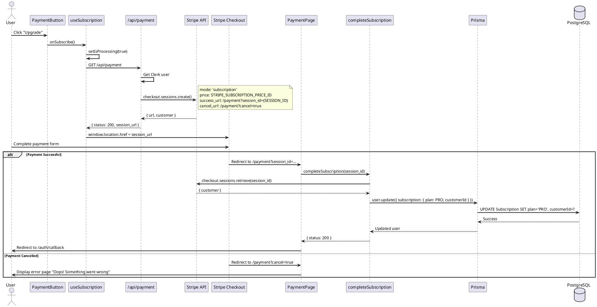
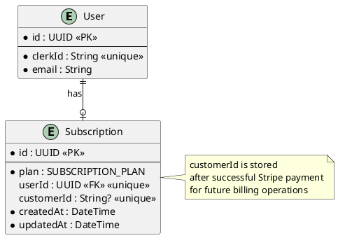

# Feature 2.2-2.4: Upgrade Subscription via Stripe

## Features Covered

| #   | Feature                                              | Actor  |
|-----|------------------------------------------------------|--------|
| 2.2 | User can upgrade to PRO subscription via Stripe checkout | User   |
| 2.3 | System stores Stripe customer ID for future billing  | System |
| 2.4 | User can cancel and return from payment page         | User   |

## Overview

This feature group covers the complete subscription upgrade flow. Users can upgrade from FREE to PRO via Stripe checkout. On successful payment, the system stores the Stripe customer ID and upgrades the subscription. If the user cancels, they're shown an error page and can retry.

---

## Use Case Diagram





---

## Use Case Description

| Field | Description |
|-------|-------------|
| **Use Case ID** | UC-2.2 |
| **Use Case Name** | Upgrade to PRO Subscription via Stripe |
| **Actor(s)** | User, Stripe (external), System |
| **Description** | A FREE user upgrades to PRO subscription by completing a Stripe checkout. The system stores the customer ID and updates the subscription plan. |
| **Preconditions** | User is authenticated; User has FREE subscription; Stripe is configured |
| **Trigger** | User clicks "Upgrade" button |
| **Main Flow** | 1. User clicks "Upgrade" button<br>2. PaymentButton calls useSubscription hook<br>3. Hook calls /api/payment endpoint<br>4. API creates Stripe checkout session<br>5. User is redirected to Stripe checkout page<br>6. User completes payment on Stripe<br>7. Stripe redirects to /payment?session_id=...<br>8. System calls completeSubscription with session ID<br>9. System retrieves Stripe session details<br>10. System updates subscription to PRO<br>11. System stores Stripe customer ID<br>12. User is redirected to auth callback |
| **Alternative Flows** | **A1: User cancels on Stripe**<br>6a. User clicks cancel on Stripe<br>6b. Stripe redirects to /payment?cancel=true<br>6c. System displays error page<br>6d. User can retry or navigate away |
| **Postconditions** | Success: User has PRO subscription and customer ID stored<br>Cancel: User remains on FREE plan |
| **Exceptions** | Stripe API error; Payment declined; Database update failure |

---

## Activity Diagram




---

## Component List

### Frontend Components

| Component | Description | Purpose | Type |
|-----------|-------------|---------|------|
| `PaymentButton` | Upgrade button | Trigger subscription upgrade | React Component |
| `Loader` | Loading spinner | Show processing state | React Component |
| `GlobalCard` | Upgrade prompt card | Container for upgrade CTA | React Component |
| `PaymentPage` | Payment result page | Handle success/cancel redirects | Next.js Server Component |

### Backend Components

| Component | Description | Purpose | Type |
|-----------|-------------|---------|------|
| `useSubscription` | Payment hook | Manage payment flow and state | React Hook |
| `GET /api/payment` | Payment API route | Create Stripe checkout session | Next.js API Route |
| `completeSubscription` | Subscription updater | Update plan and store customer ID | Server Action |

### External Services

| Service | Description | Purpose | Type |
|---------|-------------|---------|------|
| `Stripe` | Payment processor | Handle checkout and payment | External SaaS |
| `Stripe Checkout` | Payment UI | Secure payment form | External UI |
| `PostgreSQL` | Database | Store subscription updates | Database |

---

## Component/Module Diagram





---

## Sequence Diagram





---

## ERD and Schema

### Relevant Tables



### Prisma Schema

```prisma
model Subscription {
  id         String            @id @default(dbgenerated("gen_random_uuid()")) @db.Uuid
  User       User?             @relation(fields: [userId], references: [id])
  userId     String?           @unique @db.Uuid
  createdAt  DateTime          @default(now())
  plan       SUBSCRIPTION_PLAN @default(FREE)
  updatedAt  DateTime          @default(now())
  customerId String?           @unique  // Stripe customer ID (Feature 2.3)
}

enum SUBSCRIPTION_PLAN {
  PRO
  FREE
}
```

---

## Code References

### PaymentButton Component

**File:** `crystal-web-app/src/components/global/payment-button.tsx`

```typescript
const PaymentButton = () => {
  const { onSubscribe, isProcessing } = useSubscription()

  return (
    <Button className="text-sm w-full" onClick={onSubscribe}>
      <Loader color="#000" state={isProcessing}>
        Upgrade
      </Loader>
    </Button>
  )
}
```

### useSubscription Hook

**File:** `crystal-web-app/src/hooks/useSubscription.ts`

```typescript
export const useSubscription = () => {
  const [isProcessing, setIsProcessing] = useState(false)
  
  const onSubscribe = async () => {
    setIsProcessing(true)
    try {
      const response = await axios.get('/api/payment')
      if (response.data.status === 200) {
        return (window.location.href = `${response.data.session_url}`)
      }
      setIsProcessing(false)
    } catch (error) {
      console.log(error)
    }
  }
  
  return { onSubscribe, isProcessing }
}
```

### Payment API Route

**File:** `crystal-web-app/src/app/api/payment/route.ts`

```typescript
export async function GET() {
  const user = await currentUser()
  if (!user) return NextResponse.json({ status: 404 })
  
  const priceId = process.env.STRIPE_SUBSCRIPTION_PRICE_ID
  const session = await stripe.checkout.sessions.create({
    mode: 'subscription',
    line_items: [{ price: priceId, quantity: 1 }],
    success_url: `${process.env.NEXT_PUBLIC_HOST_URL}/payment?session_id={CHECKOUT_SESSION_ID}`,
    cancel_url: `${process.env.NEXT_PUBLIC_HOST_URL}/payment?cancel=true`,
  })

  return NextResponse.json({
    status: 200,
    session_url: session.url,
    customer_id: session.customer,
  })
}
```

### completeSubscription Server Action

**File:** `crystal-web-app/src/actions/user.ts`

```typescript
export const completeSubscription = async (session_id: string) => {
  try {
    const user = await currentUser()
    if (!user) return { status: 404 }
    
    const session = await stripe.checkout.sessions.retrieve(session_id)
    if (session) {
      const customer = await client.user.update({
        where: { clerkId: user.id },
        data: {
          subscription: {
            update: {
              data: {
                customerId: session.customer as string,  // Feature 2.3
                plan: 'PRO',                             // Feature 2.2
              },
            },
          },
        },
      })
      if (customer) return { status: 200 }
    }
    return { status: 404 }
  } catch (error) {
    return { status: 400 }
  }
}
```

### Payment Page (Success/Cancel Handler)

**File:** `crystal-web-app/src/app/payment/page.tsx`

```typescript
const page = async ({ searchParams }: Props) => {
  const { cancel, session_id } = await searchParams

  // Feature 2.2: Successful payment
  if (session_id) {
    const customer = await completeSubscription(session_id)
    if (customer.status === 200) {
      return redirect('/auth/callback')
    }
  }

  // Feature 2.4: Cancelled payment
  if (cancel) {
    return (
      <div className="flex flex-col justify-center items-center h-screen w-full">
        <h4 className="text-5xl font-bold">404</h4>
        <p className="text-xl text-center">Oops! Something went wrong</p>
      </div>
    )
  }
}
```

