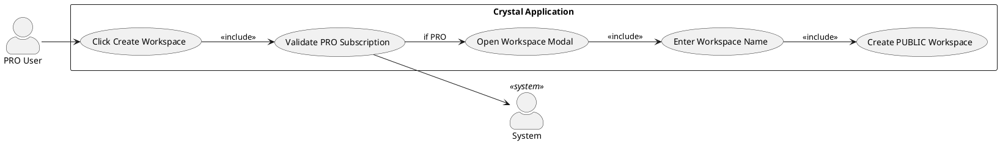
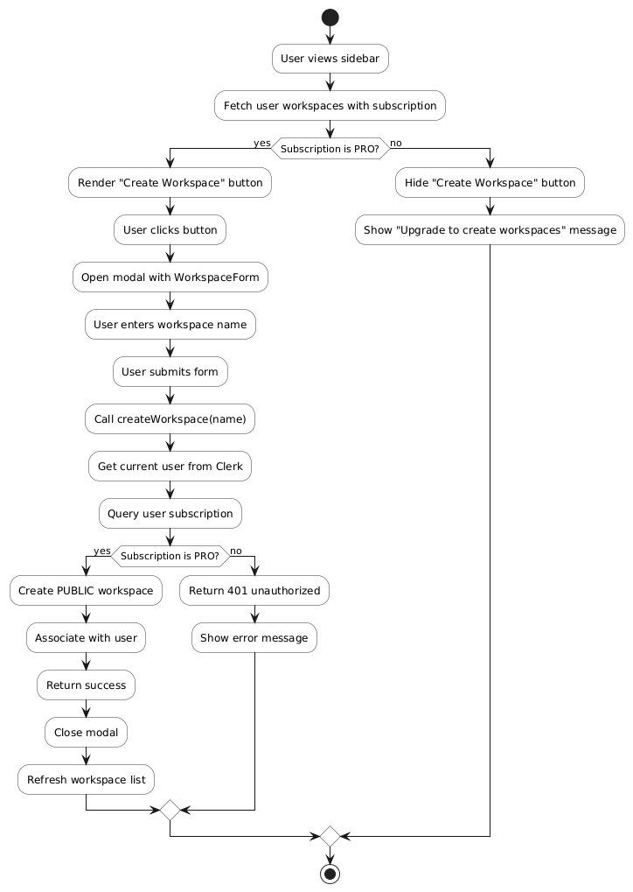
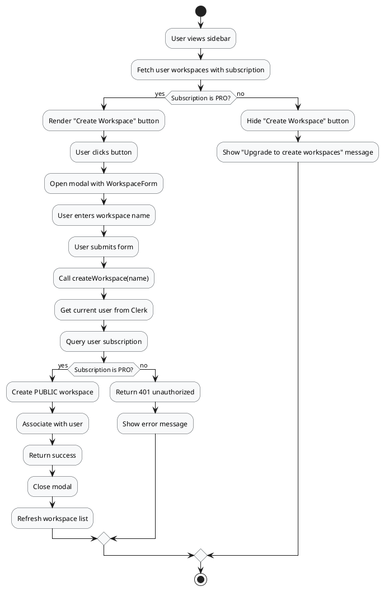
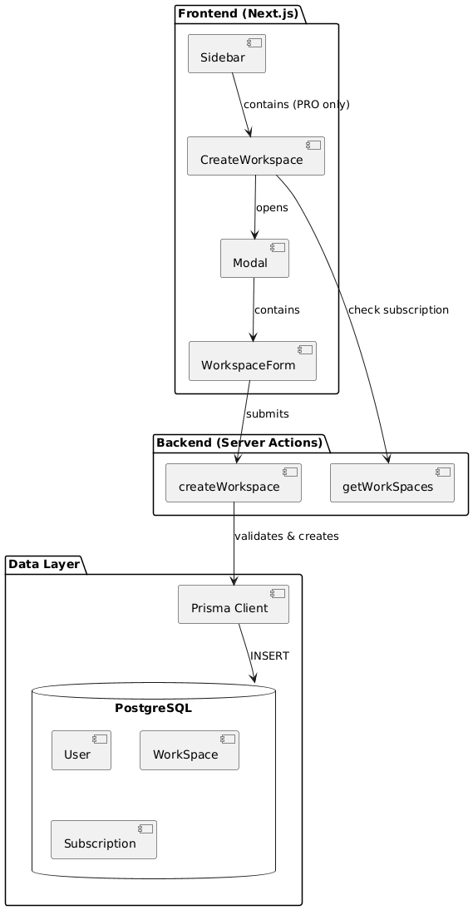
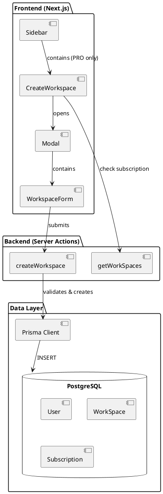
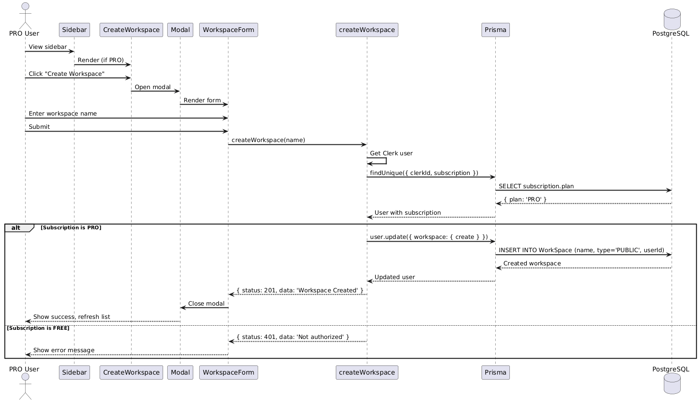
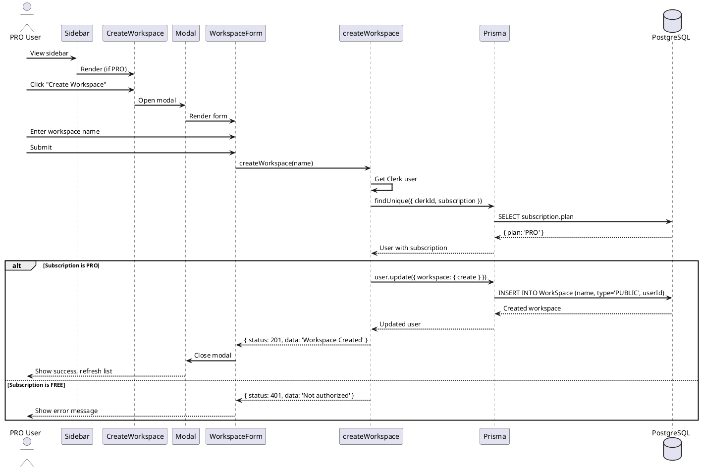
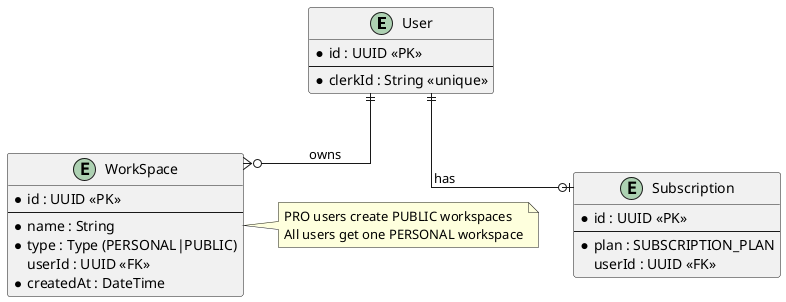

# Feature 3.1: Create New Public Workspace

## Features Covered

| #   | Feature                                    | Actor    |
|-----|--------------------------------------------|----------|
| 3.1 | PRO user can create a new public workspace | PRO User |

## Overview

This feature allows PRO subscription users to create additional public workspaces for team collaboration. FREE users only have their default personal workspace. The create workspace button is only visible to PRO users.

---

## Use Case Diagram




---

## Use Case Description

| Field | Description |
|-------|-------------|
| **Use Case ID** | UC-3.1 |
| **Use Case Name** | Create New Public Workspace |
| **Actor(s)** | PRO User, System |
| **Description** | A PRO user creates a new public workspace for team collaboration. |
| **Preconditions** | User is authenticated; User has PRO subscription |
| **Trigger** | User clicks "Create Workspace" button in sidebar |
| **Main Flow** | 1. User views sidebar<br>2. System checks subscription (PRO)<br>3. System shows "Create Workspace" button<br>4. User clicks button<br>5. Modal opens with workspace form<br>6. User enters workspace name<br>7. User submits form<br>8. System validates PRO subscription<br>9. System creates PUBLIC workspace<br>10. Modal closes, workspace appears in sidebar |
| **Alternative Flows** | **A1: FREE user**<br>2a. System detects FREE subscription<br>2b. Create button not rendered<br>2c. User cannot create workspace |
| **Postconditions** | New PUBLIC workspace created and associated with user |
| **Exceptions** | Subscription validation fails; Database error; Invalid workspace name |

---

## Activity Diagram





---

## Component List

### Frontend Components

| Component | Description | Purpose | Type |
|-----------|-------------|---------|------|
| `CreateWorkspace` | Create workspace button + modal trigger | Show create button for PRO users | React Client Component |
| `Modal` | Modal container | Display workspace creation form | React Component |
| `WorkspaceForm` | Workspace creation form | Input for workspace name | React Form Component |
| `Sidebar` | Navigation sidebar | Contains create button | React Client Component |

### Backend Components

| Component | Description | Purpose | Type |
|-----------|-------------|---------|------|
| `createWorkspace` | Workspace creator | Validate PRO and create workspace | Server Action |
| `getWorkSpaces` | Workspace fetcher | Fetch subscription for conditional render | Server Action |

---

## Component/Module Diagram





---

## Sequence Diagram





---

## ERD and Schema



---

## Code References

### CreateWorkspace Component

**File:** `crystal-web-app/src/components/global/create-workspace.tsx`

```typescript
function CreateWorkspace() {
  const { data } = useQueryData(['user-workspaces'], getWorkSpaces)
  const { data: plan } = data as { data: { subscription: { plan: SubscriptionPlan } } }

  // Only render for PRO users
  if (plan?.subscription?.plan !== 'PRO') {
    return null
  }

  return (
    <Modal
      trigger={<Button><Add /> Create Workspace</Button>}
      title="Create Workspace"
      description="Create a new workspace for your team"
    >
      <WorkspaceForm />
    </Modal>
  )
}
```

### createWorkspace Server Action

**File:** `crystal-web-app/src/actions/workspace.ts`

```typescript
export const createWorkspace = async (name: string) => {
  try {
    const user = await currentUser()
    if (!user) return { status: 404 }
    
    const authorized = await client.user.findUnique({
      where: { clerkId: user.id },
      select: { subscription: { select: { plan: true } } },
    })
    
    if (authorized?.subscription?.plan === 'PRO') {
      const workspace = await client.user.update({
        where: { clerkId: user.id },
        data: {
          workspace: {
            create: { name, type: 'PUBLIC' },
          },
        },
      })
      if (workspace) return { status: 201, data: 'Workspace Created' }
    }
    
    return { status: 401, data: 'You are not authorized to create a workspace.' }
  } catch (error) {
    return { status: 400 }
  }
}
```

