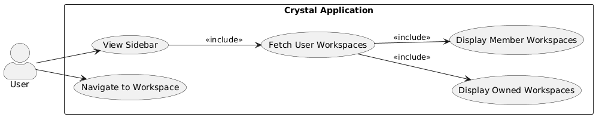
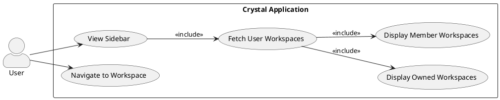
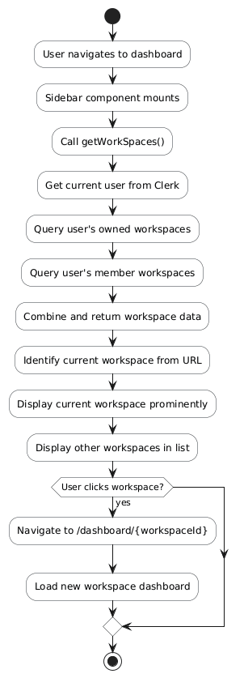
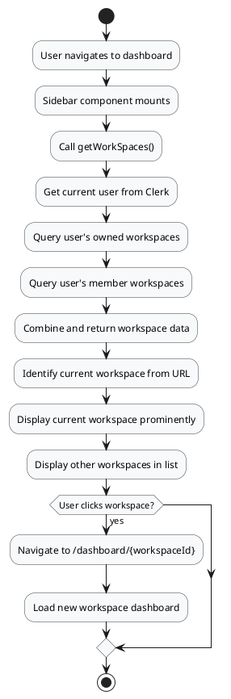
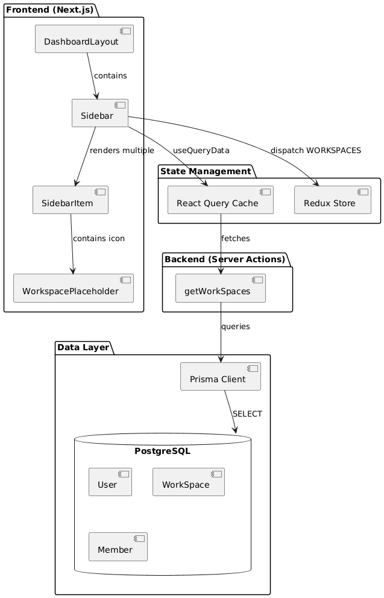
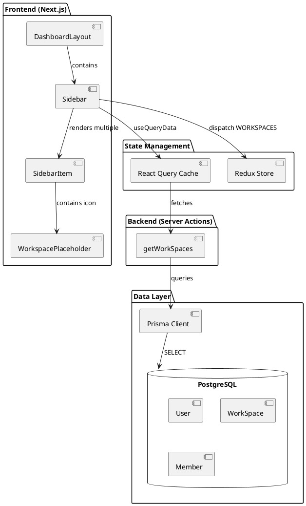
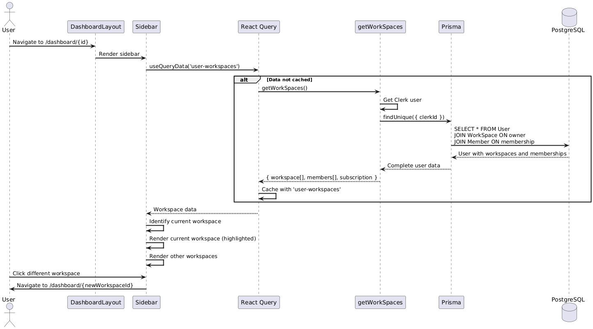
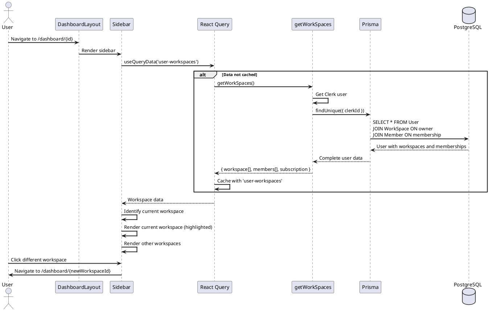
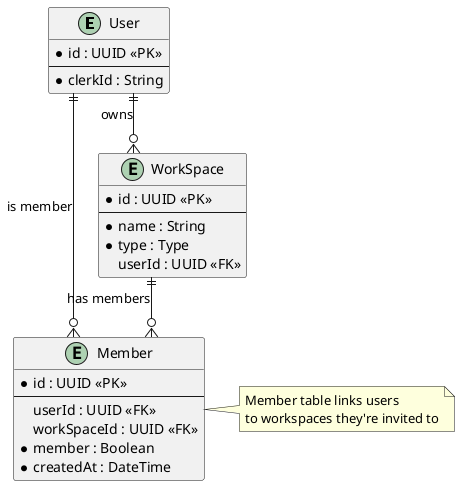

# Feature 3.2: View and Access Workspaces

## Features Covered

| #   | Feature                                                     | Actor |
|-----|-------------------------------------------------------------|-------|
| 3.2 | User can view and access their workspaces (owned and member of) | User  |

## Overview

This feature allows users to view all workspaces they have access to - both workspaces they own and workspaces they've been invited to as members. The workspace list is displayed in the sidebar with easy navigation.

---

## Use Case Diagram





---

## Use Case Description

| Field | Description |
|-------|-------------|
| **Use Case ID** | UC-3.2 |
| **Use Case Name** | View and Access Workspaces |
| **Actor(s)** | User |
| **Description** | A user views all workspaces they have access to (owned and member) in the sidebar and can navigate to any of them. |
| **Preconditions** | User is authenticated |
| **Trigger** | User navigates to any dashboard page |
| **Main Flow** | 1. User navigates to dashboard<br>2. Sidebar component loads<br>3. System calls getWorkSpaces server action<br>4. System queries owned workspaces<br>5. System queries member workspaces<br>6. Sidebar renders current workspace prominently<br>7. Sidebar renders other workspaces in list<br>8. User clicks on a workspace<br>9. System navigates to workspace dashboard |
| **Postconditions** | User can see and navigate to all accessible workspaces |
| **Exceptions** | Database unavailable; User has no workspaces (shouldn't happen - all users get default) |

---

## Activity Diagram





---

## Component List

### Frontend Components

| Component | Description | Purpose | Type |
|-----------|-------------|---------|------|
| `Sidebar` | Main navigation sidebar | Display workspace list | React Client Component |
| `SidebarItem` | Workspace navigation item | Individual workspace link | React Component |
| `WorkspacePlaceholder` | Workspace icon | Visual indicator for workspace type | React Component |

### Backend Components

| Component | Description | Purpose | Type |
|-----------|-------------|---------|------|
| `getWorkSpaces` | Workspace fetcher | Query owned and member workspaces | Server Action |

---

## Component/Module Diagram





---

## Sequence Diagram





---

## ERD and Schema



---

## Code References

### getWorkSpaces Server Action

**File:** `crystal-web-app/src/actions/workspace.ts`

```typescript
export const getWorkSpaces = async () => {
  return withAuth(async (clerkUser) => {
    const user = await client.user.findUnique({
      where: { clerkId: clerkUser.id },
      select: {
        subscription: { select: { plan: true } },
        workspace: {
          select: {
            id: true,
            name: true,
            type: true,
          },
        },
        members: {
          select: {
            WorkSpace: {
              select: {
                id: true,
                name: true,
                type: true,
              },
            },
          },
        },
      },
    })
    
    if (!user) throw new Error('User not found')
    return user
  })
}
```

### Sidebar Workspace Rendering

**File:** `crystal-web-app/src/components/global/sidebar/sidebar.tsx`

```typescript
// Current workspace (highlighted)
{currentWorkspace && (
  <SidebarItem
    href={`/dashboard/${currentWorkspace.id}`}
    selected={pathName === `/dashboard/${currentWorkspace.id}`}
    title={currentWorkspace.name}
    icon={
      <WorkspacePlaceholder type={currentWorkspace.type}>
        {currentWorkspace.name.charAt(0)}
      </WorkspacePlaceholder>
    }
  />
)}

// Other workspaces
{workspace.workspace.map((item) =>
  item !== currentWorkspace && (
    <SidebarItem
      href={`/dashboard/${item.id}`}
      selected={pathName === `/dashboard/${item.id}`}
      title={item.name}
      icon={
        <WorkspacePlaceholder type={item.type}>
          {item.name.charAt(0)}
        </WorkspacePlaceholder>
      }
    />
  )
)}
```

