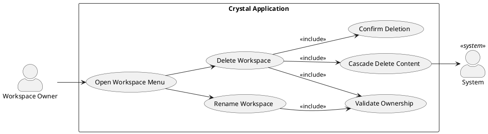
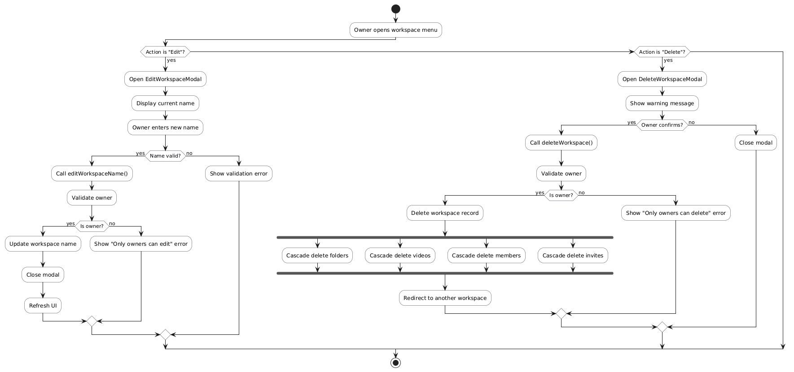
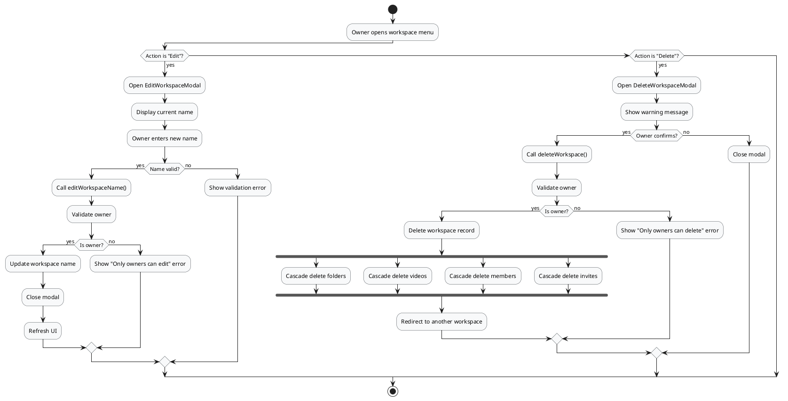
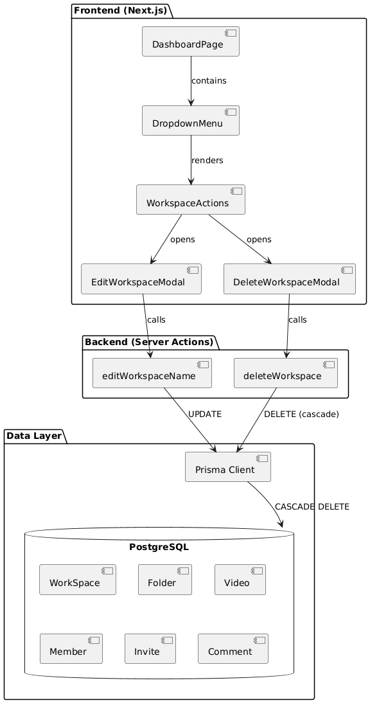
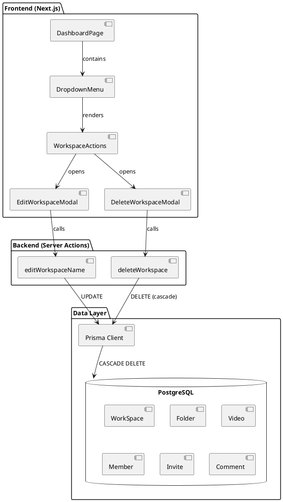
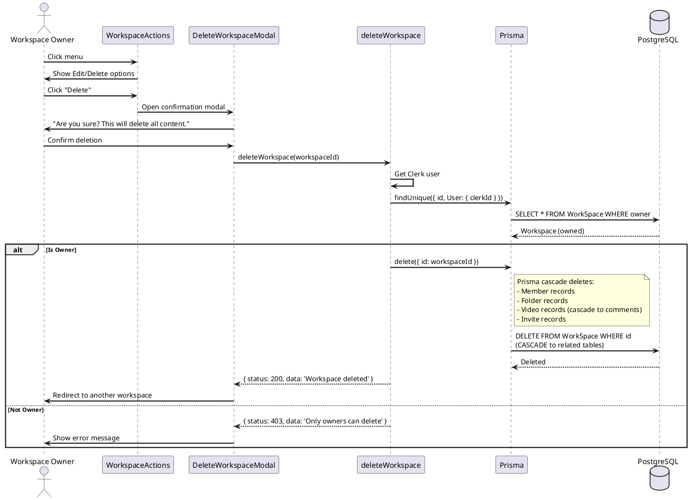
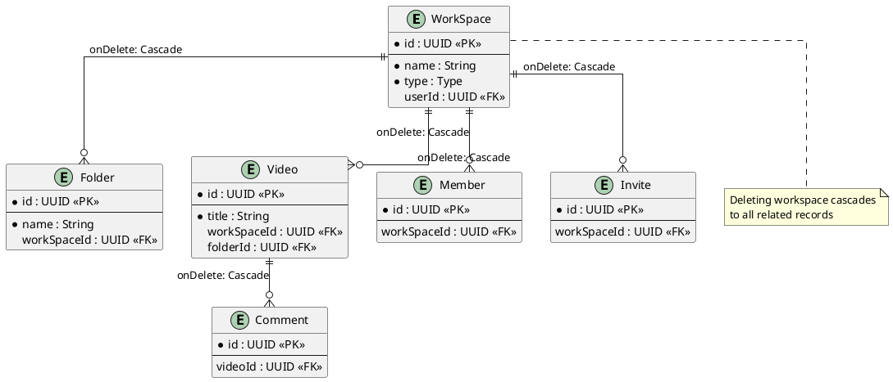

# Feature 3.3-3.5: Manage Workspace (Rename & Delete)

## Features Covered

| #   | Feature                                                                            | Actor           |
|-----|------------------------------------------------------------------------------------|-----------------|
| 3.3 | Workspace owner can rename their workspace                                         | Workspace Owner |
| 3.4 | Workspace owner can delete their workspace                                         | Workspace Owner |
| 3.5 | System cascades deletion of workspace content (folders, videos, members, comments) | System          |

## Overview

This feature group covers workspace management actions available only to workspace owners. Owners can rename their workspace or delete it entirely. When a workspace is deleted, all associated content (folders, videos, members, comments, invitations) is automatically cascade deleted.

---

## Use Case Diagram




---

## Use Case Description

### UC-3.3: Rename Workspace

| Field | Description |
|-------|-------------|
| **Use Case ID** | UC-3.3 |
| **Use Case Name** | Rename Workspace |
| **Actor(s)** | Workspace Owner |
| **Description** | A workspace owner changes the name of their workspace. |
| **Preconditions** | User is authenticated; User owns the workspace |
| **Trigger** | Owner clicks "Edit" from workspace menu |
| **Main Flow** | 1. Owner opens workspace dropdown menu<br>2. Owner clicks "Edit"<br>3. Edit modal opens with current name<br>4. Owner enters new name<br>5. Owner clicks "Save"<br>6. System validates ownership<br>7. System updates workspace name<br>8. Modal closes, UI updates |
| **Postconditions** | Workspace name updated in database and UI |
| **Exceptions** | Empty name; Name too long (>100 chars); Not owner |

### UC-3.4/3.5: Delete Workspace with Cascade

| Field | Description |
|-------|-------------|
| **Use Case ID** | UC-3.4 |
| **Use Case Name** | Delete Workspace with Cascade Deletion |
| **Actor(s)** | Workspace Owner, System |
| **Description** | A workspace owner deletes their workspace, triggering cascade deletion of all related content. |
| **Preconditions** | User is authenticated; User owns the workspace |
| **Trigger** | Owner clicks "Delete" from workspace menu |
| **Main Flow** | 1. Owner opens workspace dropdown menu<br>2. Owner clicks "Delete"<br>3. Confirmation modal appears with warning<br>4. Owner confirms deletion<br>5. System validates ownership<br>6. System deletes workspace record<br>7. Prisma cascade deletes: folders, videos, members, comments, invites<br>8. Owner redirected to another workspace |
| **Postconditions** | Workspace and all related content permanently deleted |
| **Exceptions** | Not owner; Database error; Last workspace (edge case) |

---

## Activity Diagram





---

## Component List

### Frontend Components

| Component | Description | Purpose | Type |
|-----------|-------------|---------|------|
| `WorkspaceActions` | Action dropdown menu | Show edit/delete options for owners | React Client Component |
| `EditWorkspaceModal` | Rename modal | Form for updating workspace name | React Component |
| `DeleteWorkspaceModal` | Delete confirmation | Confirm and execute deletion | React Component |
| `DropdownMenu` | Menu container | Workspace action menu | Shadcn UI Component |
| `AlertDialog` | Confirmation dialog | Warn before destructive action | Shadcn UI Component |

### Backend Components

| Component | Description | Purpose | Type |
|-----------|-------------|---------|------|
| `editWorkspaceName` | Rename handler | Validate owner and update name | Server Action |
| `deleteWorkspace` | Delete handler | Validate owner and delete workspace | Server Action |
| `WorkspaceService.updateName` | Name updater | Update workspace name in DB | Service Function |
| `WorkspaceService.delete` | Workspace deleter | Delete workspace (triggers cascade) | Service Function |

---

## Component/Module Diagram





---

## Sequence Diagram




---

## ERD and Schema



### Prisma Schema (Cascade Relations)

```prisma
model WorkSpace {
  id        String   @id @default(dbgenerated("gen_random_uuid()")) @db.Uuid
  type      Type
  name      String
  User      User?    @relation(fields: [userId], references: [id])
  userId    String?  @db.Uuid
  folders   Folder[]   // Cascade via Folder model
  videos    Video[]    // Cascade via Video model
  members   Member[]   // Cascade via Member model
  invite    Invite[]   // Cascade via Invite model
}

model Folder {
  WorkSpace   WorkSpace? @relation(fields: [workSpaceId], references: [id], onDelete: Cascade)
  workSpaceId String?    @db.Uuid
}

model Video {
  WorkSpace   WorkSpace? @relation(fields: [workSpaceId], references: [id], onDelete: Cascade)
  workSpaceId String?    @db.Uuid
}

model Member {
  WorkSpace   WorkSpace? @relation(fields: [workSpaceId], references: [id], onDelete: Cascade)
  workSpaceId String?    @db.Uuid
}
```

---

## Code References

### deleteWorkspace Server Action

**File:** `crystal-web-app/src/actions/workspace.ts`

```typescript
export const deleteWorkspace = async (workspaceId: string) => {
  try {
    const user = await currentUser()
    if (!user) return { status: 404, data: 'User not authenticated' }
    
    // Verify current user is the workspace owner
    const workspace = await client.workSpace.findUnique({
      where: {
        id: workspaceId,
        User: { clerkId: user.id }
      },
      select: { id: true, name: true }
    })
    
    if (!workspace) {
      return { status: 403, data: 'Only workspace owners can delete workspaces' }
    }
    
    // Delete the workspace (cascade will handle related data)
    const deletedWorkspace = await client.workSpace.delete({
      where: { id: workspaceId }
    })
    
    if (deletedWorkspace) {
      return { status: 200, data: 'Workspace deleted successfully' }
    }
    
    return { status: 404, data: 'Workspace not found' }
  } catch (error) {
    return { status: 500, data: 'Failed to delete workspace' }
  }
}
```

### editWorkspaceName Server Action

**File:** `crystal-web-app/src/actions/workspace.ts`

```typescript
export const editWorkspaceName = async (workspaceId: string, newName: string) => {
  try {
    const user = await currentUser()
    if (!user) return { status: 404, data: 'User not authenticated' }
    
    if (!newName || newName.trim().length === 0) {
      return { status: 400, data: 'Workspace name cannot be empty' }
    }
    
    // Verify current user is the workspace owner
    const workspace = await client.workSpace.findUnique({
      where: {
        id: workspaceId,
        User: { clerkId: user.id }
      }
    })
    
    if (!workspace) {
      return { status: 403, data: 'Only workspace owners can edit workspace name' }
    }
    
    // Update the workspace name
    const updatedWorkspace = await client.workSpace.update({
      where: { id: workspaceId },
      data: { name: newName.trim() }
    })
    
    if (updatedWorkspace) {
      return { status: 200, data: 'Workspace name updated successfully' }
    }
    
    return { status: 404, data: 'Workspace not found' }
  } catch (error) {
    return { status: 500, data: 'Failed to update workspace name' }
  }
}
```

