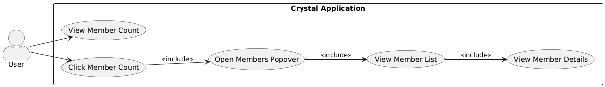
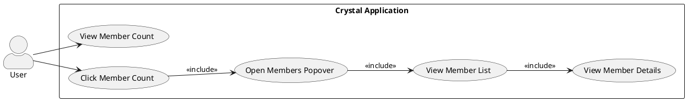
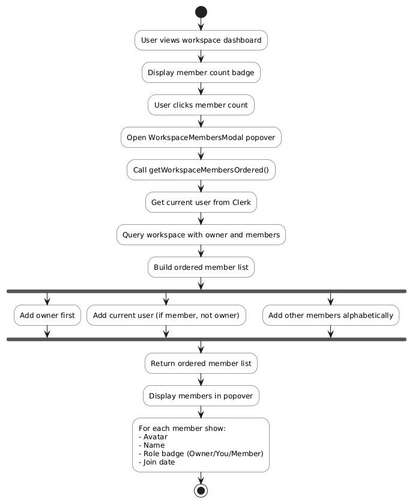
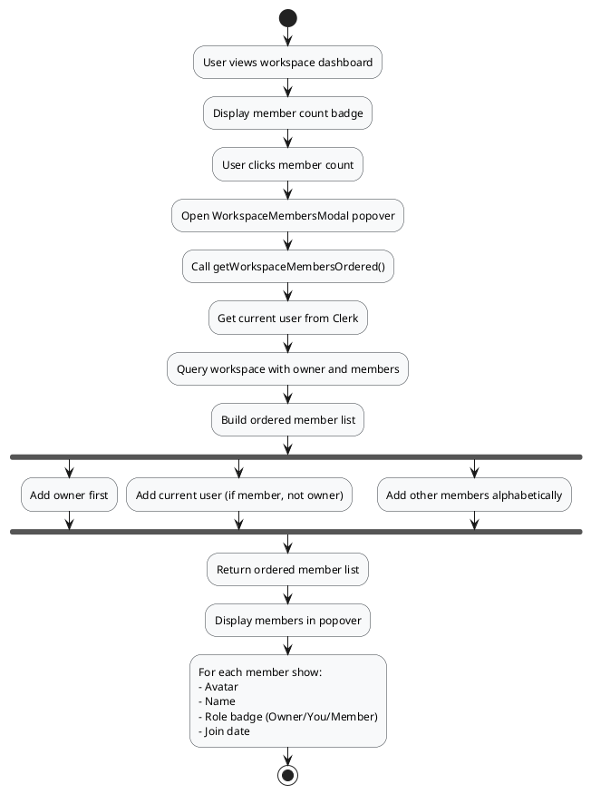
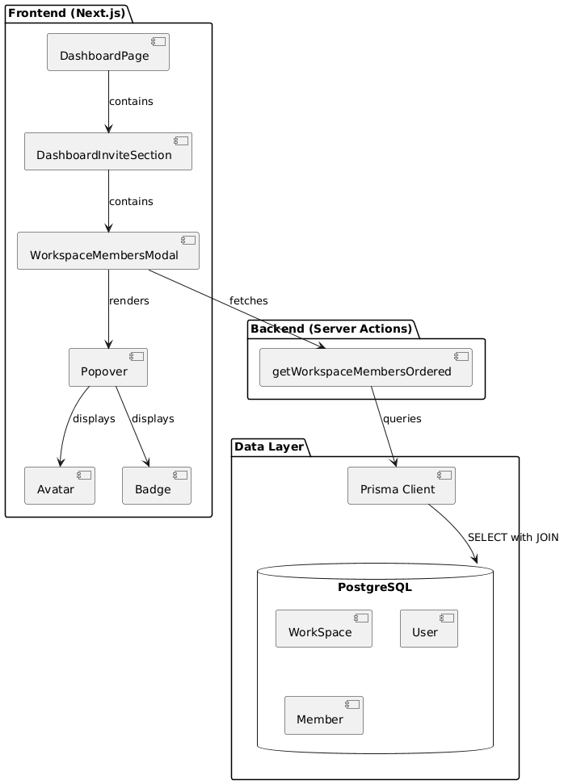
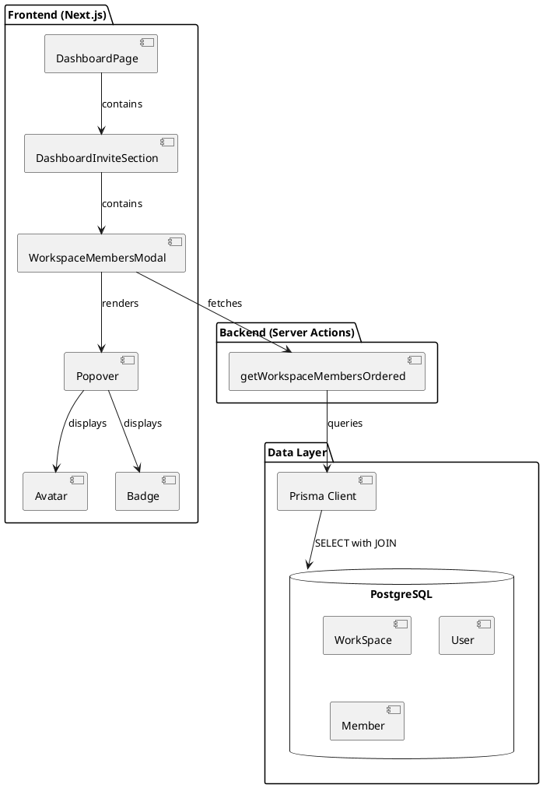
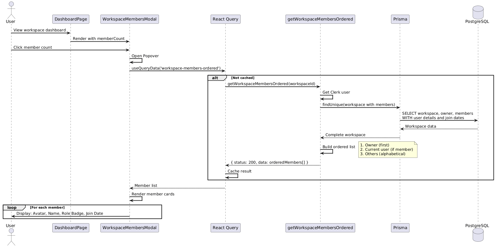
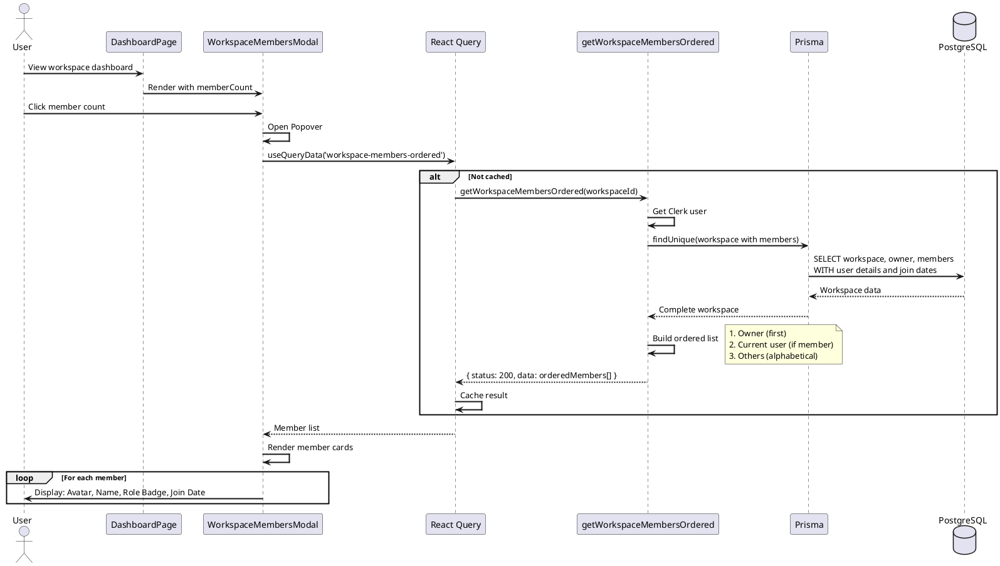
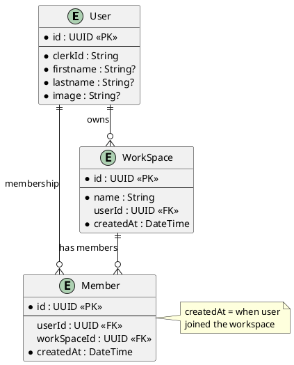

# Feature 3.6: View Workspace Members

## Features Covered

| #   | Feature                                           | Actor |
|-----|---------------------------------------------------|-------|
| 3.6 | User can view workspace members list and member count | User  |

## Overview

This feature allows users to view all members of a workspace, including the owner and invited members. The member count is displayed on the dashboard, and clicking it opens a popover with the full member list showing names, avatars, roles, and join dates.

---

## Use Case Diagram





---

## Use Case Description

| Field | Description |
|-------|-------------|
| **Use Case ID** | UC-3.6 |
| **Use Case Name** | View Workspace Members |
| **Actor(s)** | User |
| **Description** | A user views all members of a workspace they have access to, including the owner and invited members. |
| **Preconditions** | User is authenticated; User has access to workspace (owner or member) |
| **Trigger** | User clicks on member count in dashboard header |
| **Main Flow** | 1. User views workspace dashboard<br>2. System displays member count badge<br>3. User clicks member count<br>4. System fetches ordered member list<br>5. Popover opens with member list<br>6. User sees: Owner (first), themselves (if member), other members (alphabetical)<br>7. Each member shows: avatar, name, role badge, join date |
| **Postconditions** | User can see all workspace members and their details |
| **Exceptions** | No access to workspace; Database error |

---

## Activity Diagram





---

## Component List

### Frontend Components

| Component | Description | Purpose | Type |
|-----------|-------------|---------|------|
| `DashboardInviteSection` | Header section with member count | Display count and trigger popover | React Component |
| `WorkspaceMembersModal` | Members popover | Display ordered member list | React Client Component |
| `Popover` | Popover container | Floating member list UI | Shadcn UI Component |
| `Avatar` | Member avatar | Display user profile image | Shadcn UI Component |
| `Badge` | Role indicator | Show Owner/You/Member role | Shadcn UI Component |
| `ScrollArea` | Scrollable container | Handle long member lists | Shadcn UI Component |

### Backend Components

| Component | Description | Purpose | Type |
|-----------|-------------|---------|------|
| `getWorkspaceMembersOrdered` | Member list fetcher | Query and order workspace members | Server Action |
| `WorkspaceService.getMemberCount` | Count fetcher | Get member count for display | Service Function |

---

## Component/Module Diagram





---

## Sequence Diagram





---

## ERD and Schema



---

## Code References

### WorkspaceMembersModal Component

**File:** `crystal-web-app/src/components/global/workspace/workspace-members-modal.tsx`

```typescript
function WorkspaceMembersModal({ workspaceId, memberCount }: Props) {
  const { data: membersData } = useQueryData(
    ['workspace-members-ordered', workspaceId],
    () => getWorkspaceMembersOrdered(workspaceId)
  )
  
  const members = membersData?.data || []

  return (
    <Popover>
      <PopoverTrigger>
        <button className="flex items-center gap-2">
          <Users size={20} />
          <span>{memberCount}</span>
        </button>
      </PopoverTrigger>
      
      <PopoverContent className="w-[400px]">
        <div className="p-4 border-b">
          <h3>Workspace Members ({members.length})</h3>
        </div>
        
        <ScrollArea className="max-h-[350px]">
          {members.map((member) => (
            <div key={member.id} className="flex items-center gap-3 p-3">
              <Avatar>
                <AvatarImage src={member.image} />
                <AvatarFallback>{getInitials(member)}</AvatarFallback>
              </Avatar>
              
              <div className="flex-1">
                <p className="font-medium">{getMemberName(member)}</p>
                <p className="text-xs text-muted">{formatJoinedDate(member.joinedAt)}</p>
              </div>
              
              {member.role === 'owner' && (
                <Badge><Crown /> Owner</Badge>
              )}
              {member.role === 'you' && (
                <Badge variant="secondary">You</Badge>
              )}
            </div>
          ))}
        </ScrollArea>
      </PopoverContent>
    </Popover>
  )
}
```

### getWorkspaceMembersOrdered Server Action

**File:** `crystal-web-app/src/actions/workspace.ts`

```typescript
export const getWorkspaceMembersOrdered = async (workspaceId: string) => {
  try {
    const user = await currentUser()
    if (!user) return { status: 404, data: [] }
    
    const workspace = await client.workSpace.findUnique({
      where: { id: workspaceId },
      select: {
        createdAt: true,
        User: { select: { id, clerkId, firstname, lastname, image } },
        members: {
          select: {
            createdAt: true,
            User: { select: { id, clerkId, firstname, lastname, image } }
          }
        }
      }
    })
    
    const result = []
    
    // 1. Add owner first
    if (workspace.User) {
      result.push({ ...workspace.User, role: 'owner', joinedAt: workspace.createdAt })
    }
    
    // 2. Add current user if member (not owner)
    const currentUserMember = workspace.members.find(m => m.User?.clerkId === user.id)
    if (currentUserMember) {
      result.push({ ...currentUserMember.User, role: 'you', joinedAt: currentUserMember.createdAt })
    }
    
    // 3. Add remaining members alphabetically
    const others = workspace.members
      .filter(m => m.User?.clerkId !== user.id)
      .sort((a, b) => getName(a).localeCompare(getName(b)))
    
    result.push(...others.map(m => ({ ...m.User, role: 'member', joinedAt: m.createdAt })))
    
    return { status: 200, data: result }
  } catch (error) {
    return { status: 500, data: [] }
  }
}
```

