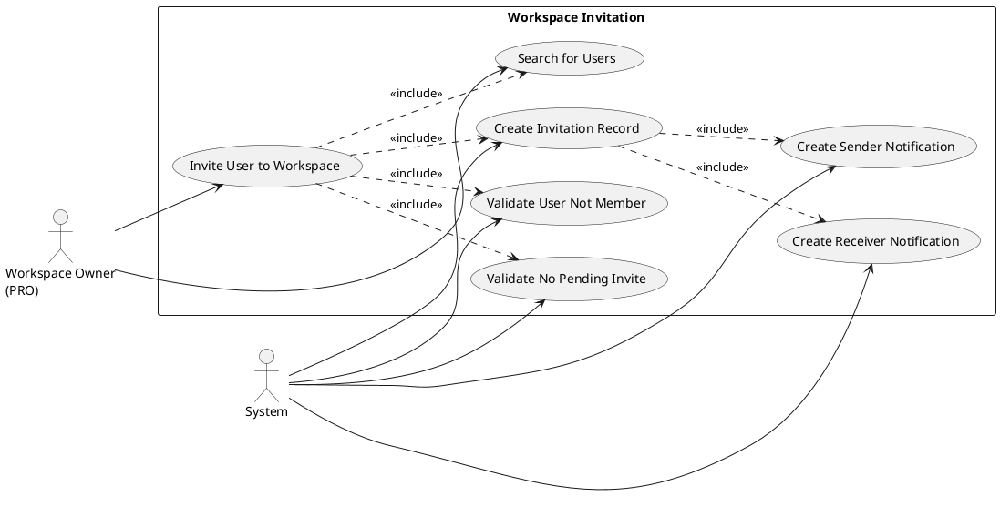
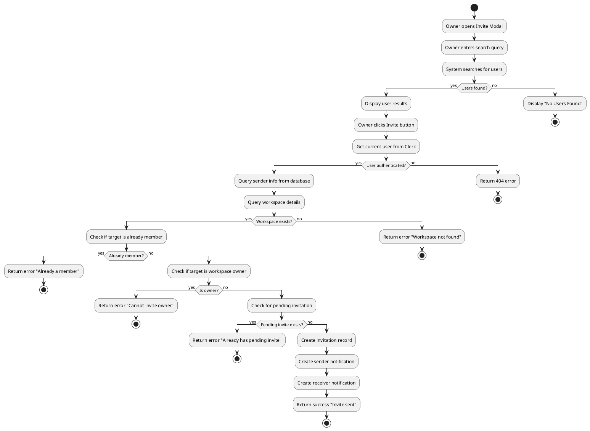
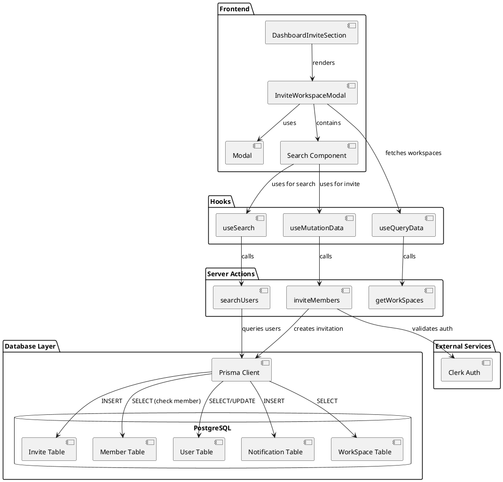
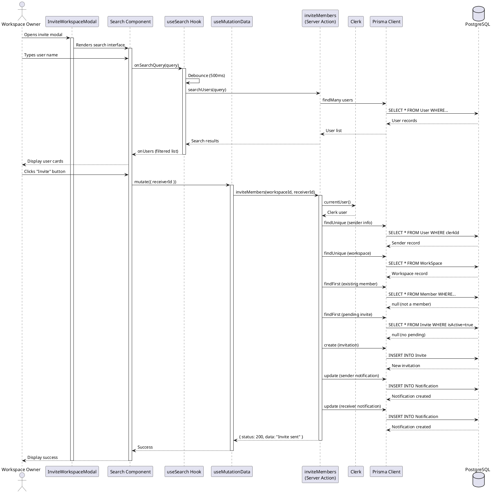
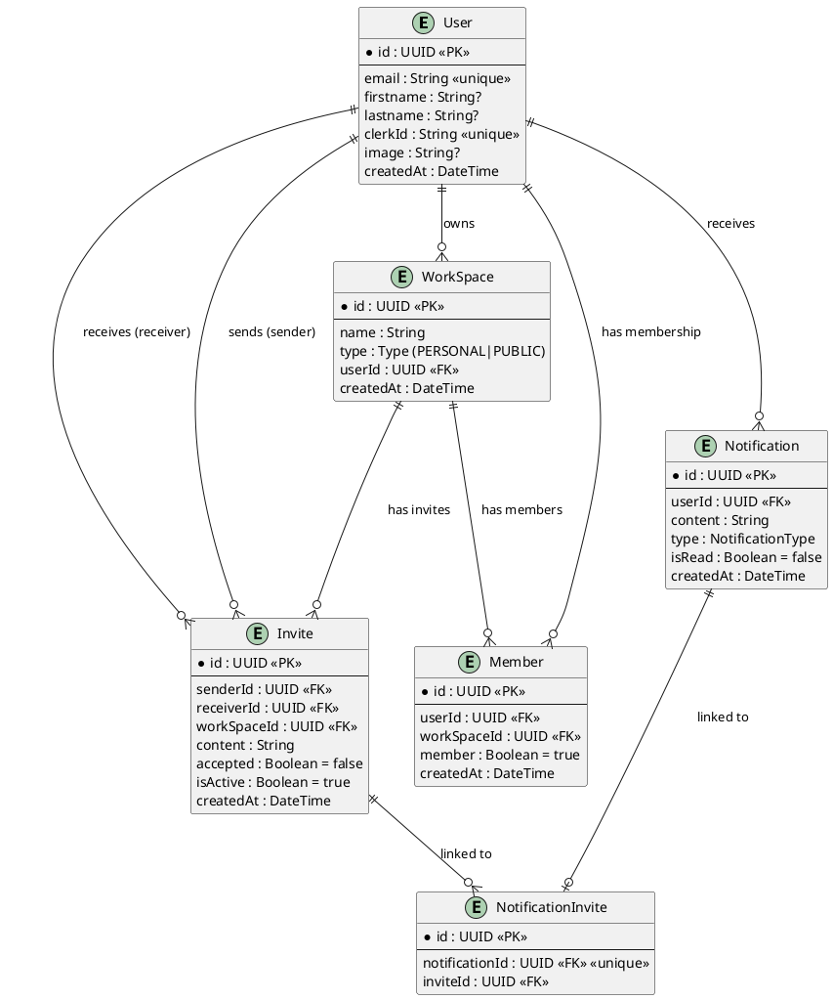

# Feature 4.1: Workspace Invitation

## Features Covered
| #     | Feature/Transaction                                                              | Actor           |
|-------|----------------------------------------------------------------------------------|-----------------|
| 4.1   | Public workspace owner can invite other users to their workspace                 | Workspace Owner |
| 4.1.1 | System validates that user is not already a member before sending invite         | System          |
| 4.1.2 | System validates that user doesn't have pending invitation                       | System          |
| 4.1.3 | System creates notification for both sender and receiver when invitation is sent | System          |

---

## Use Case Diagram



---

## Use Case Description

| Field | Description |
|-------|-------------|
| **Use Case ID** | UC-4.1 |
| **Use Case Name** | Invite User to Workspace |
| **Actor(s)** | Workspace Owner (PRO subscription), System |
| **Description** | A PRO workspace owner searches for users and invites them to join their public workspace. The system validates the invitation and creates notifications. |
| **Preconditions** | 1. Owner is authenticated and has PRO subscription<br>2. Workspace is PUBLIC type<br>3. Target user exists in the system |
| **Postconditions** | 1. Invitation record created in database<br>2. Sender notification created<br>3. Receiver notification created |
| **Main Flow** | 1. Owner opens invite modal from workspace dashboard<br>2. Owner searches for users by name<br>3. System returns matching users<br>4. Owner clicks "Invite" on desired user<br>5. System validates user is not already a member (4.1.1)<br>6. System validates no pending invitation exists (4.1.2)<br>7. System creates invitation record<br>8. System creates notifications for both parties (4.1.3)<br>9. Success message displayed |
| **Alternative Flows** | A1: User is already a member → Display error "User is already a member"<br>A2: Pending invitation exists → Display error "User already has a pending invitation"<br>A3: User is workspace owner → Display error "Cannot invite the workspace owner" |
| **Exceptions** | E1: Network error → Display generic error message<br>E2: User not authenticated → Redirect to login |

---

## Activity Diagram



---

## Component List

### Frontend Components

| Component | File Path | Description | Type |
|-----------|-----------|-------------|------|
| InviteWorkspaceModal | `src/components/global/invite-workspace-modal.tsx` | Modal dialog for inviting users, only visible for PUBLIC workspaces with PRO subscription | Modal Component |
| Search | `src/components/global/search.tsx` | User search interface with real-time results and invite buttons | Form Component |
| Modal | `src/components/global/modal.tsx` | Reusable modal wrapper component | UI Component |
| DashboardInviteSection | `src/components/global/dashboard-invite-section.tsx` | Container for invite functionality in dashboard | Layout Component |
| Input | `src/components/ui/input.tsx` | Text input for search query | UI Component |
| Button | `src/components/ui/button.tsx` | Invite action button | UI Component |
| Avatar | `src/components/ui/avatar.tsx` | User avatar display in search results | UI Component |
| Loader | `src/components/global/loader/loader.tsx` | Loading spinner for pending state | UI Component |

### Backend Components

| Component | File Path | Description | Type |
|-----------|-----------|-------------|------|
| inviteMembers | `src/actions/user.ts` | Server action that validates and creates invitation with notifications | Server Action |
| searchUsers | `src/actions/user.ts` | Server action to search users by name | Server Action |
| useSearch | `src/hooks/useSearch.ts` | Custom hook for debounced user search | Custom Hook |
| useMutationData | `src/hooks/useMutationData.ts` | React Query mutation hook for invite action | Custom Hook |
| Prisma Client | `src/lib/prisma.ts` | Database client for Invite, Member, User, Notification tables | Database Client |

---

## Component/Module Diagram



---

## Sequence Diagram



---

## ERD and Schema



### Prisma Schema (Relevant Models)

```prisma
model Invite {
  id                String              @id @default(dbgenerated("gen_random_uuid()")) @db.Uuid
  sender            User?               @relation("sender", fields: [senderId], references: [id])
  senderId          String?             @db.Uuid
  receiver          User?               @relation("receiver", fields: [receiverId], references: [id])
  receiverId        String?             @db.Uuid
  content           String
  WorkSpace         WorkSpace?          @relation(fields: [workSpaceId], references: [id], onDelete: Cascade)
  workSpaceId       String?             @db.Uuid
  accepted          Boolean             @default(false)
  isActive          Boolean             @default(true)
  createdAt         DateTime            @default(now())
  NotificationInvite NotificationInvite[]
}

model Member {
  id          String     @id @default(dbgenerated("gen_random_uuid()")) @db.Uuid
  User        User?      @relation(fields: [userId], references: [id])
  userId      String?    @db.Uuid
  createdAt   DateTime   @default(now())
  member      Boolean    @default(true)
  WorkSpace   WorkSpace? @relation(fields: [workSpaceId], references: [id], onDelete: Cascade)
  workSpaceId String?    @db.Uuid
}

model Notification {
  id               String              @id @default(dbgenerated("gen_random_uuid()")) @db.Uuid
  User             User?               @relation(fields: [userId], references: [id])
  userId           String?             @db.Uuid
  content          String
  type             NotificationType    @default(INVITE)
  isRead           Boolean             @default(false)
  createdAt        DateTime            @default(now())
  NotificationInvite NotificationInvite?
}

model NotificationInvite {
  id             String       @id @default(dbgenerated("gen_random_uuid()")) @db.Uuid
  notification   Notification @relation(fields: [notificationId], references: [id], onDelete: Cascade)
  notificationId String       @unique @db.Uuid
  Invite         Invite       @relation(fields: [inviteId], references: [id], onDelete: Cascade)
  inviteId       String       @db.Uuid
}
```

