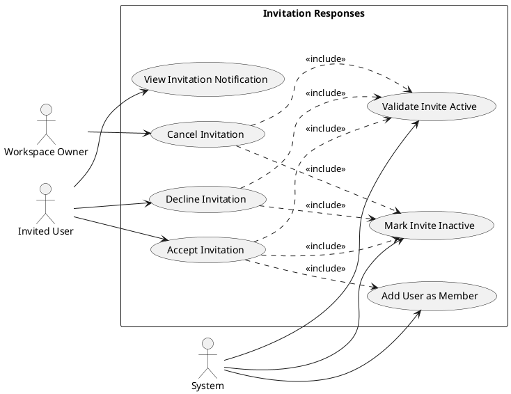
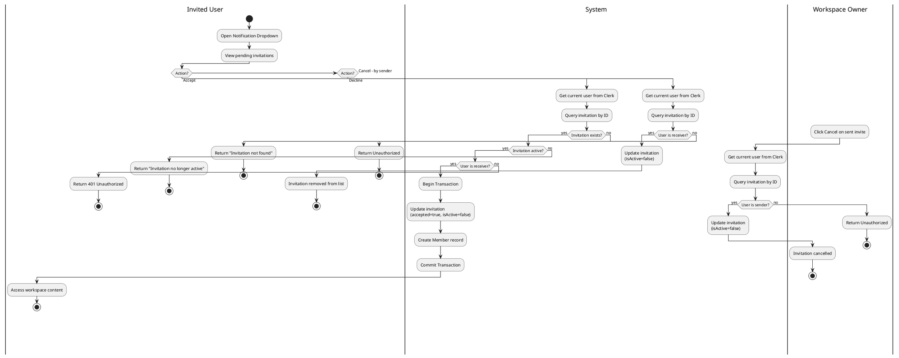
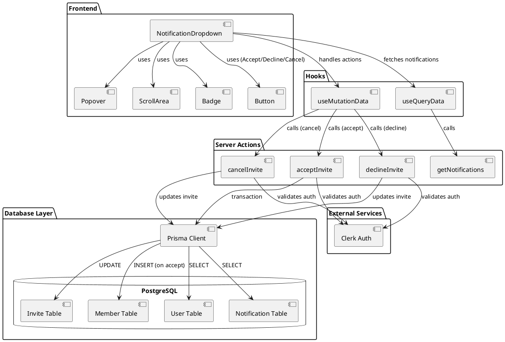
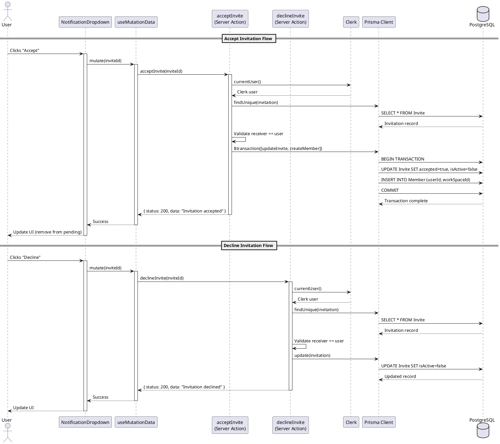
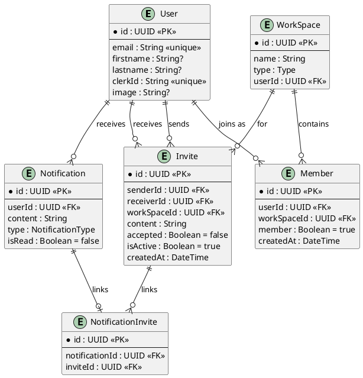

# Features 4.2-4.4: Invitation Responses

## Features Covered
| #   | Feature/Transaction                                         | Actor           |
|-----|-------------------------------------------------------------|-----------------|
| 4.2 | User can accept a workspace invitation, which adds them as a member | Invited User    |
| 4.3 | User can decline a workspace invitation                     | Invited User    |
| 4.4 | Workspace owner can cancel a pending workspace invitation   | Workspace Owner |

---

## Use Case Diagram



---

## Use Case Description

### UC-4.2: Accept Invitation

| Field | Description |
|-------|-------------|
| **Use Case ID** | UC-4.2 |
| **Use Case Name** | Accept Workspace Invitation |
| **Actor(s)** | Invited User, System |
| **Description** | An invited user accepts a workspace invitation, which adds them as a member of the workspace. |
| **Preconditions** | 1. User is authenticated<br>2. Valid invitation exists<br>3. Invitation is active (isActive=true)<br>4. User is the intended receiver |
| **Postconditions** | 1. Invitation marked as accepted<br>2. Invitation marked as inactive<br>3. User added as workspace member |
| **Main Flow** | 1. User views notification dropdown<br>2. User sees pending invitation<br>3. User clicks "Accept" button<br>4. System validates invitation ownership<br>5. System validates invitation is active<br>6. System updates invitation (accepted=true, isActive=false)<br>7. System creates member record<br>8. User gains access to workspace |
| **Alternative Flows** | A1: Invitation already processed → Display error message |
| **Exceptions** | E1: Database transaction fails → Rollback changes |

### UC-4.3: Decline Invitation

| Field | Description |
|-------|-------------|
| **Use Case ID** | UC-4.3 |
| **Use Case Name** | Decline Workspace Invitation |
| **Actor(s)** | Invited User, System |
| **Description** | An invited user declines a workspace invitation without joining. |
| **Preconditions** | 1. User is authenticated<br>2. Valid invitation exists<br>3. Invitation is active<br>4. User is the intended receiver |
| **Postconditions** | 1. Invitation marked as inactive<br>2. User not added to workspace |
| **Main Flow** | 1. User views notification dropdown<br>2. User sees pending invitation<br>3. User clicks "Decline" button<br>4. System validates invitation ownership<br>5. System updates invitation (isActive=false)<br>6. Invitation disappears from active list |

### UC-4.4: Cancel Invitation

| Field | Description |
|-------|-------------|
| **Use Case ID** | UC-4.4 |
| **Use Case Name** | Cancel Workspace Invitation |
| **Actor(s)** | Workspace Owner, System |
| **Description** | A workspace owner cancels a pending invitation they sent. |
| **Preconditions** | 1. Owner is authenticated<br>2. Valid invitation exists<br>3. Invitation is active<br>4. User is the invitation sender |
| **Postconditions** | 1. Invitation marked as inactive<br>2. Receiver can no longer accept |
| **Main Flow** | 1. Owner views notification dropdown<br>2. Owner sees sent invitation<br>3. Owner clicks "Cancel" button<br>4. System validates sender ownership<br>5. System updates invitation (isActive=false)<br>6. Invitation no longer actionable |

---

## Activity Diagram



---

## Component List

### Frontend Components

| Component | File Path | Description | Type |
|-----------|-----------|-------------|------|
| NotificationDropdown | `src/components/global/notifications/notification-dropdown.tsx` | Dropdown showing all notifications with accept/decline/cancel buttons for invites | Dropdown Component |
| Avatar | `src/components/ui/avatar.tsx` | Displays user avatars in notification items | UI Component |
| Button | `src/components/ui/button.tsx` | Accept, Decline, Cancel action buttons | UI Component |
| Badge | `src/components/ui/badge.tsx` | Shows invite status (pending, accepted, declined) | UI Component |
| Popover | `src/components/ui/popover.tsx` | Notification dropdown container | UI Component |
| ScrollArea | `src/components/ui/scroll-area.tsx` | Scrollable notification list | UI Component |

### Backend Components

| Component | File Path | Description | Type |
|-----------|-----------|-------------|------|
| acceptInvite | `src/actions/user.ts` | Server action to accept invitation and create membership | Server Action |
| declineInvite | `src/actions/user.ts` | Server action to decline invitation | Server Action |
| cancelInvite | `src/actions/user.ts` | Server action to cancel sent invitation | Server Action |
| getNotifications | `src/actions/user.ts` | Server action to fetch user notifications | Server Action |
| useMutationData | `src/hooks/useMutationData.ts` | React Query mutation hook for invitation actions | Custom Hook |
| useQueryData | `src/hooks/useQueryData.ts` | React Query hook for fetching notifications | Custom Hook |
| Prisma Client | `src/lib/prisma.ts` | Database client for Invite, Member tables | Database Client |

---

## Component/Module Diagram



---

## Sequence Diagram



---

## ERD and Schema



### Prisma Schema (Relevant Models)

```prisma
model Invite {
  id                String              @id @default(dbgenerated("gen_random_uuid()")) @db.Uuid
  sender            User?               @relation("sender", fields: [senderId], references: [id])
  senderId          String?             @db.Uuid
  receiver          User?               @relation("receiver", fields: [receiverId], references: [id])
  receiverId        String?             @db.Uuid
  content           String
  WorkSpace         WorkSpace?          @relation(fields: [workSpaceId], references: [id], onDelete: Cascade)
  workSpaceId       String?             @db.Uuid
  accepted          Boolean             @default(false)
  isActive          Boolean             @default(true)
  createdAt         DateTime            @default(now())
  NotificationInvite NotificationInvite[]
}

model Member {
  id          String     @id @default(dbgenerated("gen_random_uuid()")) @db.Uuid
  User        User?      @relation(fields: [userId], references: [id])
  userId      String?    @db.Uuid
  createdAt   DateTime   @default(now())
  member      Boolean    @default(true)
  WorkSpace   WorkSpace? @relation(fields: [workSpaceId], references: [id], onDelete: Cascade)
  workSpaceId String?    @db.Uuid
}
```

