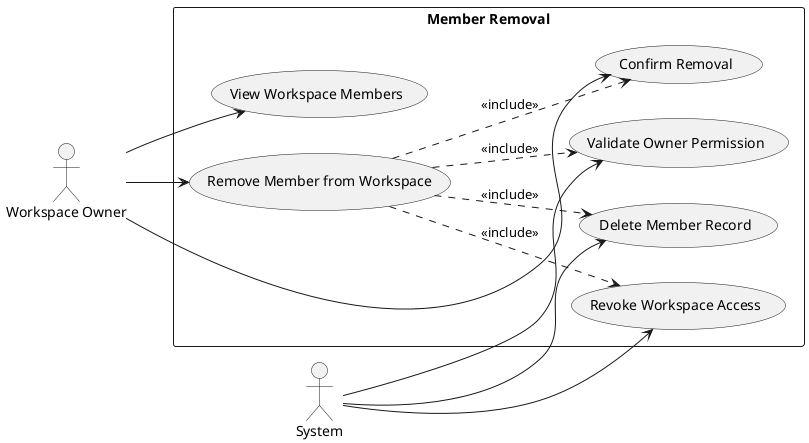
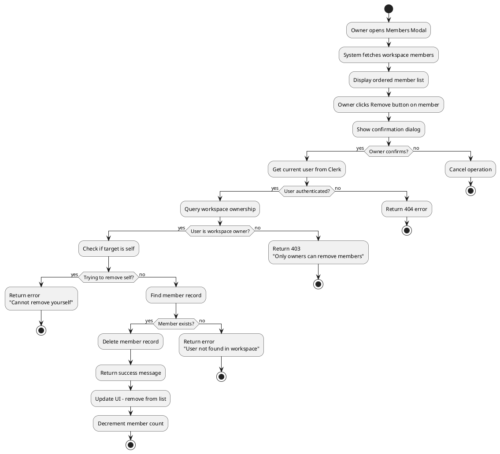
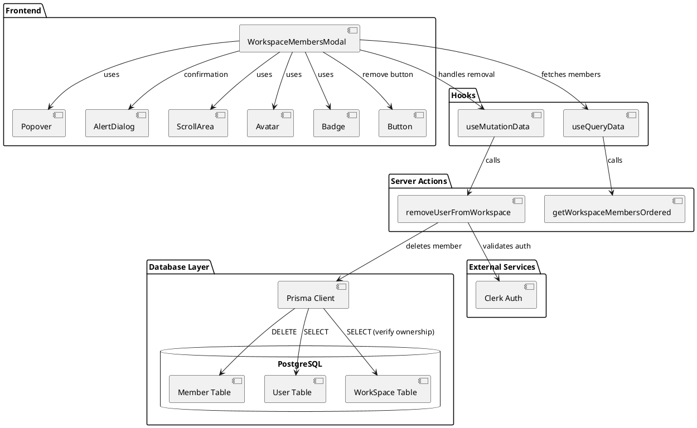
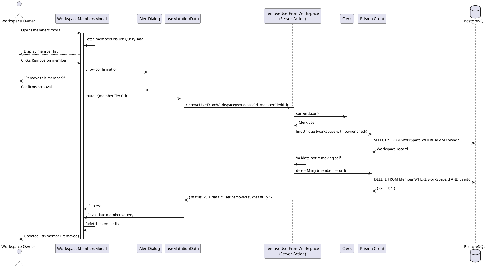
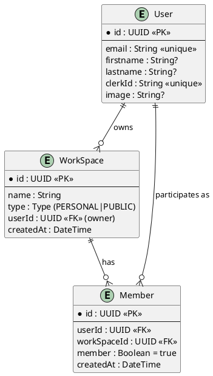

# Feature 4.5: Member Removal

## Features Covered
| #   | Feature/Transaction                                    | Actor           |
|-----|--------------------------------------------------------|-----------------|
| 4.5 | Workspace owner can remove a member from the workspace | Workspace Owner |

---

## Use Case Diagram



---

## Use Case Description

| Field | Description |
|-------|-------------|
| **Use Case ID** | UC-4.5 |
| **Use Case Name** | Remove Member from Workspace |
| **Actor(s)** | Workspace Owner, System |
| **Description** | A workspace owner removes a member from their workspace, revoking their access to all workspace content. |
| **Preconditions** | 1. User is authenticated<br>2. User is the workspace owner<br>3. Target user is a member of the workspace<br>4. Target user is not the owner |
| **Postconditions** | 1. Member record deleted from database<br>2. User loses access to workspace<br>3. Member count decremented |
| **Main Flow** | 1. Owner opens workspace members modal<br>2. Owner views list of workspace members<br>3. Owner clicks remove button on target member<br>4. Confirmation dialog appears<br>5. Owner confirms removal<br>6. System validates owner permission<br>7. System deletes member record<br>8. Member removed from list<br>9. Success confirmation displayed |
| **Alternative Flows** | A1: Owner tries to remove themselves → Display error "Cannot remove yourself"<br>A2: Member not found → Display error "User not found in workspace" |
| **Exceptions** | E1: Permission denied → Display error "Only workspace owners can remove members" |

---

## Activity Diagram



---

## Component List

### Frontend Components

| Component | File Path | Description | Type |
|-----------|-----------|-------------|------|
| WorkspaceMembersModal | `src/components/global/workspace/workspace-members-modal.tsx` | Popover showing all workspace members with remove buttons for owners | Modal Component |
| Avatar | `src/components/ui/avatar.tsx` | Member avatar display | UI Component |
| Badge | `src/components/ui/badge.tsx` | Role badges (owner, member, you) | UI Component |
| Button | `src/components/ui/button.tsx` | Remove action button | UI Component |
| Popover | `src/components/ui/popover.tsx` | Container for members list | UI Component |
| AlertDialog | `src/components/ui/alert-dialog.tsx` | Confirmation dialog for removal | UI Component |
| ScrollArea | `src/components/ui/scroll-area.tsx` | Scrollable member list | UI Component |

### Backend Components

| Component | File Path | Description | Type |
|-----------|-----------|-------------|------|
| removeUserFromWorkspace | `src/actions/workspace.ts` | Server action to remove member from workspace | Server Action |
| getWorkspaceMembersOrdered | `src/actions/workspace.ts` | Server action to fetch ordered member list | Server Action |
| useMutationData | `src/hooks/useMutationData.ts` | React Query mutation hook for remove action | Custom Hook |
| useQueryData | `src/hooks/useQueryData.ts` | React Query hook for fetching members | Custom Hook |
| Prisma Client | `src/lib/prisma.ts` | Database client for Member table | Database Client |

---

## Component/Module Diagram



---

## Sequence Diagram



---

## ERD and Schema



### Prisma Schema (Relevant Models)

```prisma
model User {
  id           String         @id @default(dbgenerated("gen_random_uuid()")) @db.Uuid
  email        String         @unique
  firstname    String?
  lastname     String?
  clerkId      String         @unique
  image        String?
  workspace    WorkSpace[]
  members      Member[]
}

model WorkSpace {
  id        String   @id @default(dbgenerated("gen_random_uuid()")) @db.Uuid
  type      Type
  name      String
  User      User?    @relation(fields: [userId], references: [id])
  userId    String?  @db.Uuid
  members   Member[]
}

model Member {
  id          String     @id @default(dbgenerated("gen_random_uuid()")) @db.Uuid
  User        User?      @relation(fields: [userId], references: [id])
  userId      String?    @db.Uuid
  createdAt   DateTime   @default(now())
  member      Boolean    @default(true)
  WorkSpace   WorkSpace? @relation(fields: [workSpaceId], references: [id], onDelete: Cascade)
  workSpaceId String?    @db.Uuid
}
```

