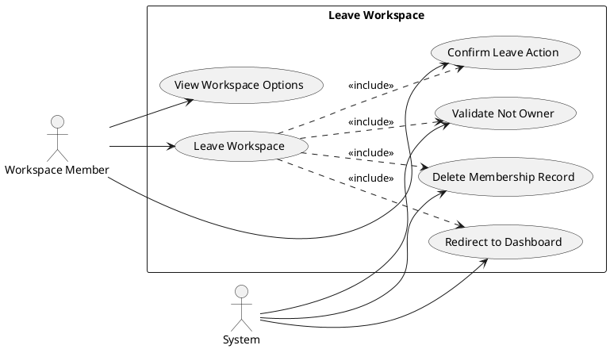
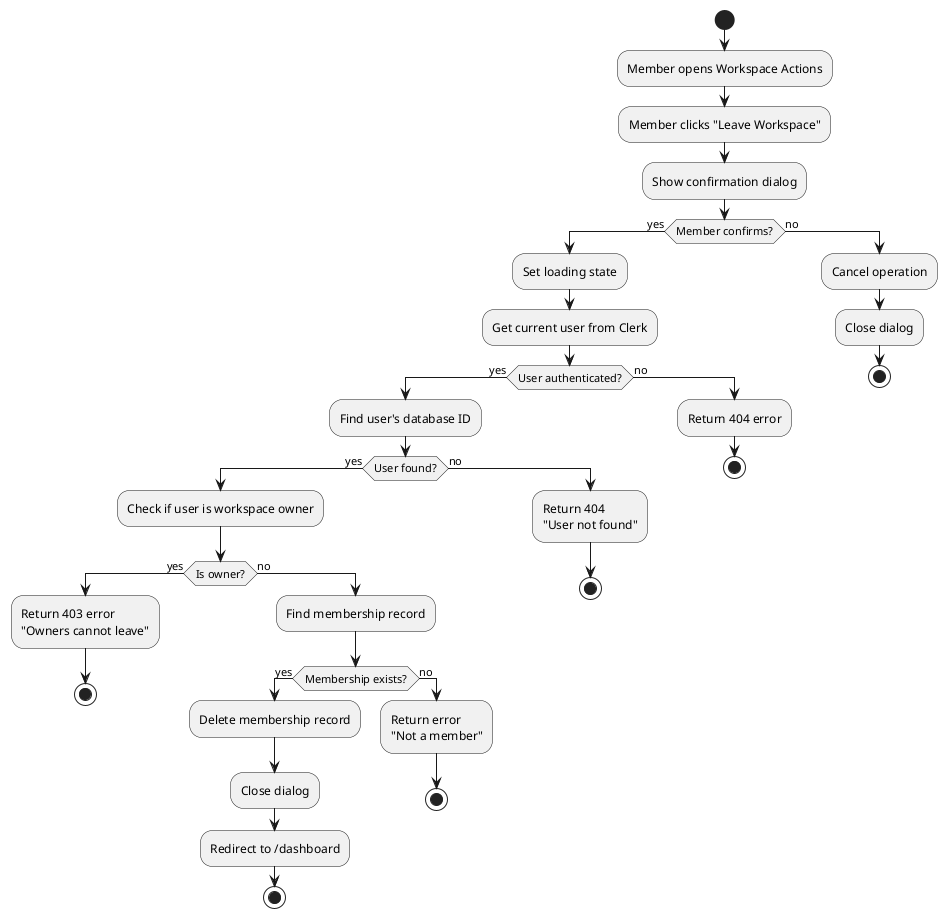
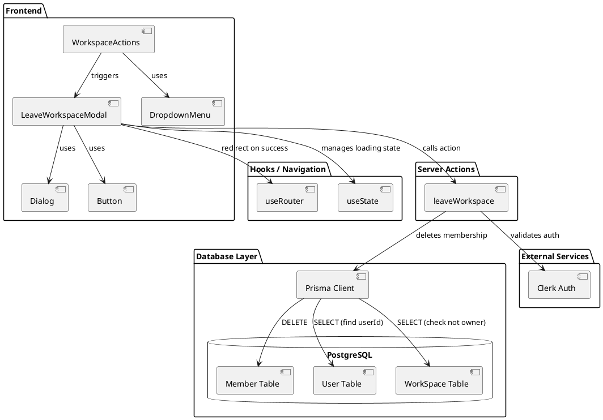
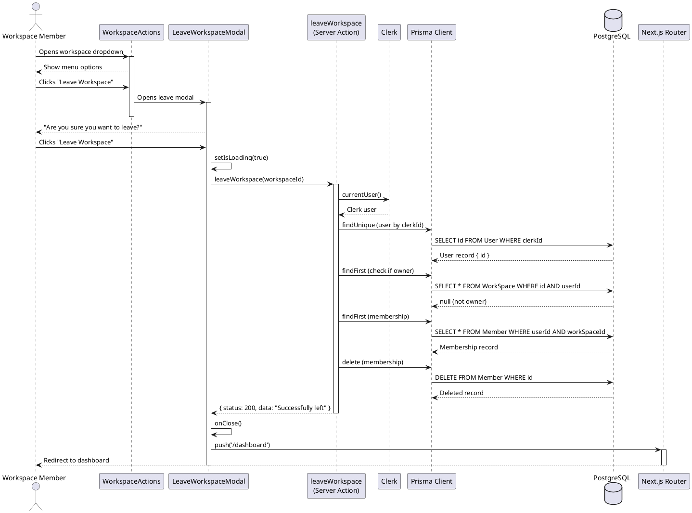
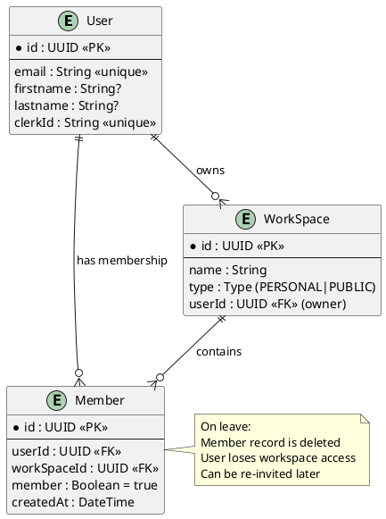

# Feature 4.6: Leave Workspace

## Features Covered
| #   | Feature/Transaction                      | Actor            |
|-----|------------------------------------------|------------------|
| 4.6 | Workspace member can leave a workspace   | Workspace Member |

---

## Use Case Diagram



---

## Use Case Description

| Field | Description |
|-------|-------------|
| **Use Case ID** | UC-4.6 |
| **Use Case Name** | Leave Workspace |
| **Actor(s)** | Workspace Member, System |
| **Description** | A workspace member voluntarily leaves a workspace they were invited to, removing their access to all workspace content. |
| **Preconditions** | 1. User is authenticated<br>2. User is a member of the workspace (not owner)<br>3. Membership record exists |
| **Postconditions** | 1. Membership record deleted<br>2. User loses workspace access<br>3. User redirected to dashboard |
| **Main Flow** | 1. Member navigates to workspace<br>2. Member opens workspace actions dropdown<br>3. Member selects "Leave Workspace"<br>4. Confirmation dialog appears<br>5. Member confirms leave action<br>6. System validates user is not owner<br>7. System deletes membership record<br>8. User redirected to dashboard<br>9. Success toast displayed |
| **Alternative Flows** | A1: User is the workspace owner → Display error "Owners cannot leave. Delete the workspace instead." |
| **Exceptions** | E1: Membership not found → Display error "You are not a member of this workspace" |

---

## Activity Diagram



---

## Component List

### Frontend Components

| Component | File Path | Description | Type |
|-----------|-----------|-------------|------|
| LeaveWorkspaceModal | `src/components/global/workspace/leave-workspace-modal.tsx` | Confirmation dialog for leaving a workspace | Modal Component |
| WorkspaceActions | `src/components/global/workspace/workspace-actions.tsx` | Dropdown menu with workspace actions including leave | Dropdown Component |
| Dialog | `src/components/ui/dialog.tsx` | Base dialog component | UI Component |
| Button | `src/components/ui/button.tsx` | Cancel and Leave buttons | UI Component |
| DropdownMenu | `src/components/ui/dropdown-menu.tsx` | Workspace actions menu | UI Component |

### Backend Components

| Component | File Path | Description | Type |
|-----------|-----------|-------------|------|
| leaveWorkspace | `src/actions/workspace.ts` | Server action to remove user's own membership | Server Action |
| Prisma Client | `src/lib/prisma.ts` | Database client for Member, WorkSpace, User tables | Database Client |
| useRouter | `next/navigation` | Next.js router for redirect | Next.js Hook |

---

## Component/Module Diagram



---

## Sequence Diagram



---

## ERD and Schema



### Prisma Schema (Relevant Models)

```prisma
model User {
  id           String         @id @default(dbgenerated("gen_random_uuid()")) @db.Uuid
  email        String         @unique
  firstname    String?
  lastname     String?
  clerkId      String         @unique
  members      Member[]
  workspace    WorkSpace[]
}

model WorkSpace {
  id        String   @id @default(dbgenerated("gen_random_uuid()")) @db.Uuid
  type      Type
  name      String
  User      User?    @relation(fields: [userId], references: [id])
  userId    String?  @db.Uuid
  members   Member[]
}

model Member {
  id          String     @id @default(dbgenerated("gen_random_uuid()")) @db.Uuid
  User        User?      @relation(fields: [userId], references: [id])
  userId      String?    @db.Uuid
  createdAt   DateTime   @default(now())
  member      Boolean    @default(true)
  WorkSpace   WorkSpace? @relation(fields: [workSpaceId], references: [id], onDelete: Cascade)
  workSpaceId String?    @db.Uuid
}

enum Type {
  PERSONAL
  PUBLIC
}
```

