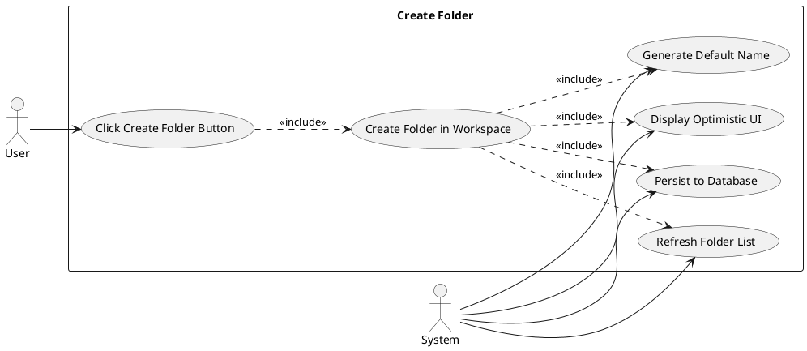
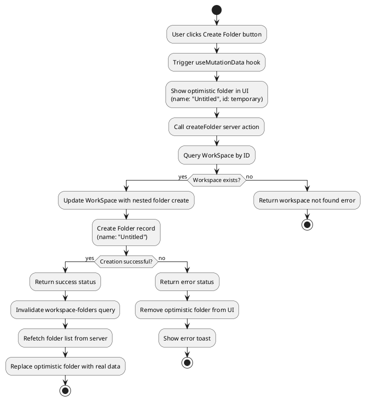
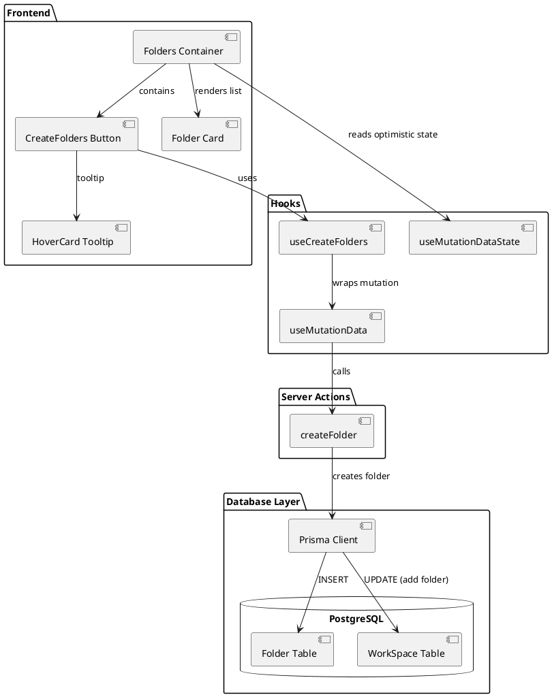
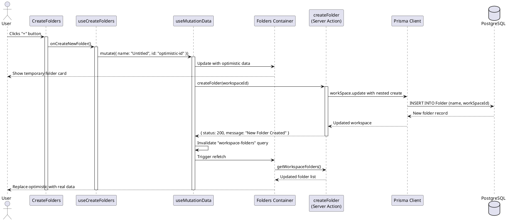
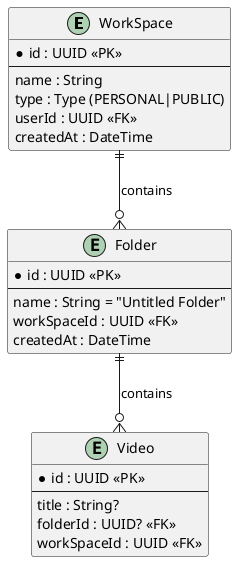

# Feature 5.1: Create Folder

## Features Covered
| #   | Feature/Transaction                         | Actor |
|-----|---------------------------------------------|-------|
| 5.1 | User can create a new folder in a workspace | User  |

---

## Use Case Diagram



---

## Use Case Description

| Field | Description |
|-------|-------------|
| **Use Case ID** | UC-5.1 |
| **Use Case Name** | Create Folder in Workspace |
| **Actor(s)** | User, System |
| **Description** | A user creates a new folder within their workspace. The folder is created with a default "Untitled" name and immediately appears in the UI through optimistic updates. |
| **Preconditions** | 1. User is authenticated<br>2. User has access to the workspace (owner or member) |
| **Postconditions** | 1. New folder record created in database<br>2. Folder appears in workspace folder list<br>3. Folder has default "Untitled" name |
| **Main Flow** | 1. User views workspace dashboard with folders section<br>2. User hovers over "+" button to see "Create a new folder" tooltip<br>3. User clicks the create folder button<br>4. System immediately shows optimistic folder in UI<br>5. System creates folder record in database<br>6. System refreshes folder list with server data<br>7. New folder is confirmed in list |
| **Alternative Flows** | A1: Database error → Show error toast, remove optimistic folder |
| **Exceptions** | E1: User not authenticated → Return 404 error |

---

## Activity Diagram



---

## Component List

### Frontend Components

| Component | File Path | Description | Type |
|-----------|-----------|-------------|------|
| CreateFolders | `src/components/global/create-folders.tsx` | Button with tooltip that triggers folder creation | Button Component |
| Folders | `src/components/global/folders/folders.tsx` | Container showing all folders with optimistic UI support | List Component |
| Folder | `src/components/global/folders/folder.tsx` | Individual folder card display | Card Component |
| HoverCard | `src/components/ui/hover-card.tsx` | Tooltip showing "Create a new folder" | UI Component |
| Button | `src/components/ui/button.tsx` | Plus icon button | UI Component |
| Add Icon | `src/components/icons/add.tsx` | Plus icon for create button | Icon Component |

### Backend Components

| Component | File Path | Description | Type |
|-----------|-----------|-------------|------|
| createFolder | `src/actions/workspace.ts` | Server action to create folder with default name | Server Action |
| useCreateFolders | `src/hooks/useCreateFolders.ts` | Custom hook wrapping createFolder with mutation | Custom Hook |
| useMutationData | `src/hooks/useMutationData.ts` | React Query mutation hook with cache invalidation | Custom Hook |
| Prisma Client | `src/lib/prisma.ts` | Database client for WorkSpace and Folder tables | Database Client |

---

## Component/Module Diagram



---

## Sequence Diagram



---

## ERD and Schema



### Prisma Schema (Relevant Models)

```prisma
model WorkSpace {
  id        String   @id @default(dbgenerated("gen_random_uuid()")) @db.Uuid
  type      Type
  name      String
  User      User?    @relation(fields: [userId], references: [id])
  userId    String?  @db.Uuid
  createdAt DateTime @default(now())
  folders   Folder[]
  videos    Video[]
  members   Member[]
}

model Folder {
  id          String     @id @default(dbgenerated("gen_random_uuid()")) @db.Uuid
  name        String     @default("Untitled Folder")
  createdAt   DateTime   @default(now())
  WorkSpace   WorkSpace? @relation(fields: [workSpaceId], references: [id], onDelete: Cascade)
  workSpaceId String?    @db.Uuid
  videos      Video[]
}
```

