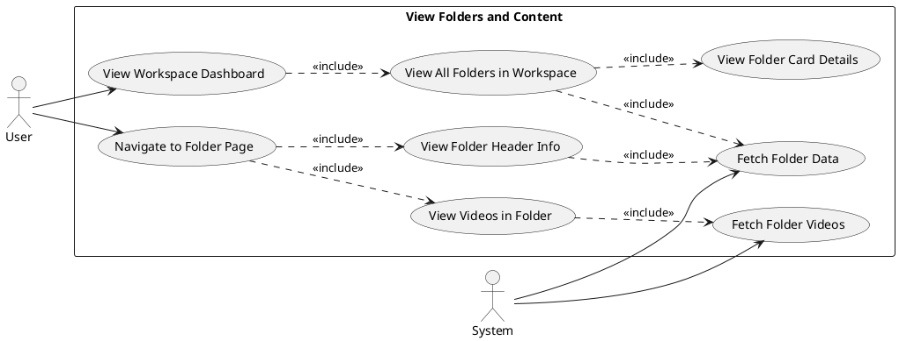
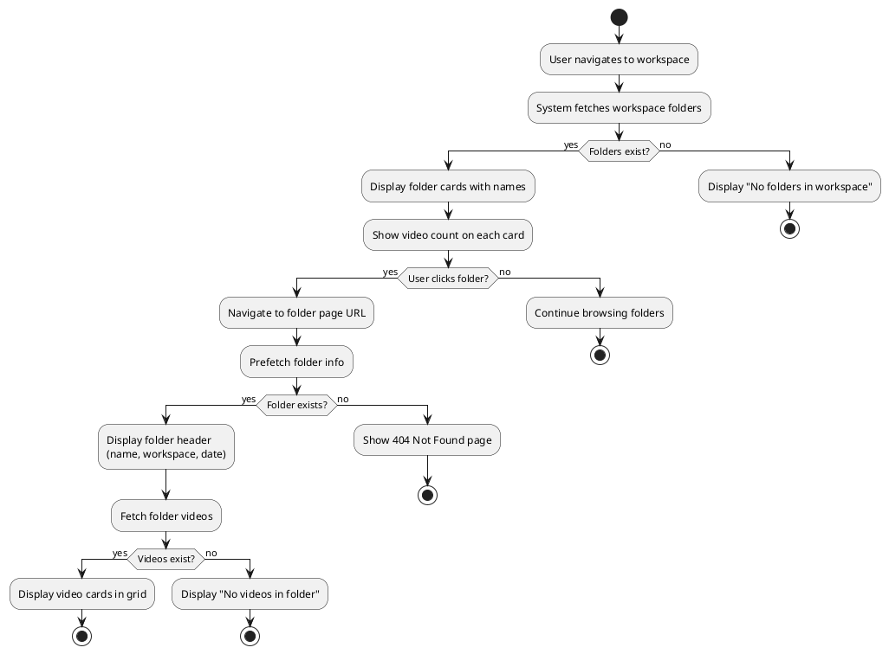
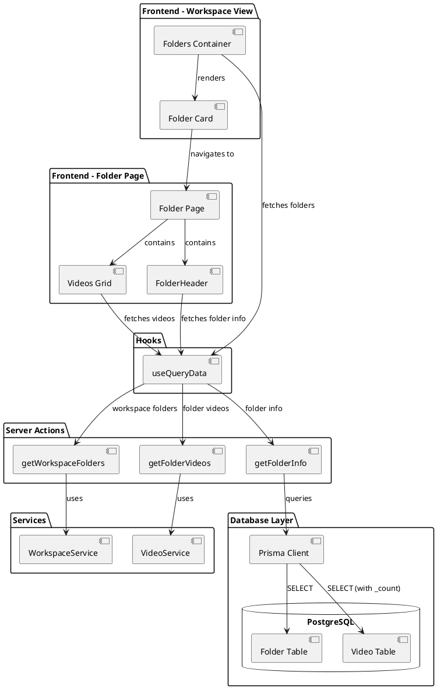
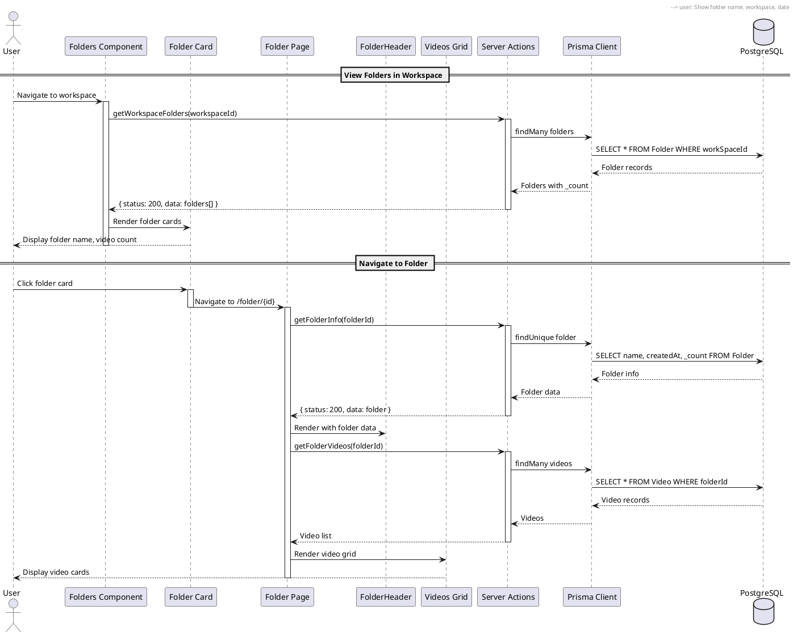
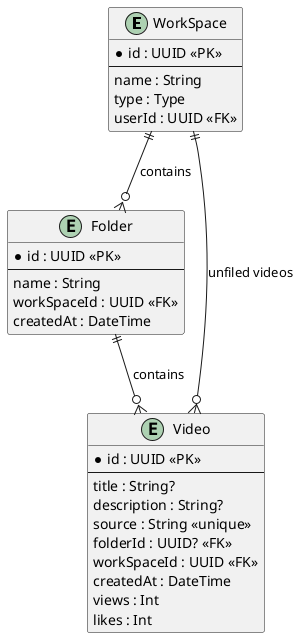

# Features 5.2, 5.3, 5.6: View Folders and Content

## Features Covered
| #   | Feature/Transaction                                  | Actor |
|-----|------------------------------------------------------|-------|
| 5.2 | User can view all folders in a workspace             | User  |
| 5.3 | User can view folder information (name, video count) | User  |
| 5.6 | User can view videos within a specific folder        | User  |

---

## Use Case Diagram



---

## Use Case Description

### UC-5.2: View All Folders in Workspace

| Field | Description |
|-------|-------------|
| **Use Case ID** | UC-5.2 |
| **Use Case Name** | View All Folders in Workspace |
| **Actor(s)** | User, System |
| **Description** | User views all folders within a workspace displayed as horizontal scrollable cards. |
| **Preconditions** | 1. User is authenticated<br>2. User has access to the workspace |
| **Postconditions** | 1. Folders displayed in UI<br>2. Folder data cached for performance |
| **Main Flow** | 1. User navigates to workspace dashboard<br>2. System fetches workspace folders via getWorkspaceFolders<br>3. System displays folder cards in horizontal scroll section<br>4. Each card shows folder name and video count |

### UC-5.3: View Folder Information

| Field | Description |
|-------|-------------|
| **Use Case ID** | UC-5.3 |
| **Use Case Name** | View Folder Information |
| **Actor(s)** | User, System |
| **Description** | User views detailed folder information including name, creation date, and video count. |
| **Preconditions** | 1. User is on folder page or viewing folder card |
| **Postconditions** | 1. Folder metadata displayed |
| **Main Flow** | 1. System calls getFolderInfo with folder ID<br>2. System retrieves name, createdAt, and video count<br>3. Information displayed in folder header or card |

### UC-5.6: View Videos in Folder

| Field | Description |
|-------|-------------|
| **Use Case ID** | UC-5.6 |
| **Use Case Name** | View Videos Within Folder |
| **Actor(s)** | User, System |
| **Description** | User navigates to a folder and views all videos contained within it. |
| **Preconditions** | 1. User has access to workspace<br>2. Folder exists |
| **Postconditions** | 1. Videos displayed in folder page |
| **Main Flow** | 1. User clicks on folder card<br>2. System navigates to folder page<br>3. System calls getFolderVideos<br>4. System displays videos with full management capabilities |
| **Alternative Flows** | A1: Folder not found → Show 404 page |

---

## Activity Diagram



---

## Component List

### Frontend Components

| Component | File Path | Description | Type |
|-----------|-----------|-------------|------|
| Folders | `src/components/global/folders/folders.tsx` | Container for folder list with horizontal scroll | List Component |
| Folder | `src/components/global/folders/folder.tsx` | Individual folder card with name and actions | Card Component |
| FolderHeader | `src/components/global/folders/folder-header.tsx` | Folder page header with name, date, actions | Header Component |
| Videos | `src/components/global/videos/videos.tsx` | Video grid component for folder contents | Grid Component |
| Folder Page | `src/app/dashboard/[workspaceid]/folder/[folder]/page.tsx` | Server component for folder view | Page Component |

### Backend Components

| Component | File Path | Description | Type |
|-----------|-----------|-------------|------|
| getWorkspaceFolders | `src/actions/workspace.ts` | Fetches all folders for a workspace | Server Action |
| getFolderInfo | `src/actions/workspace.ts` | Fetches folder metadata with video count | Server Action |
| getFolderVideos | `src/actions/workspace.ts` | Fetches videos within a folder | Server Action |
| useQueryData | `src/hooks/useQueryData.ts` | React Query wrapper for data fetching | Custom Hook |
| VideoService | `src/services/video.service.ts` | Video data operations | Service |

---

## Component/Module Diagram



---

## Sequence Diagram



---

## ERD and Schema



### Prisma Schema (Relevant Models)

```prisma
model Folder {
  id          String     @id @default(dbgenerated("gen_random_uuid()")) @db.Uuid
  name        String     @default("Untitled Folder")
  createdAt   DateTime   @default(now())
  WorkSpace   WorkSpace? @relation(fields: [workSpaceId], references: [id], onDelete: Cascade)
  workSpaceId String?    @db.Uuid
  videos      Video[]
}

model Video {
  id          String     @id @default(dbgenerated("gen_random_uuid()")) @db.Uuid
  title       String?    @default("Untitled Video")
  description String?    @default("No Description")
  source      String     @unique
  createdAt   DateTime   @default(now())
  Folder      Folder?    @relation(fields: [folderId], references: [id], onDelete: Cascade)
  folderId    String?    @db.Uuid
  WorkSpace   WorkSpace? @relation(fields: [workSpaceId], references: [id], onDelete: Cascade)
  workSpaceId String?    @db.Uuid
  views       Int        @default(0)
  likes       Int        @default(0)
}
```

