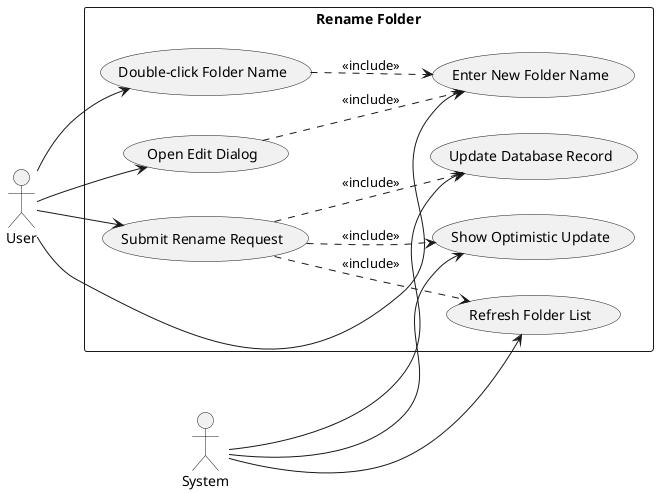
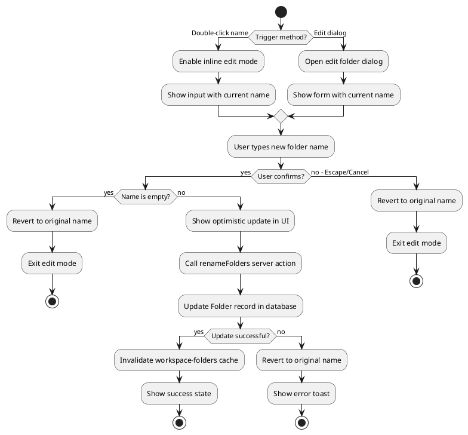
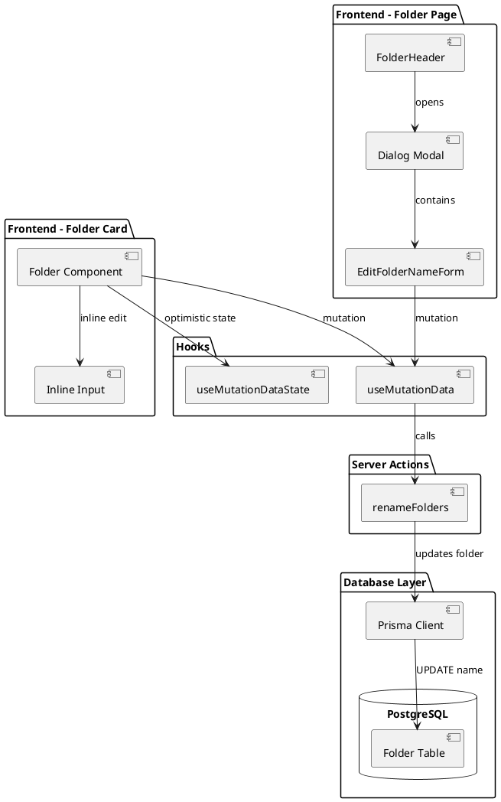
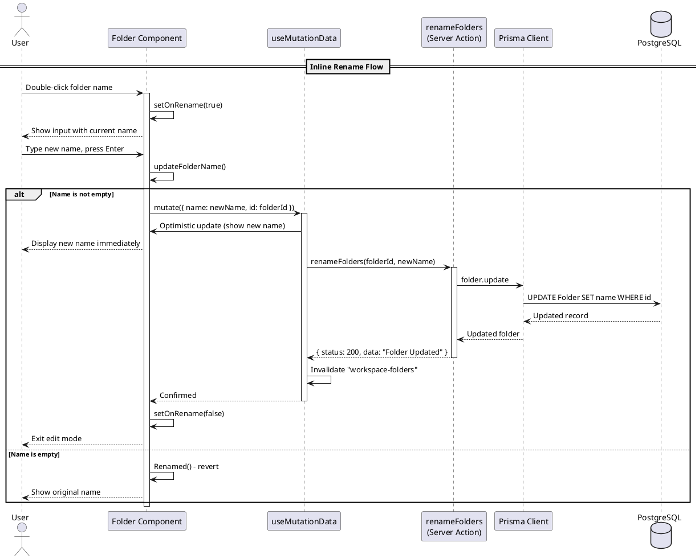
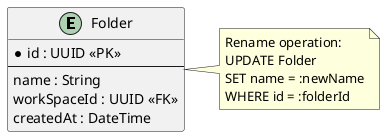

# Feature 5.4: Rename Folder

## Features Covered
| #   | Feature/Transaction                    | Actor |
|-----|----------------------------------------|-------|
| 5.4 | User can rename an existing folder     | User  |

---

## Use Case Diagram



---

## Use Case Description

| Field | Description |
|-------|-------------|
| **Use Case ID** | UC-5.4 |
| **Use Case Name** | Rename Folder |
| **Actor(s)** | User, System |
| **Description** | User renames an existing folder using either inline editing (double-click) or a dialog modal. The change is optimistically shown and persisted to the database. |
| **Preconditions** | 1. User is authenticated<br>2. Folder exists in user's workspace |
| **Postconditions** | 1. Folder name updated in database<br>2. UI reflects new name immediately |
| **Main Flow** | 1. User double-clicks folder name OR opens edit dialog<br>2. Input field becomes editable with current name<br>3. User types new folder name<br>4. User confirms by pressing Enter or clicking save<br>5. System shows optimistic update<br>6. System calls renameFolders server action<br>7. System updates database record<br>8. Cache invalidated and list refreshed |
| **Alternative Flows** | A1: Empty name submitted → Revert to original name<br>A2: User presses Escape → Cancel edit mode |
| **Exceptions** | E1: Database error → Show error, revert to original name |

---

## Activity Diagram



---

## Component List

### Frontend Components

| Component | File Path | Description | Type |
|-----------|-----------|-------------|------|
| Folder | `src/components/global/folders/folder.tsx` | Folder card with inline rename capability | Card Component |
| FolderHeader | `src/components/global/folders/folder-header.tsx` | Folder page header with edit dialog | Header Component |
| EditFolderNameForm | `src/components/forms/edit-folder/edit-folder-name.tsx` | Form component for folder rename dialog | Form Component |
| Input | `src/components/ui/input.tsx` | Text input for folder name | UI Component |
| Dialog | `src/components/ui/dialog.tsx` | Modal container for edit form | UI Component |

### Backend Components

| Component | File Path | Description | Type |
|-----------|-----------|-------------|------|
| renameFolders | `src/actions/workspace.ts` | Server action to update folder name | Server Action |
| useMutationData | `src/hooks/useMutationData.ts` | React Query mutation with optimistic updates | Custom Hook |
| useMutationDataState | `src/hooks/useMutationDataState.ts` | Access mutation state for optimistic UI | Custom Hook |
| Prisma Client | `src/lib/prisma.ts` | Database client for Folder table | Database Client |

---

## Component/Module Diagram



---

## Sequence Diagram



---

## ERD and Schema



### Prisma Schema (Relevant Models)

```prisma
model Folder {
  id          String     @id @default(dbgenerated("gen_random_uuid()")) @db.Uuid
  name        String     @default("Untitled Folder")
  createdAt   DateTime   @default(now())
  WorkSpace   WorkSpace? @relation(fields: [workSpaceId], references: [id], onDelete: Cascade)
  workSpaceId String?    @db.Uuid
  videos      Video[]
}
```

### Server Action Code

```typescript
export const renameFolders = async (folderId: string, name: string) => {
  try {
    const folder = await client.folder.update({
      where: {
        id: folderId,
      },
      data: {
        name,
      },
    })
    if (folder) {
      return { status: 200, data: 'Folder Updated' }
    }
    return { status: 400, data: 'Folder not found' }
  } catch (error) {
    console.log(error)
    return { status: 500, data: 'Something went wrong' }
  }
}
```

