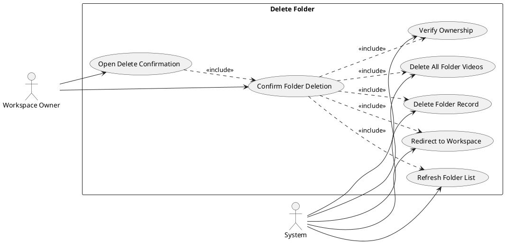
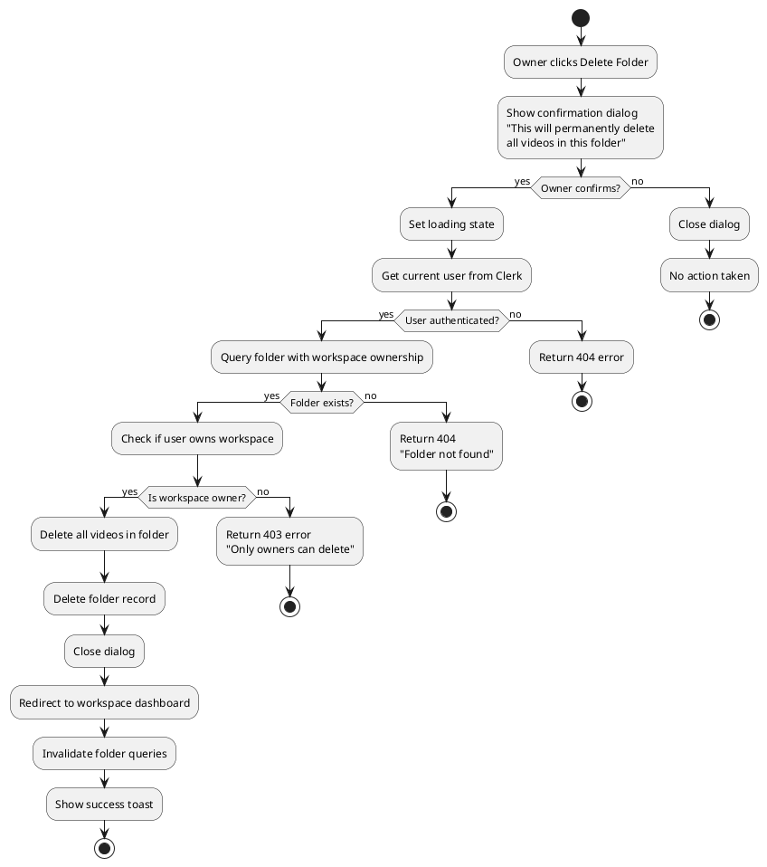
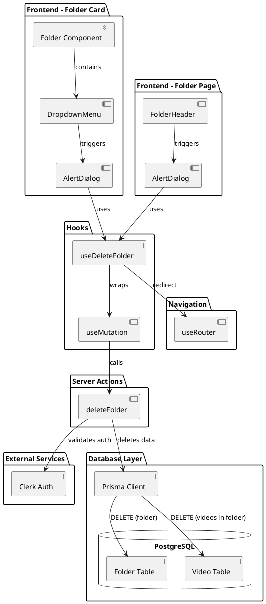
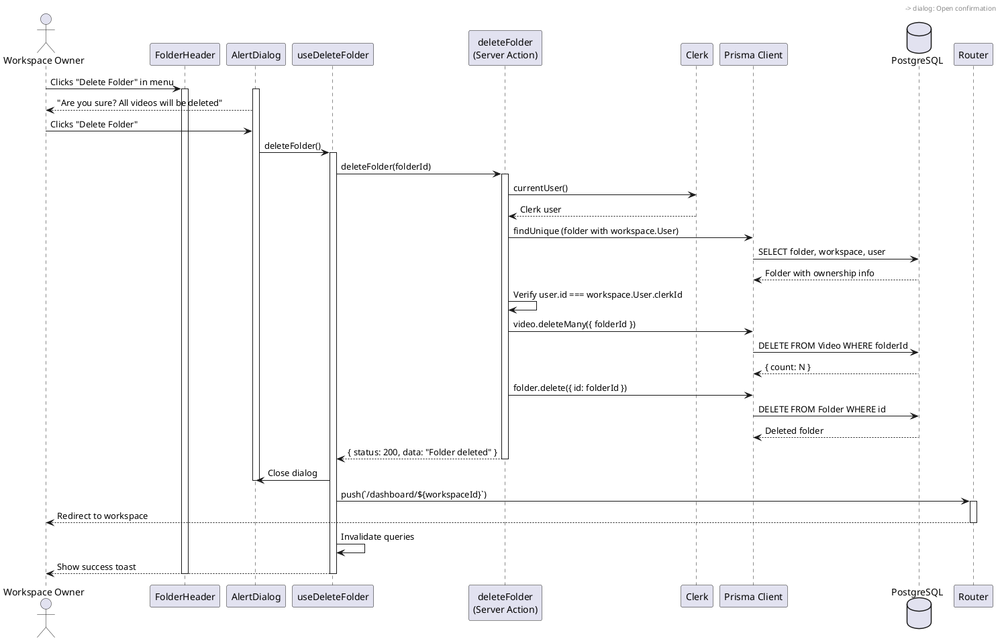
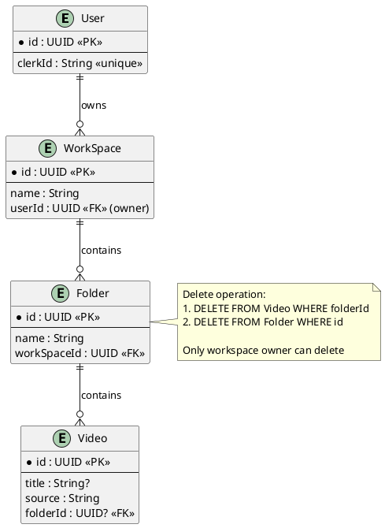

# Feature 5.5: Delete Folder

## Features Covered
| #   | Feature/Transaction                                    | Actor           |
|-----|--------------------------------------------------------|-----------------|
| 5.5 | Workspace owner can delete a folder and all its videos | Workspace Owner |

---

## Use Case Diagram



---

## Use Case Description

| Field | Description |
|-------|-------------|
| **Use Case ID** | UC-5.5 |
| **Use Case Name** | Delete Folder and Videos |
| **Actor(s)** | Workspace Owner, System |
| **Description** | A workspace owner deletes a folder, which also permanently deletes all videos contained within it. This is a destructive operation with confirmation required. |
| **Preconditions** | 1. User is authenticated<br>2. User is the workspace owner<br>3. Folder exists in the workspace |
| **Postconditions** | 1. Folder record deleted<br>2. All videos in folder deleted<br>3. User redirected to workspace<br>4. Folder list refreshed |
| **Main Flow** | 1. Owner clicks delete option (from folder card menu or folder header)<br>2. System shows confirmation dialog with warning<br>3. Owner confirms deletion<br>4. System verifies workspace ownership<br>5. System deletes all videos in the folder<br>6. System deletes the folder record<br>7. System redirects to workspace dashboard<br>8. Success toast shown |
| **Alternative Flows** | A1: User cancels → Dialog closes, no action taken |
| **Exceptions** | E1: User is not owner → Return 403 forbidden<br>E2: Folder not found → Return 404 error |

---

## Activity Diagram



---

## Component List

### Frontend Components

| Component | File Path | Description | Type |
|-----------|-----------|-------------|------|
| Folder | `src/components/global/folders/folder.tsx` | Folder card with delete action in dropdown | Card Component |
| FolderHeader | `src/components/global/folders/folder-header.tsx` | Folder page header with delete in dropdown | Header Component |
| AlertDialog | `src/components/ui/alert-dialog.tsx` | Confirmation dialog component | UI Component |
| DropdownMenu | `src/components/ui/dropdown-menu.tsx` | Menu containing delete option | UI Component |
| Button | `src/components/ui/button.tsx` | Cancel and Delete buttons | UI Component |

### Backend Components

| Component | File Path | Description | Type |
|-----------|-----------|-------------|------|
| deleteFolder | `src/actions/workspace.ts` | Server action to delete folder and videos | Server Action |
| useDeleteFolder | `src/hooks/useDeleteFolder.ts` | Custom hook for folder deletion with redirect | Custom Hook |
| Prisma Client | `src/lib/prisma.ts` | Database client for Folder, Video tables | Database Client |
| useRouter | `next/navigation` | Next.js router for redirect | Next.js Hook |

---

## Component/Module Diagram



---

## Sequence Diagram



---

## ERD and Schema



### Prisma Schema (Relevant Models)

```prisma
model Folder {
  id          String     @id @default(dbgenerated("gen_random_uuid()")) @db.Uuid
  name        String     @default("Untitled Folder")
  createdAt   DateTime   @default(now())
  WorkSpace   WorkSpace? @relation(fields: [workSpaceId], references: [id], onDelete: Cascade)
  workSpaceId String?    @db.Uuid
  videos      Video[]
}

model Video {
  id          String     @id @default(dbgenerated("gen_random_uuid()")) @db.Uuid
  title       String?    @default("Untitled Video")
  source      String     @unique
  Folder      Folder?    @relation(fields: [folderId], references: [id], onDelete: Cascade)
  folderId    String?    @db.Uuid
  WorkSpace   WorkSpace? @relation(fields: [workSpaceId], references: [id], onDelete: Cascade)
  workSpaceId String?    @db.Uuid
}
```

### Server Action Code

```typescript
export const deleteFolder = async (folderId: string) => {
  try {
    const user = await currentUser()
    if (!user) return { status: 404, data: 'User not authenticated' }
    
    const folder = await client.folder.findUnique({
      where: { id: folderId },
      select: {
        id: true,
        name: true,
        WorkSpace: {
          select: {
            id: true,
            User: {
              select: { clerkId: true }
            }
          }
        }
      }
    })
    
    if (!folder) return { status: 404, data: 'Folder not found' }
    
    if (folder.WorkSpace?.User?.clerkId !== user.id) {
      return { status: 403, data: 'You can only delete your own folders' }
    }
    
    // Delete all videos in the folder
    await client.video.deleteMany({
      where: { folderId }
    })
    
    // Delete the folder
    const deletedFolder = await client.folder.delete({
      where: { id: folderId }
    })
    
    if (deletedFolder) {
      return { status: 200, data: 'Folder deleted successfully' }
    }
    
    return { status: 404, data: 'Folder not found' }
  } catch (error) {
    console.log('Error deleting folder:', error)
    return { status: 500, data: 'Failed to delete folder' }
  }
}
```

