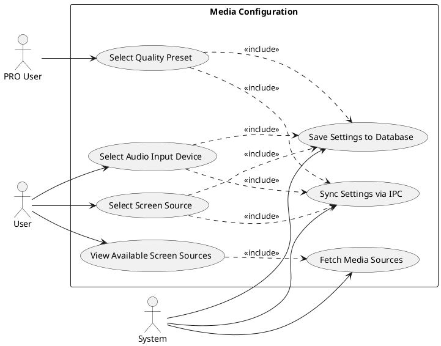
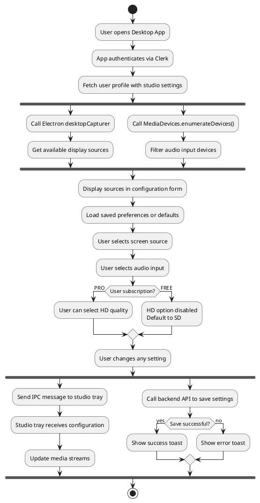
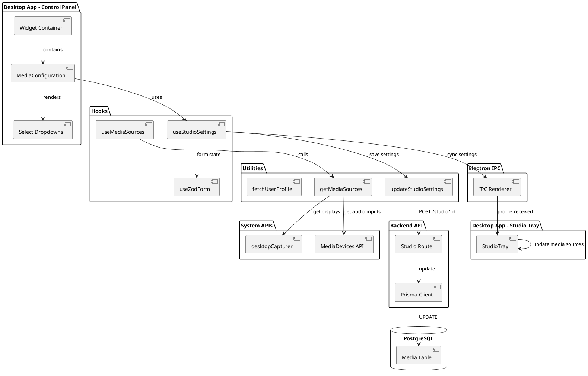
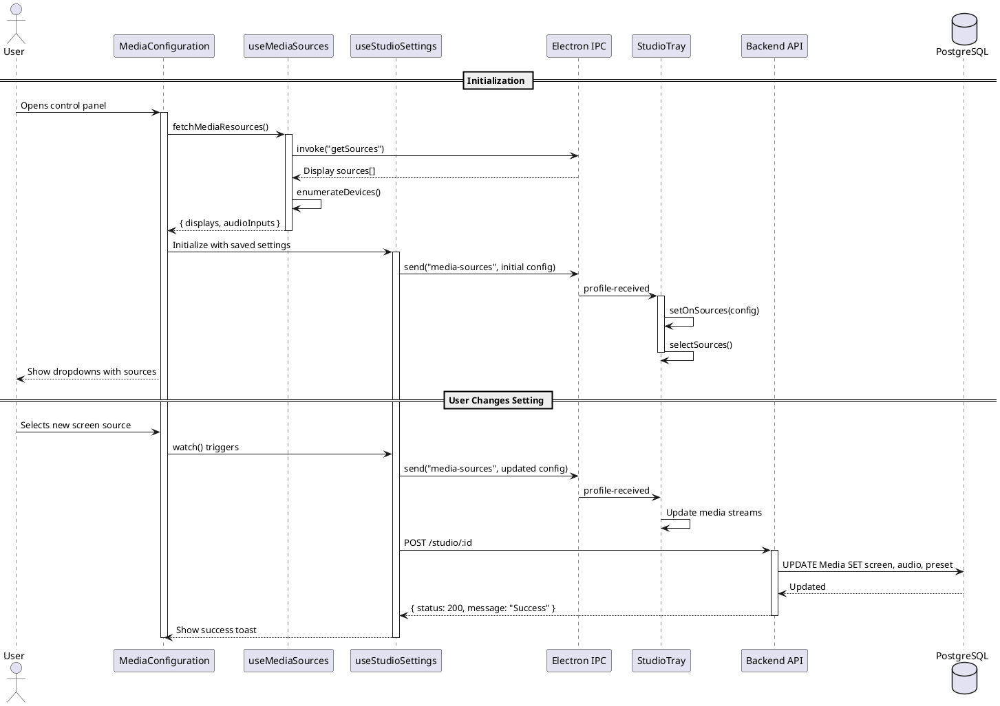
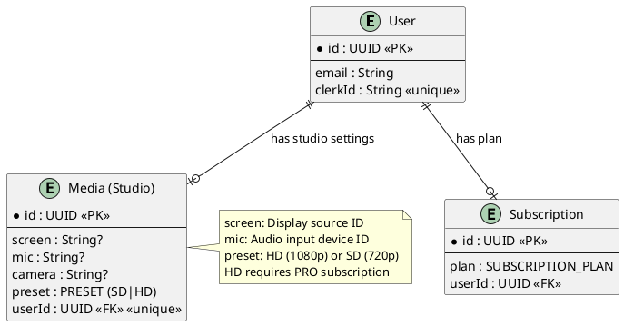

# Features 6.1-6.5, 6.8: Media Configuration

## Features Covered
| #   | Feature/Transaction                                                | Actor    |
|-----|--------------------------------------------------------------------|----------|
| 6.1 | User can view available screen capture sources                     | User     |
| 6.2 | User can select a screen source for recording                      | User     |
| 6.3 | User can select an audio input device for recording                | User     |
| 6.4 | PRO user can select recording quality preset (SD/HD)               | PRO User |
| 6.5 | System syncs studio settings between control panel and studio tray | System   |
| 6.8 | System saves studio settings to the database                       | System   |

---

## Use Case Diagram



---

## Use Case Description

### UC-6.1: View Available Screen Sources

| Field | Description |
|-------|-------------|
| **Use Case ID** | UC-6.1 |
| **Use Case Name** | View Available Screen Sources |
| **Actor(s)** | User, System |
| **Description** | User views all available screen capture sources (displays and windows) detected by the system. |
| **Preconditions** | 1. Desktop app is running<br>2. User is authenticated |
| **Postconditions** | 1. Available displays listed in dropdown |
| **Main Flow** | 1. User opens media configuration<br>2. System calls Electron's desktopCapturer API<br>3. System fetches audio input devices from MediaDevices API<br>4. Available sources displayed in dropdowns |

### UC-6.2-6.4: Select Media Sources and Quality

| Field | Description |
|-------|-------------|
| **Use Case ID** | UC-6.2-6.4 |
| **Use Case Name** | Configure Recording Sources |
| **Actor(s)** | User, PRO User, System |
| **Description** | User selects screen source, audio input, and quality preset for recording. |
| **Preconditions** | 1. Media sources fetched<br>2. User authenticated |
| **Postconditions** | 1. Selection saved to database<br>2. Settings synced to studio tray window |
| **Main Flow** | 1. User selects screen source from dropdown<br>2. User selects audio input from dropdown<br>3. User selects quality preset (HD for PRO users only)<br>4. System sends settings via IPC to studio tray<br>5. System saves settings to backend database |

### UC-6.5, 6.8: Settings Synchronization

| Field | Description |
|-------|-------------|
| **Use Case ID** | UC-6.5/6.8 |
| **Use Case Name** | Sync and Save Settings |
| **Actor(s)** | System |
| **Description** | System syncs settings between control panel and studio tray, and persists to database. |
| **Preconditions** | 1. User has made configuration changes |
| **Postconditions** | 1. Studio tray has updated settings<br>2. Database updated |
| **Main Flow** | 1. User changes any setting<br>2. System watches for form changes<br>3. System sends IPC message to studio tray<br>4. System calls backend API to save settings<br>5. Success toast displayed |

---

## Activity Diagram



---

## Component List

### Frontend Components (Desktop App)

| Component | File Path | Description | Type |
|-----------|-----------|-------------|------|
| MediaConfiguration | `src/components/global/widget/media-configuration.tsx` | Main configuration form with dropdowns | Form Component |
| Widget | `src/components/global/widget/widget.tsx` | Container for media configuration | Layout Component |
| Select | `src/components/ui/select.tsx` | Dropdown component for source selection | UI Component |
| Spinner | `src/components/global/loader-spinner.tsx` | Loading state indicator | UI Component |

### Hooks and Utilities

| Component | File Path | Description | Type |
|-----------|-----------|-------------|------|
| useMediaSources | `src/hooks/useMediaSources.ts` | Fetches available displays and audio inputs | Custom Hook |
| useStudioSettings | `src/hooks/useStudioSettings.ts` | Manages settings form with sync and save | Custom Hook |
| getMediaSources | `src/lib/utils.ts` | Utility to call Electron and browser APIs | Utility Function |
| updateStudioSettings | `src/lib/utils.ts` | HTTP call to save settings | Utility Function |
| fetchUserProfile | `src/lib/utils.ts` | Fetches user data with studio settings | Utility Function |

### Backend Components (Express Server)

| Component | File Path | Description | Type |
|-----------|-----------|-------------|------|
| Studio Route | `express-backend/routes/studio.ts` | API endpoint for studio settings | Express Route |
| Prisma Client | Database client for Media table | Database Client |

---

## Component/Module Diagram



---

## Sequence Diagram



---

## ERD and Schema



### Prisma Schema (Relevant Models)

```prisma
model Media {
  id     String  @id @default(dbgenerated("gen_random_uuid()")) @db.Uuid
  screen String?
  mic    String?
  camera String?
  preset PRESET  @default(SD)
  User   User?   @relation(fields: [userId], references: [id])
  userId String? @unique @db.Uuid
}

enum PRESET {
  SD
  HD
}

enum SUBSCRIPTION_PLAN {
  PRO
  FREE
}
```

