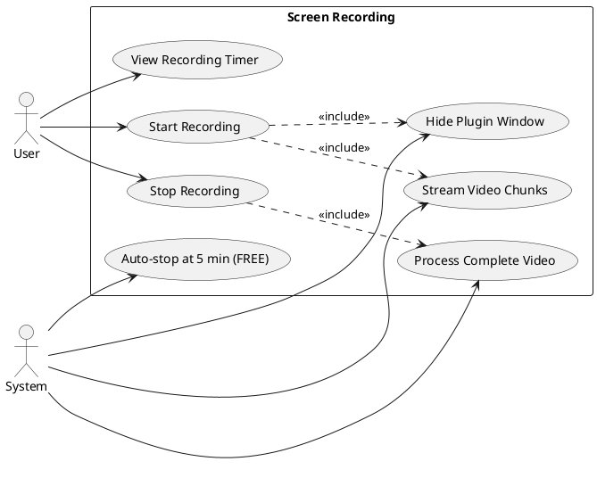
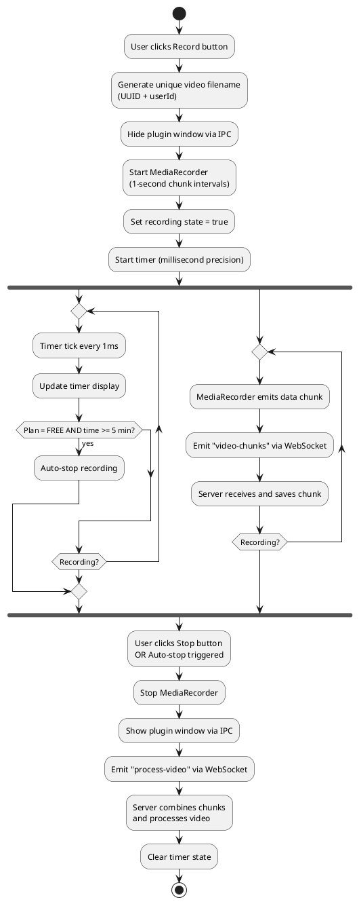
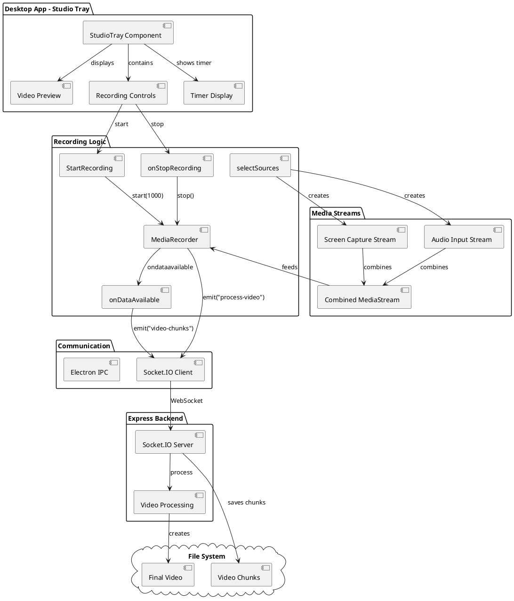
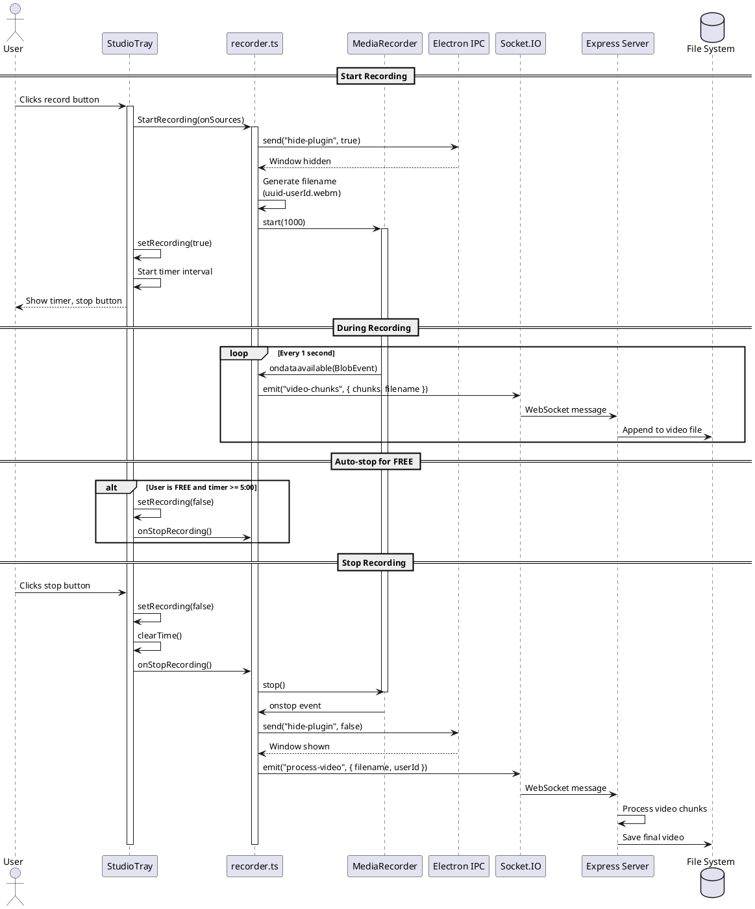
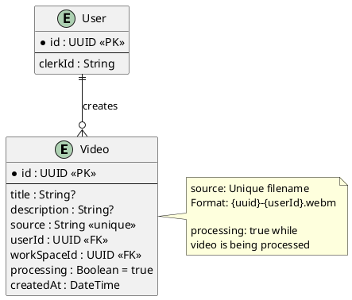

# Feature 6.6: Screen Recording

## Features Covered
| #     | Feature/Transaction                                               | Actor  |
|-------|-------------------------------------------------------------------|--------|
| 6.6   | User can record their screen (start and stop)                     | User   |
| 6.6.1 | System streams video chunks to server during recording            | System |
| 6.6.2 | System hides plugin window during recording to avoid capturing it | System |

---

## Use Case Diagram



---

## Use Case Description

| Field | Description |
|-------|-------------|
| **Use Case ID** | UC-6.6 |
| **Use Case Name** | Screen Recording |
| **Actor(s)** | User, System |
| **Description** | User records their screen using the desktop app. The system streams video chunks in real-time to the server, hides the plugin window during recording, and processes the video when complete. |
| **Preconditions** | 1. User authenticated<br>2. Media sources configured<br>3. Studio tray received configuration |
| **Postconditions** | 1. Video file saved to server<br>2. Video processing initiated<br>3. Plugin window restored |
| **Main Flow** | 1. User clicks red record button<br>2. System hides plugin window (6.6.2)<br>3. System starts MediaRecorder with 1-second chunks<br>4. Timer starts counting<br>5. System streams chunks via WebSocket (6.6.1)<br>6. User clicks stop button<br>7. System stops MediaRecorder<br>8. System shows plugin window<br>9. System signals server to process video |
| **Alternative Flows** | A1: FREE user reaches 5 minutes → Auto-stop recording |
| **Exceptions** | E1: Media stream error → Recording fails to start |

---

## Activity Diagram



---

## Component List

### Frontend Components (Desktop App)

| Component | File Path | Description | Type |
|-----------|-----------|-------------|------|
| StudioTray | `src/components/global/studio.tsx` | Main recording interface with controls | Recording Component |
| Record Button | Built-in | Red circle button to start recording | UI Element |
| Stop Button | Built-in | Square button to stop recording | UI Element |
| Timer Display | Built-in | Shows recording duration (HH:MM:SS) | UI Element |
| Preview Toggle | Built-in | Cast icon to toggle preview | UI Element |

### Recording Logic

| Component | File Path | Description | Type |
|-----------|-----------|-------------|------|
| selectSources | `src/lib/recorder.ts` | Configures media streams and MediaRecorder | Function |
| StartRecording | `src/lib/recorder.ts` | Initiates recording with filename generation | Function |
| onStopRecording | `src/lib/recorder.ts` | Stops the MediaRecorder | Function |
| onDataAvailable | `src/lib/recorder.ts` | Handles video chunks, emits to WebSocket | Function |
| stopRecording | `src/lib/recorder.ts` | Cleanup and signals video processing | Function |

### Utilities

| Component | File Path | Description | Type |
|-----------|-----------|-------------|------|
| hidePluginWindow | `src/lib/utils.ts` | IPC call to hide/show plugin window | Function |
| resizeWindow | `src/lib/utils.ts` | IPC call to resize studio window | Function |
| videoRecordingTime | `src/lib/utils.ts` | Converts ms to HH:MM:SS format | Function |
| Socket.IO Client | `src/lib/recorder.ts` | WebSocket connection to server | Client |

### Backend Components

| Component | File Path | Description | Type |
|-----------|-----------|-------------|------|
| Express Server | `express-backend/` | Handles video chunk uploads | Server |
| Socket.IO Server | Handles WebSocket events | Server |
| File System | Saves video chunks to disk | System |

---

## Component/Module Diagram



---

## Sequence Diagram



---

## ERD and Schema



### Recording Flow Notes

```
Recording Filename Format:
  {uuid}-{userId.slice(0,8)}.webm

Video Codec: VP9 in WebM container

Chunk Interval: 1 second (1000ms)

FREE Plan Limit: 5 minutes

Resolution:
  HD (PRO): 1920x1080 @ 30fps
  SD (FREE): 1280x720 @ 30fps
```

