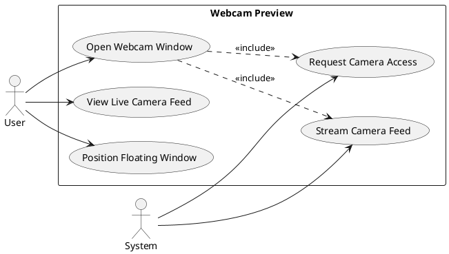
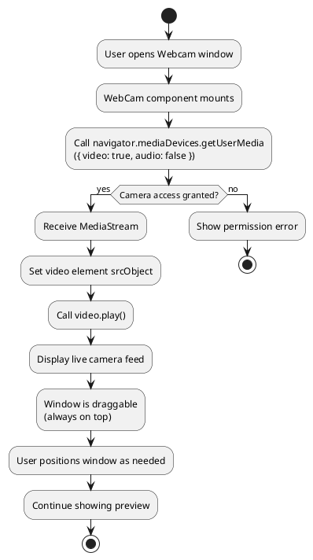
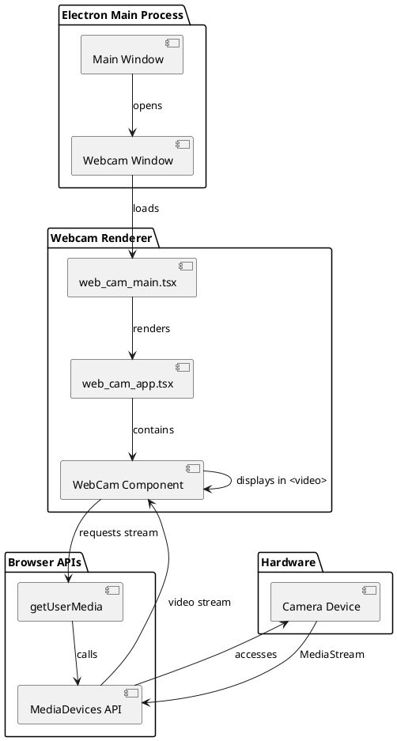
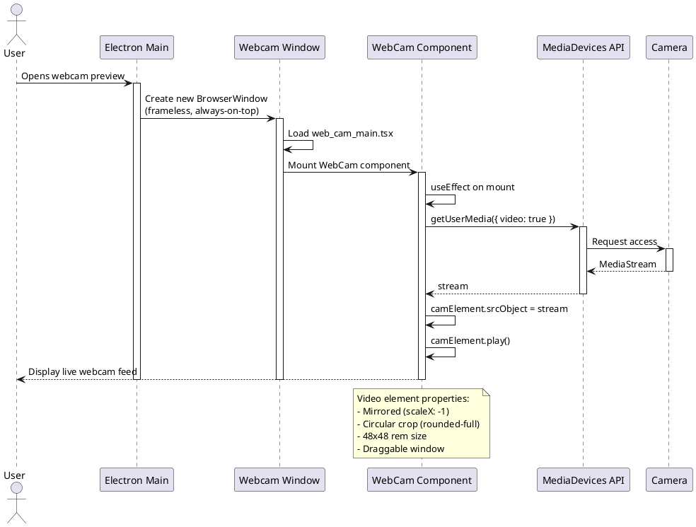
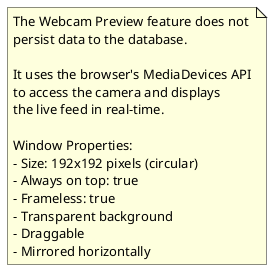

# Feature 6.7: Webcam Preview

## Features Covered
| #   | Feature/Transaction                            | Actor |
|-----|------------------------------------------------|-------|
| 6.7 | User can view webcam preview during recording  | User  |

---

## Use Case Diagram



---

## Use Case Description

| Field | Description |
|-------|-------------|
| **Use Case ID** | UC-6.7 |
| **Use Case Name** | Webcam Preview |
| **Actor(s)** | User, System |
| **Description** | User views a live webcam preview in a separate floating window that can be positioned anywhere on screen during recording. |
| **Preconditions** | 1. Desktop app is running<br>2. Webcam is connected<br>3. Camera permissions granted |
| **Postconditions** | 1. Live webcam feed displayed in floating window |
| **Main Flow** | 1. User launches webcam window from desktop app<br>2. System requests camera access from browser API<br>3. System receives MediaStream from webcam<br>4. System displays stream in video element<br>5. User can drag window to any position<br>6. Preview continues until window is closed |
| **Alternative Flows** | A1: Camera access denied → Window shows error state |
| **Exceptions** | E1: No camera found → Stream fails to initialize |

---

## Activity Diagram



---

## Component List

### Frontend Components (Desktop App)

| Component | File Path | Description | Type |
|-----------|-----------|-------------|------|
| WebCam | `src/components/global/webcam.tsx` | Webcam preview component with live feed | Video Component |
| web_cam_app.tsx | `src/web_cam_app.tsx` | Root app for webcam window | App Component |
| web_cam_main.tsx | `src/web_cam_main.tsx` | Entry point for webcam window | Entry Point |

### Electron Configuration

| Component | Description | Type |
|-----------|-------------|------|
| Webcam BrowserWindow | Separate Electron window for webcam | Electron Window |
| Always-on-top | Window property for overlay behavior | Window Property |
| Frameless | Removes window decorations | Window Property |
| Draggable | CSS class for window dragging | CSS Property |

---

## Component/Module Diagram



---

## Sequence Diagram



---

## ERD and Schema



### Component Code Reference

```typescript
// WebCam component - src/components/global/webcam.tsx
export const WebCam = () => {
  const camElement = useRef<HTMLVideoElement | null>(null);

  const streamWebCam = async () => {
    const stream = await navigator.mediaDevices.getUserMedia({
      video: true,
      audio: false,
    });

    if (camElement.current) {
      camElement.current.srcObject = stream;
      await camElement.current.play();
    }
  };

  useEffect(() => {
    streamWebCam();
  }, []);

  return (
    <video
      ref={camElement}
      className="w-48 h-48 draggable object-cover rounded-full border-2 border-white"
      style={{ transform: 'scaleX(-1)' }}
    />
  );
};
```

### Video Element Styling

| Property | Value | Purpose |
|----------|-------|---------|
| width | 48 (192px) | Fixed circular size |
| height | 48 (192px) | Fixed circular size |
| object-cover | true | Fills container without distortion |
| rounded-full | true | Circular clip mask |
| border | 2px white | Visual boundary |
| transform | scaleX(-1) | Mirror image horizontally |
| draggable | class | Allows window repositioning |

