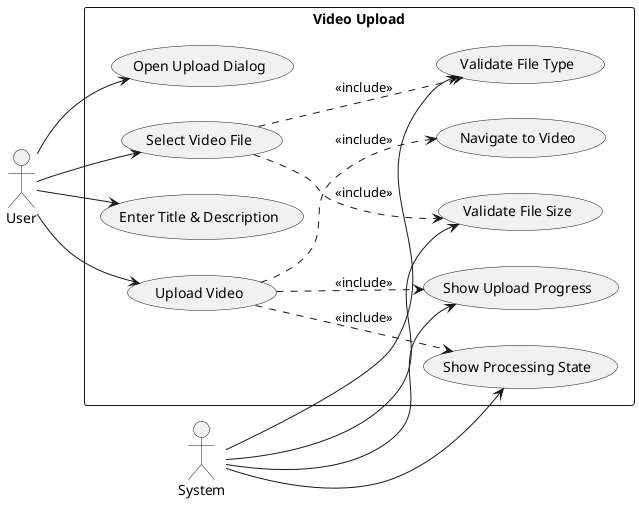
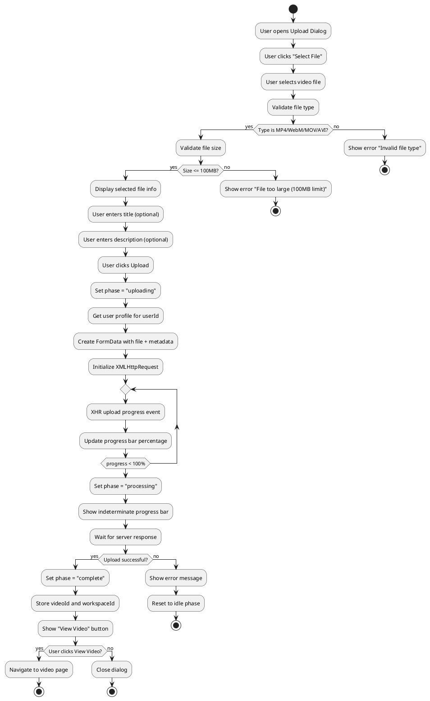
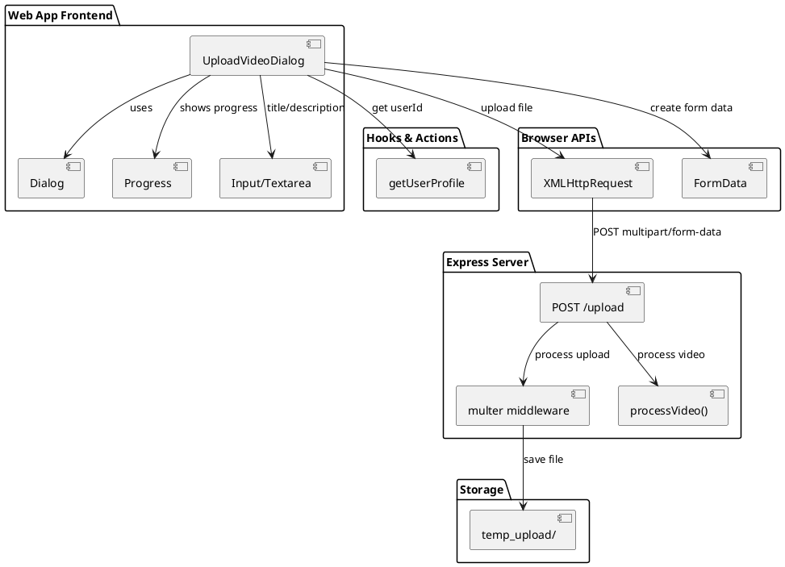
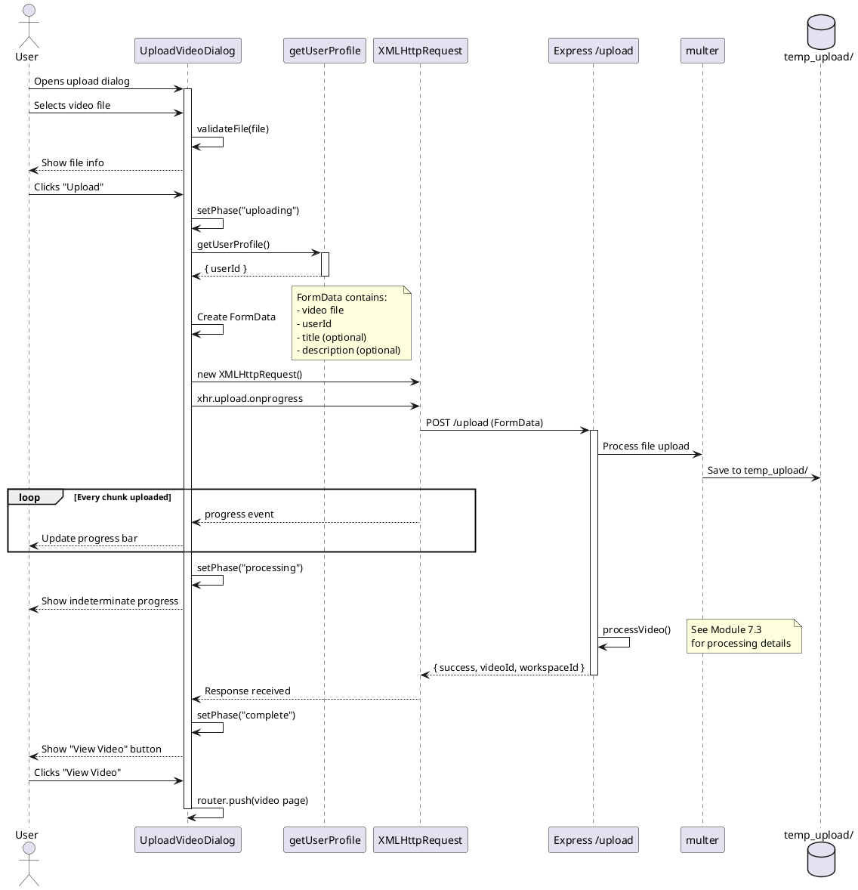
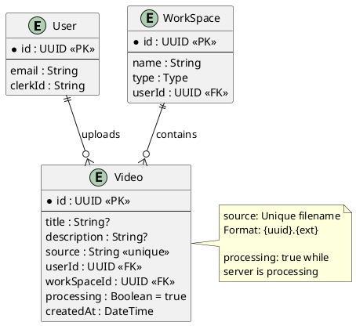

# Features 7.1-7.2: Video Upload

## Features Covered
| #   | Feature/Transaction                                                         | Actor  |
|-----|-----------------------------------------------------------------------------|--------|
| 7.1 | User can upload a video file via the web app (validates file type and size) | User   |
| 7.2 | System shows upload progress during file upload                             | System |

---

## Use Case Diagram

---

## Use Case Description

| Field | Description |
|-------|-------------|
| **Use Case ID** | UC-7.1-7.2 |
| **Use Case Name** | Upload Video via Web App |
| **Actor(s)** | User, System |
| **Description** | User uploads a video file through the web application with real-time progress tracking. The system validates the file and shows multi-phase progress. |
| **Preconditions** | 1. User is authenticated 2. User has a workspace |
| **Postconditions** | 1. Video file uploaded to server 2. User can navigate to video |
| **Main Flow** | 1. User opens upload dialog 2. User selects video file 3. System validates file type (MP4, WebM, MOV, AVI) 4. System validates file size (max 100MB) 5. User optionally enters title and description 6. User clicks upload 7. System shows upload progress (0-100%) 8. System shows "Processing..." state 9. System shows "Complete" with View Video button |
| **Alternative Flows** | A1: Invalid file type → Show error message A2: File too large → Show error message |
| **Exceptions** | E1: Upload fails → Show error toast E2: Server error → Display error message |

---

## Activity Diagram

---

## Component List

### Frontend Components

| Component | File Path | Description | Type |
|-----------|-----------|-------------|------|
| UploadVideoDialog | `src/components/global/upload-video-dialog.tsx` | Main upload dialog with multi-phase UI | Dialog Component |
| Dialog | `src/components/ui/dialog.tsx` | Base dialog component | UI Component |
| Input | `src/components/ui/input.tsx` | Title input field | UI Component |
| Textarea | `src/components/ui/textarea.tsx` | Description input field | UI Component |
| Progress | `src/components/ui/progress.tsx` | Upload progress bar | UI Component |
| Button | `src/components/ui/button.tsx` | Upload and navigation buttons | UI Component |

### Backend Components

| Component | File Path | Description | Type |
|-----------|-----------|-------------|------|
| getUserProfile | `src/actions/user.ts` | Gets user ID for upload | Server Action |
| Express /upload | `crystal-express/server.js` | HTTP file upload endpoint | Express Route |
| multer | Express middleware | File upload handling | Middleware |

---

## Component/Module Diagram

---

## Sequence Diagram

---

## ERD and Schema

### Validation Rules

| Validation | Rule |
|------------|------|
| Allowed Types | `video/mp4`, `video/webm`, `video/quicktime`, `video/x-msvideo` |
| File Extensions | `.mp4`, `.webm`, `.mov`, `.avi` |
| Max File Size | 100MB (100 * 1024 * 1024 bytes) |

### Upload Phases

| Phase | Progress Bar | Description |
|-------|--------------|-------------|
| `idle` | None | File selection and metadata entry |
| `uploading` | Determinate (0-100%) | File being uploaded |
| `processing` | Indeterminate | Server processing video |
| `complete` | None | Success with navigation option |

