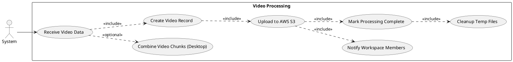
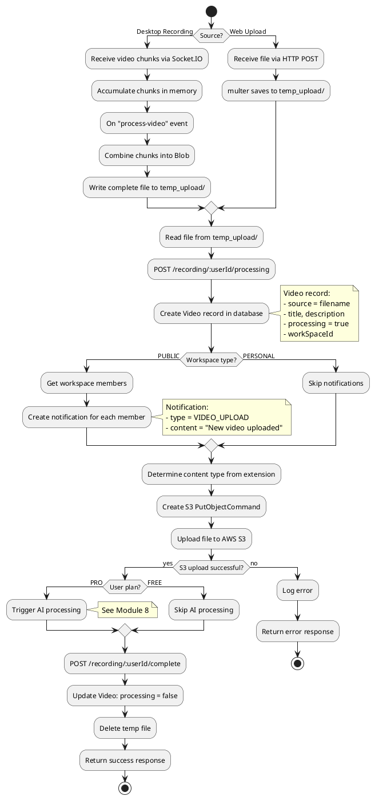
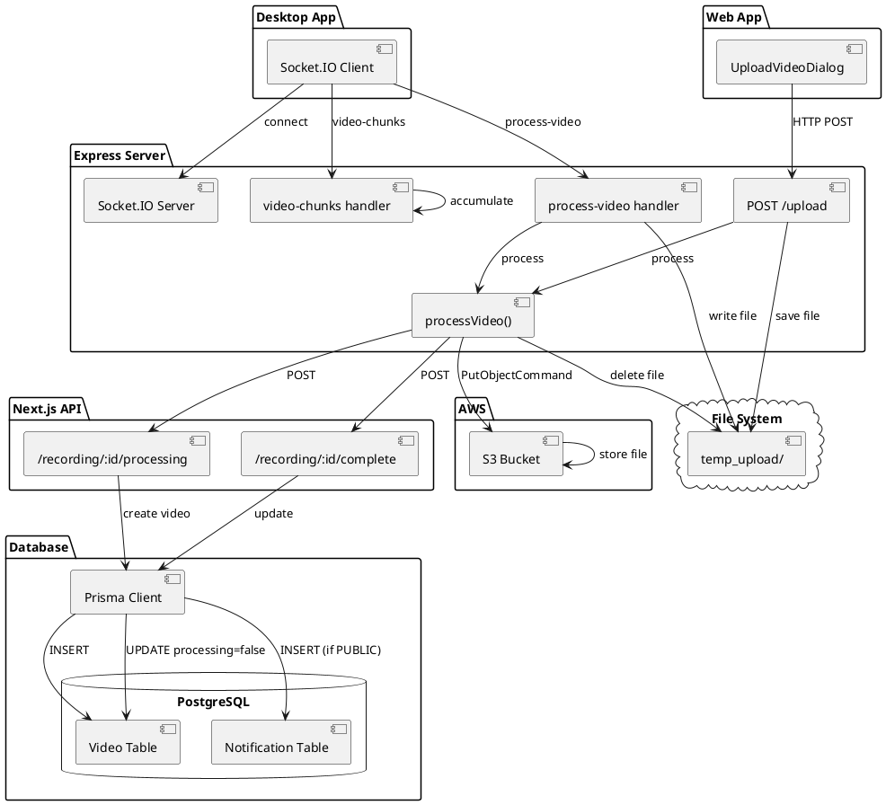
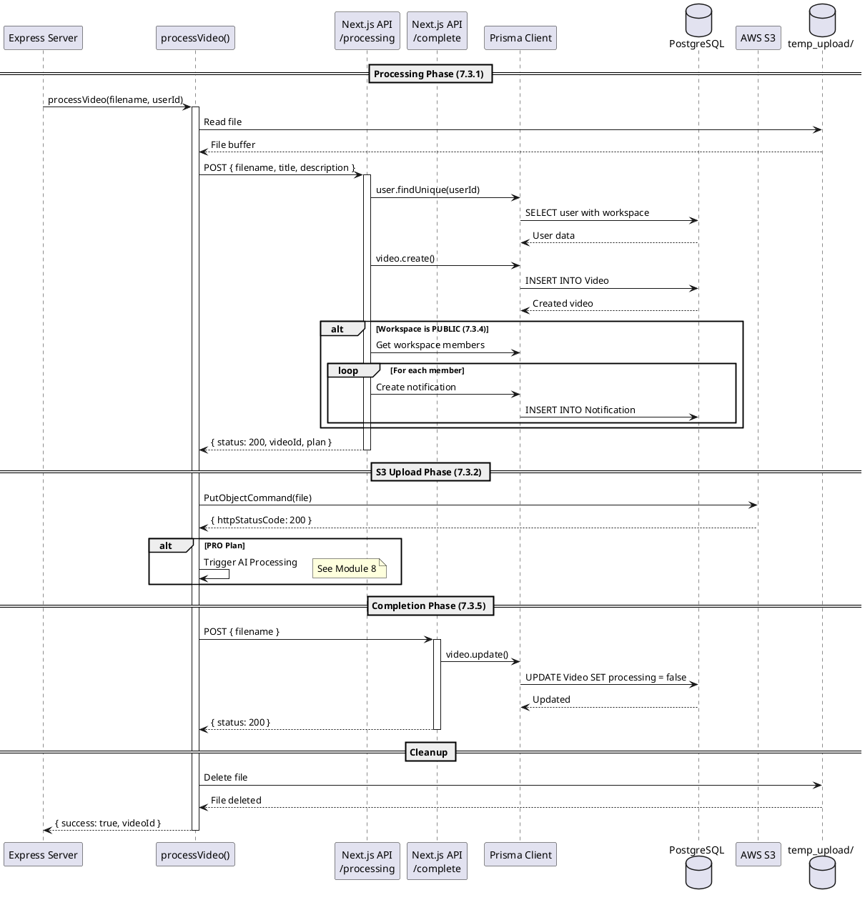
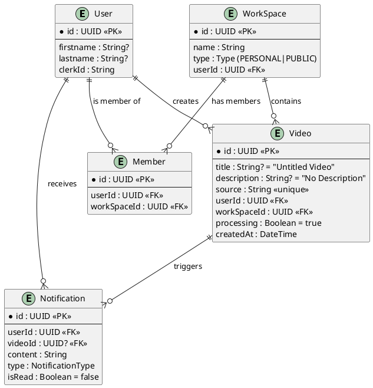

# Feature 7.3: Video Processing

## Features Covered
| #     | Feature/Transaction                                                    | Actor  |
|-------|------------------------------------------------------------------------|--------|
| 7.3   | System processes the uploaded/recorded video                           | System |
| 7.3.1 | System creates video record in database when processing begins         | System |
| 7.3.2 | System uploads video to AWS S3 storage                                 | System |
| 7.3.3 | System combines recorded video chunks into final video file            | System |
| 7.3.4 | System creates notifications for workspace members (public workspaces) | System |
| 7.3.5 | System marks video processing as complete                              | System |

---

## Use Case Diagram



---

## Use Case Description

| Field | Description |
|-------|-------------|
| **Use Case ID** | UC-7.3 |
| **Use Case Name** | Process Video |
| **Actor(s)** | System |
| **Description** | System processes an uploaded or recorded video by creating database records, uploading to S3, notifying members, and marking completion. |
| **Preconditions** | 1. Video file exists in temp_upload/<br>2. Valid userId provided |
| **Postconditions** | 1. Video record in database<br>2. Video file in AWS S3<br>3. Temp file cleaned up<br>4. processing = false |
| **Main Flow** | 1. System receives video data (upload or socket)<br>2. For desktop: combine chunks into file (7.3.3)<br>3. Call /recording/:id/processing API (7.3.1)<br>4. Upload file to AWS S3 (7.3.2)<br>5. For PUBLIC workspace: create notifications (7.3.4)<br>6. Call /recording/:id/complete API (7.3.5)<br>7. Delete temp file |
| **Alternative Flows** | A1: PRO user → Trigger AI processing (Module 8)<br>A2: PERSONAL workspace → Skip notifications |
| **Exceptions** | E1: S3 upload fails → Log error, abort<br>E2: Database error → Log error |

---

## Activity Diagram



---

## Component List

### Express Server Components

| Component | File Path | Description | Type |
|-----------|-----------|-------------|------|
| processVideo() | `crystal-express/server.js` | Main processing function | Function |
| Socket.IO handler | `crystal-express/server.js` | Handles desktop recording chunks | Event Handler |
| POST /upload | `crystal-express/server.js` | HTTP upload endpoint | Express Route |

### Next.js API Routes

| Component | File Path | Description | Type |
|-----------|-----------|-------------|------|
| POST /recording/:id/processing | `src/app/api/recording/[id]/processing/route.ts` | Creates video record | API Route |
| POST /recording/:id/complete | `src/app/api/recording/[id]/complete/route.ts` | Marks processing complete | API Route |

### External Services

| Service | Purpose | Type |
|---------|---------|------|
| AWS S3 | Video file storage | Cloud Storage |
| Socket.IO | Real-time chunk streaming | WebSocket |

---

## Component/Module Diagram



---

## Sequence Diagram



---

## ERD and Schema



### Prisma Schema (Relevant Models)

```prisma
model Video {
  id          String     @id @default(dbgenerated("gen_random_uuid()")) @db.Uuid
  title       String?    @default("Untitled Video")
  description String?    @default("No Description")
  source      String     @unique
  createdAt   DateTime   @default(now())
  userId      String?    @db.Uuid
  processing  Boolean    @default(true)
  workSpaceId String?    @db.Uuid
  User        User?      @relation(fields: [userId], references: [id], onDelete: Cascade)
  WorkSpace   WorkSpace? @relation(fields: [workSpaceId], references: [id], onDelete: Cascade)
  Notification Notification[]
}

model Notification {
  id        String           @id @default(dbgenerated("gen_random_uuid()")) @db.Uuid
  userId    String?          @db.Uuid
  content   String
  type      NotificationType @default(INVITE)
  videoId   String?          @db.Uuid
  isRead    Boolean          @default(false)
  createdAt DateTime         @default(now())
  User      User?            @relation(fields: [userId], references: [id])
  Video     Video?           @relation(fields: [videoId], references: [id], onDelete: Cascade)
}

enum NotificationType {
  INVITE
  VIDEO_VIEW
  VIDEO_LIKE
  VIDEO_UPLOAD
}
```

### Processing Flow Summary

| Step | Action | Endpoint/Service |
|------|--------|------------------|
| 1 | Create video record | POST /recording/:id/processing |
| 2 | Upload to S3 | AWS S3 PutObjectCommand |
| 3 | (PRO) AI processing | OpenAI Whisper + GPT |
| 4 | Mark complete | POST /recording/:id/complete |
| 5 | Cleanup temp file | fs.unlink() |

