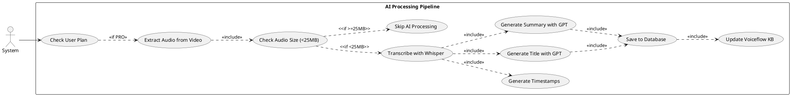
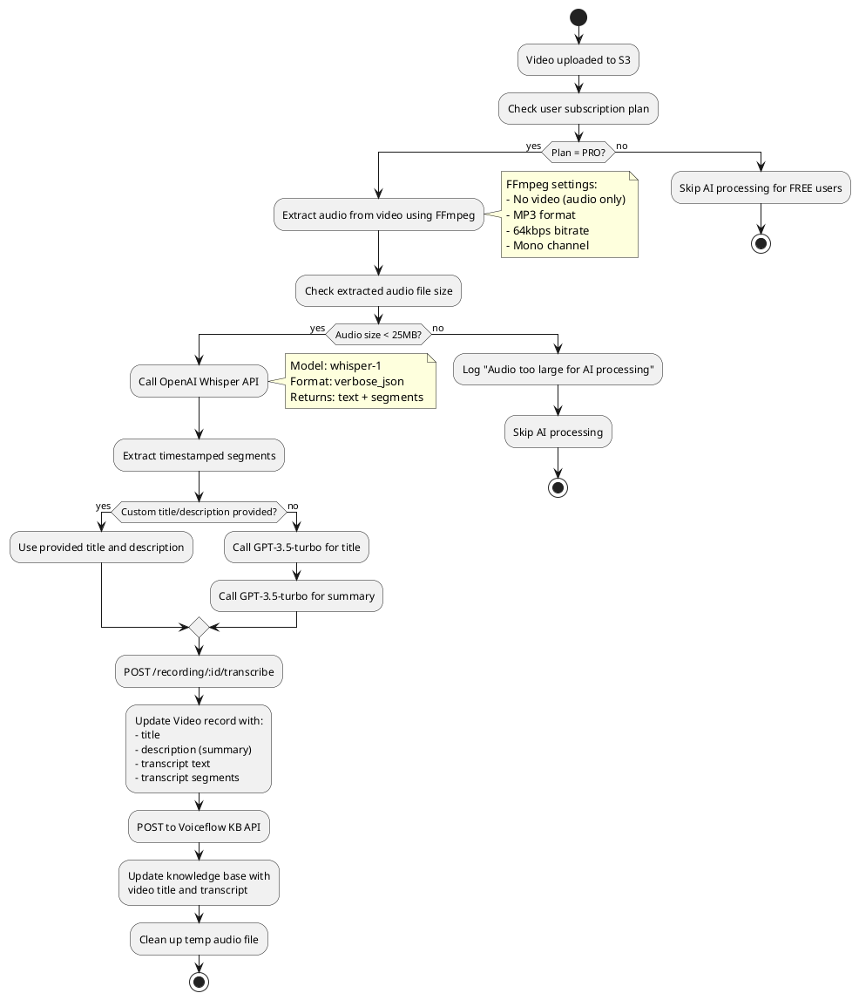
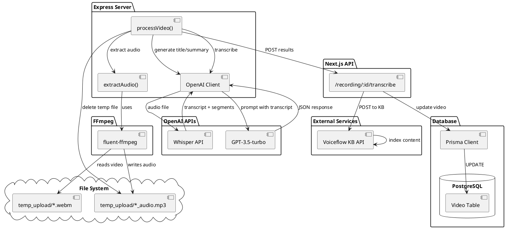
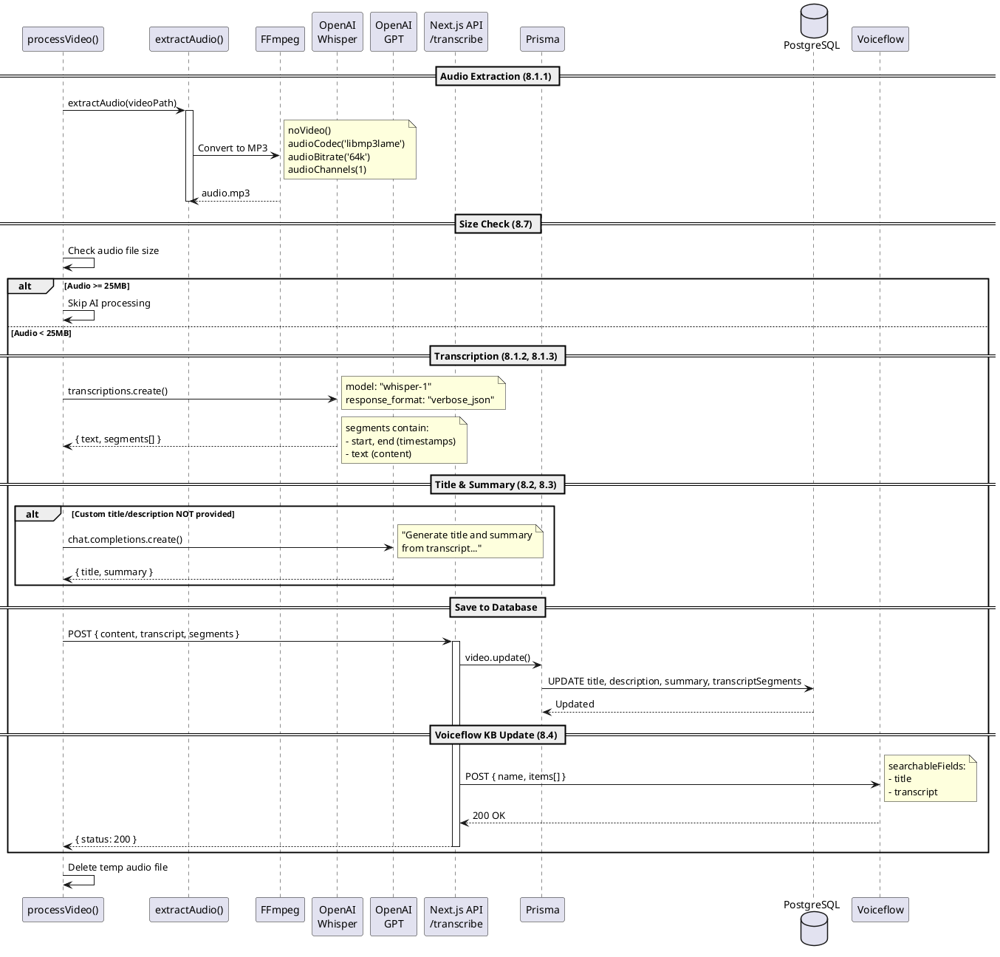
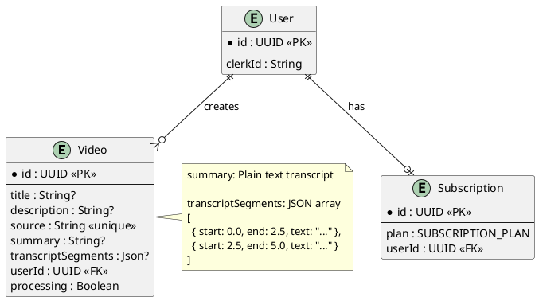

# Features 8.1-8.4, 8.7: AI Processing Pipeline

## Features Covered
| #     | Feature/Transaction                                                    | Actor  |
|-------|------------------------------------------------------------------------|--------|
| 8.1   | System generates AI transcript from video (PRO users)                  | System |
| 8.1.1 | System extracts audio from video                                       | System |
| 8.1.2 | System transcribes audio using OpenAI Whisper                          | System |
| 8.1.3 | System generates timestamped transcript segments                       | System |
| 8.2   | System generates AI-powered video title (PRO users)                    | System |
| 8.3   | System generates AI-powered video summary/description (PRO users)      | System |
| 8.4   | System updates Voiceflow knowledge base with video content (PRO users) | System |
| 8.7   | System skips AI processing for videos whose audio exceeds 25MB         | System |

---

## Use Case Diagram



---

## Use Case Description

| Field | Description |
|-------|-------------|
| **Use Case ID** | UC-8.1-8.4-8.7 |
| **Use Case Name** | AI Video Processing Pipeline |
| **Actor(s)** | System |
| **Description** | System processes video content with AI to generate transcripts, titles, summaries, and update the Voiceflow knowledge base. Only available for PRO users. |
| **Preconditions** | 1. Video uploaded to S3<br>2. User has PRO subscription<br>3. Video file exists in temp_upload/ |
| **Postconditions** | 1. Transcript saved to video record<br>2. AI title and summary generated<br>3. Voiceflow KB updated |
| **Main Flow** | 1. System checks user plan is PRO<br>2. System extracts audio using FFmpeg (8.1.1)<br>3. System checks extracted audio size<br>4. If audio < 25MB: transcribe with Whisper (8.1.2)<br>5. System extracts timestamped segments (8.1.3)<br>6. System generates title/summary with GPT (8.2, 8.3)<br>7. System saves transcript and metadata to DB<br>8. System updates Voiceflow KB (8.4) |
| **Alternative Flows** | A1: Audio >= 25MB → Skip AI processing (8.7)<br>A2: Custom title/description provided → Skip GPT generation |
| **Exceptions** | E1: FFmpeg fails → Log error, skip AI<br>E2: Whisper fails → Log error, continue |

---

## Activity Diagram



---

## Component List

### Express Server Components

| Component | File Path | Description | Type |
|-----------|-----------|-------------|------|
| extractAudio() | `crystal-express/server.js` | FFmpeg audio extraction function | Function |
| processVideo() | `crystal-express/server.js` | Main processing with AI flow | Function |
| OpenAI Client | `crystal-express/server.js` | OpenAI API client | Client |

### External AI Services

| Service | API | Purpose |
|---------|-----|---------|
| OpenAI Whisper | `openai.audio.transcriptions.create()` | Speech-to-text transcription |
| GPT-3.5-turbo | `openai.chat.completions.create()` | Title and summary generation |
| Voiceflow | `VOICEFLOW_KNOWLEDGE_BASE_API` | AI agent knowledge base |

### Next.js API Routes

| Component | File Path | Description | Type |
|-----------|-----------|-------------|------|
| POST /recording/:id/transcribe | `src/app/api/recording/[id]/transcribe/route.ts` | Saves transcript and updates Voiceflow | API Route |

---

## Component/Module Diagram



---

## Sequence Diagram



---

## ERD and Schema



### Prisma Schema (Relevant Fields)

```prisma
model Video {
  id                 String     @id @default(dbgenerated("gen_random_uuid()")) @db.Uuid
  title              String?    @default("Untitled Video")
  description        String?    @default("No Description")
  summary            String?    // Plain text transcript
  transcriptSegments Json?      // Timestamped segments array
  // ... other fields
}

enum SUBSCRIPTION_PLAN {
  PRO
  FREE
}
```

### AI Processing Specifications

| Component | Specification |
|-----------|---------------|
| Audio Extraction | FFmpeg: MP3, 64kbps, mono |
| Max Audio Size | 25MB (Whisper limit) |
| Transcription Model | OpenAI whisper-1 |
| Response Format | verbose_json (includes timestamps) |
| Title/Summary Model | GPT-3.5-turbo with JSON response |
| Voiceflow Fields | title, transcript (searchable) |

