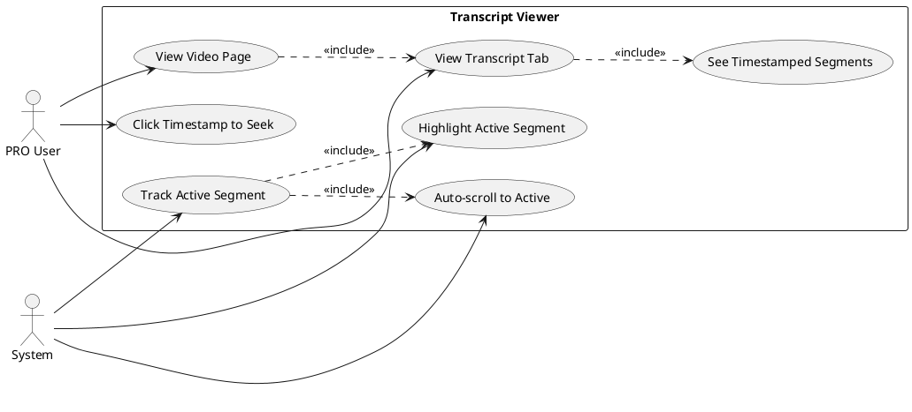
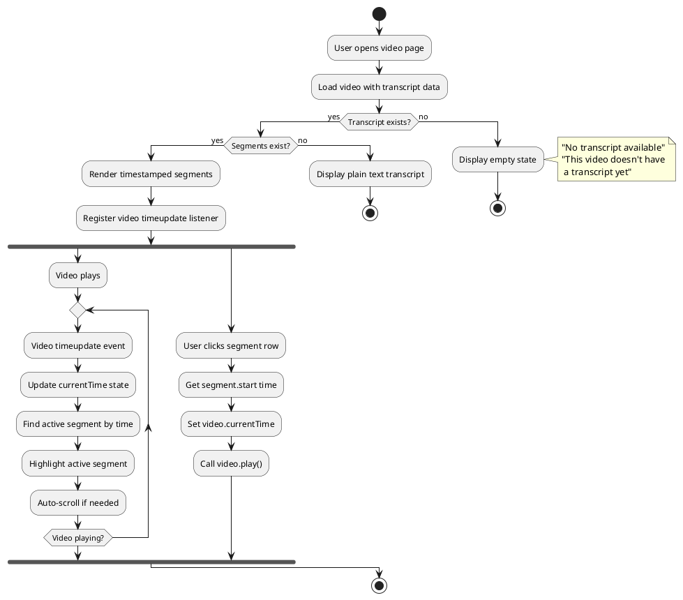
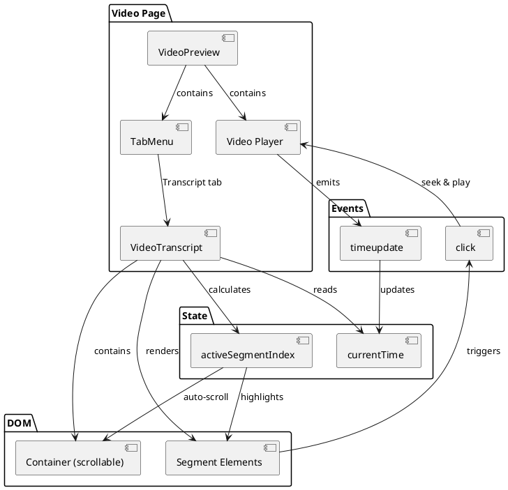
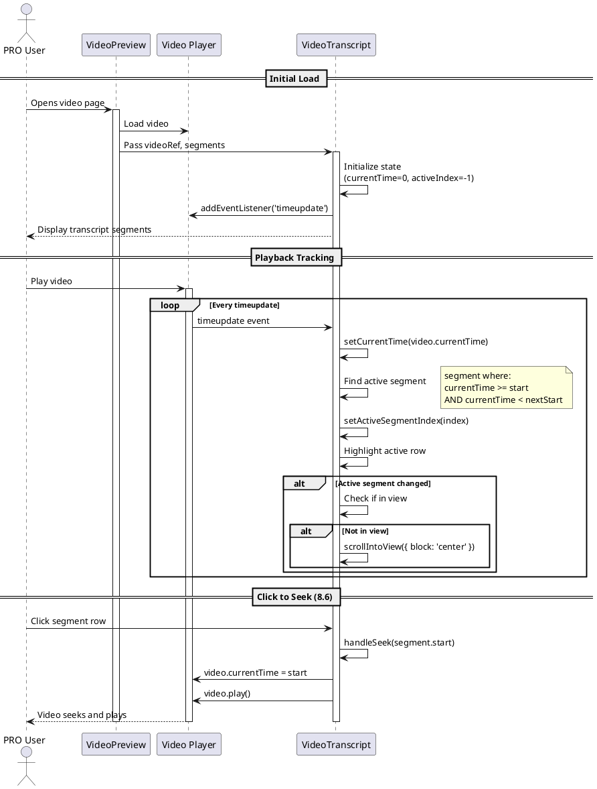
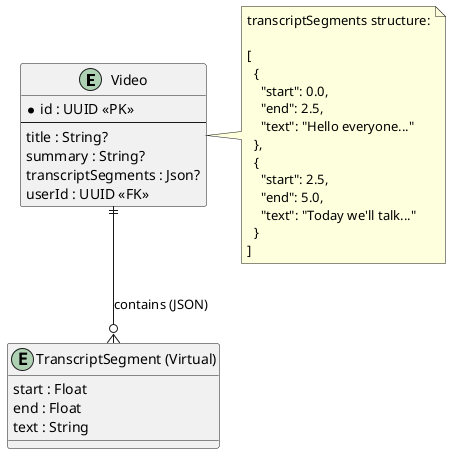

# Features 8.5-8.6: Transcript Viewer

## Features Covered
| #   | Feature/Transaction                                    | Actor    |
|-----|--------------------------------------------------------|----------|
| 8.5 | User can view AI-generated transcript with timestamps  | PRO User |
| 8.6 | User can click transcript timestamps to seek video     | PRO User |

---

## Use Case Diagram



---

## Use Case Description

### UC-8.5: View Transcript with Timestamps

| Field | Description |
|-------|-------------|
| **Use Case ID** | UC-8.5 |
| **Use Case Name** | View AI-Generated Transcript |
| **Actor(s)** | PRO User, System |
| **Description** | PRO user views the AI-generated transcript with timestamped segments that sync with video playback. |
| **Preconditions** | 1. Video has been processed with AI<br>2. Transcript segments exist<br>3. User is viewing video page |
| **Postconditions** | 1. Transcript displayed with timestamps |
| **Main Flow** | 1. User navigates to video page<br>2. User selects Transcript tab<br>3. System displays timestamped segments<br>4. System tracks video playback time<br>5. System highlights active segment<br>6. System auto-scrolls to keep active visible |
| **Alternative Flows** | A1: No transcript → Show empty state<br>A2: No segments → Show plain text |

### UC-8.6: Click to Seek

| Field | Description |
|-------|-------------|
| **Use Case ID** | UC-8.6 |
| **Use Case Name** | Seek Video via Transcript |
| **Actor(s)** | PRO User |
| **Description** | User clicks on a timestamp or segment to jump to that point in the video. |
| **Preconditions** | 1. Transcript with segments displayed<br>2. Video player loaded |
| **Postconditions** | 1. Video seeks to clicked time<br>2. Video starts playing |
| **Main Flow** | 1. User clicks on a segment row<br>2. System sets video.currentTime to segment.start<br>3. System starts video playback |

---

## Activity Diagram



---

## Component List

### Frontend Components

| Component | File Path | Description | Type |
|-----------|-----------|-------------|------|
| VideoTranscript | `src/components/global/video-tools/video-transcript.tsx` | Main transcript display component | Tab Component |
| VideoPreview | `src/components/global/videos/video-preview.tsx` | Video page with transcript tab | Page Component |
| TabMenu | `src/components/global/tabs/tab-menu.tsx` | Tab container for Transcript/Comments | Tab Component |
| TabsContent | `src/components/ui/tabs.tsx` | Tab content wrapper | UI Component |

### State Management

| Hook/State | Purpose |
|------------|---------|
| currentTime | Tracks video playback position |
| activeSegmentIndex | Index of currently active segment |
| videoRef | Reference to video element |
| containerRef | Reference for auto-scroll container |
| segmentRefs | References to each segment element |

---

## Component/Module Diagram



---

## Sequence Diagram



---

## ERD and Schema



### TypeScript Types

```typescript
// TranscriptSegment type definition
type TranscriptSegment = {
  start: number   // Start time in seconds
  end: number     // End time in seconds
  text: string    // Segment text content
}

// VideoTranscript props
type Props = {
  transcript: string                          // Plain text fallback
  segments?: TranscriptSegment[] | null       // Timestamped segments
  videoRef: React.RefObject<HTMLVideoElement> // Video element reference
}
```

### UI States

| State | Condition | Display |
|-------|-----------|---------|
| Empty | No transcript AND no segments | Icon + "No transcript available" |
| Plain Text | Transcript exists, no segments | Plain paragraph text |
| Segments | segments.length > 0 | Timestamped clickable rows |
| Active Segment | currentTime within segment range | Highlighted background + accent border |

### Timestamp Format

```typescript
const formatTimestamp = (seconds: number): string => {
  const hrs = Math.floor(seconds / 3600)
  const mins = Math.floor((seconds % 3600) / 60)
  const secs = Math.floor(seconds % 60)
  
  // Returns "1:23" or "1:05:30"
  if (hrs > 0) {
    return `${hrs}:${mins.toString().padStart(2, '0')}:${secs.toString().padStart(2, '0')}`
  }
  return `${mins}:${secs.toString().padStart(2, '0')}`
}
```

