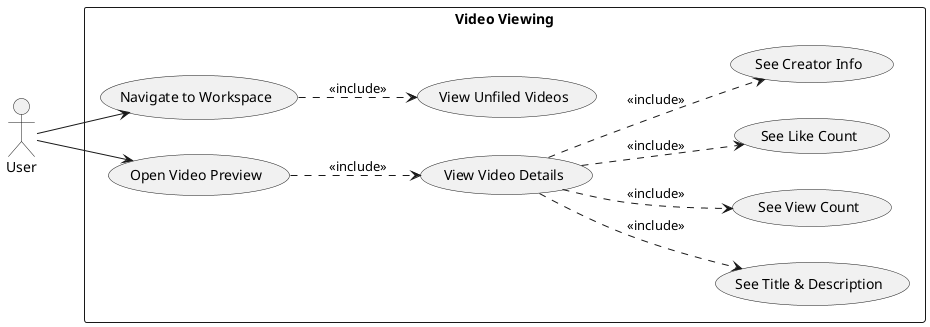
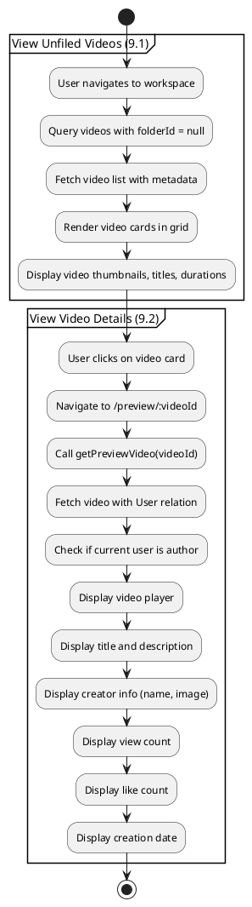
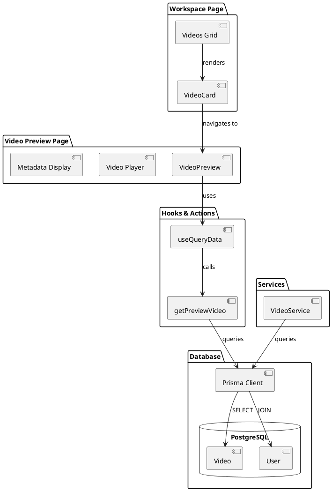
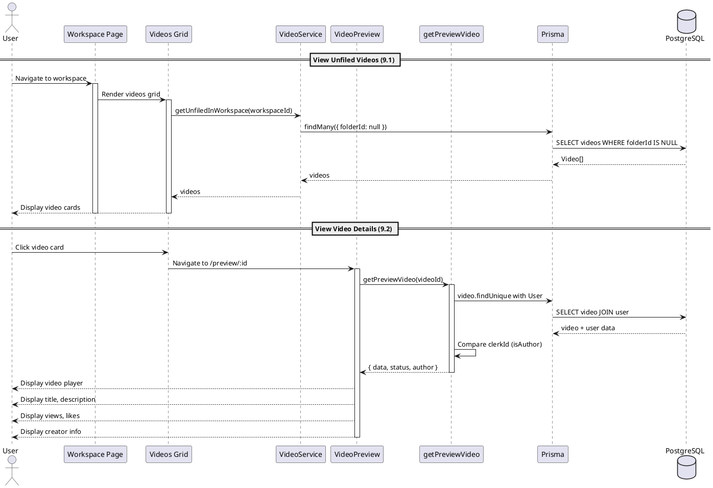
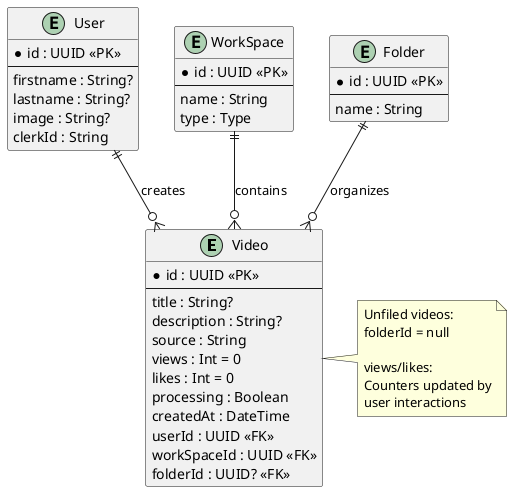

# Features 9.1-9.2: Video Viewing

## Features Covered
| #   | Feature/Transaction                                            | Actor |
|-----|----------------------------------------------------------------|-------|
| 9.1 | User can view all unfiled videos in a workspace                | User  |
| 9.2 | User can view video details (title, description, views, likes) | User  |

---

## Use Case Diagram

---

## Use Case Description

### UC-9.1: View Unfiled Videos

| Field | Description |
|-------|-------------|
| **Use Case ID** | UC-9.1 |
| **Use Case Name** | View Unfiled Videos |
| **Actor(s)** | User |
| **Description** | User views all videos in a workspace that are not assigned to any folder. |
| **Preconditions** | 1. User is authenticated 2. User has access to workspace |
| **Postconditions** | 1. Unfiled videos displayed in grid |
| **Main Flow** | 1. User navigates to workspace 2. System queries videos where folderId = null 3. System displays video cards in grid layout |

### UC-9.2: View Video Details

| Field | Description |
|-------|-------------|
| **Use Case ID** | UC-9.2 |
| **Use Case Name** | View Video Details |
| **Actor(s)** | User |
| **Description** | User views comprehensive video metadata including title, description, views, and likes. |
| **Preconditions** | 1. Video exists 2. User has access |
| **Postconditions** | 1. Video preview page displayed |
| **Main Flow** | 1. User clicks video card 2. System fetches video details via getPreviewVideo 3. System displays title, description, creator, views, likes |

---

## Activity Diagram

---

## Component List

### Frontend Components

| Component | File Path | Description | Type |
|-----------|-----------|-------------|------|
| VideoCard | `src/components/global/videos/video-card.tsx` | Video card in grid view | Card Component |
| VideoPreview | `src/components/global/videos/video-preview.tsx` | Full video preview page | Page Component |
| Videos (Grid) | `src/components/global/videos/index.tsx` | Video grid container | Container |

### Backend Components

| Component | File Path | Description | Type |
|-----------|-----------|-------------|------|
| getPreviewVideo | `src/actions/workspace.ts` | Fetches video details | Server Action |
| VideoService.getUnfiledInWorkspace | `src/services/video.service.ts` | Gets unfiled videos | Service |

---

## Component/Module Diagram

---

## Sequence Diagram

---

## ERD and Schema

### Video Details Retrieved

| Field | Type | Description |
|-------|------|-------------|
| title | String | Video title (default: "Untitled Video") |
| description | String | Video description |
| source | String | S3 file reference |
| views | Int | View counter |
| likes | Int | Like counter |
| createdAt | DateTime | Upload timestamp |
| User.firstname | String | Creator first name |
| User.lastname | String | Creator last name |
| User.image | String | Creator avatar URL |

