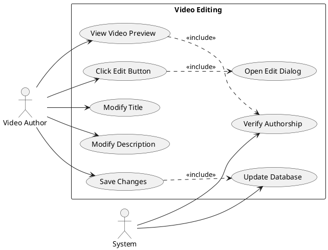
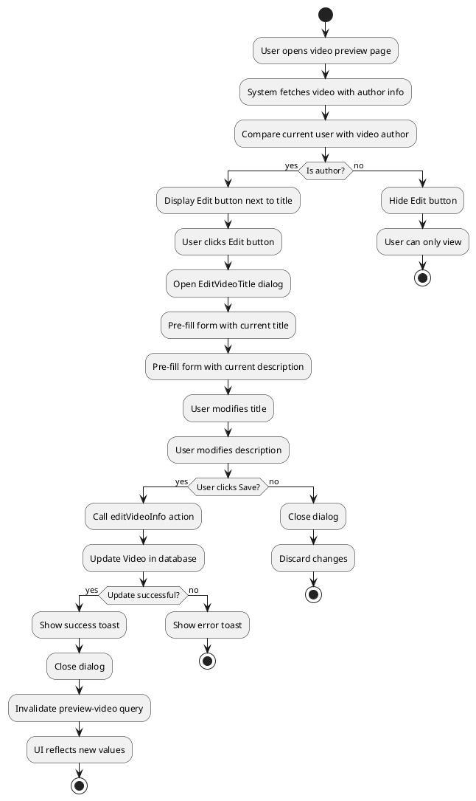
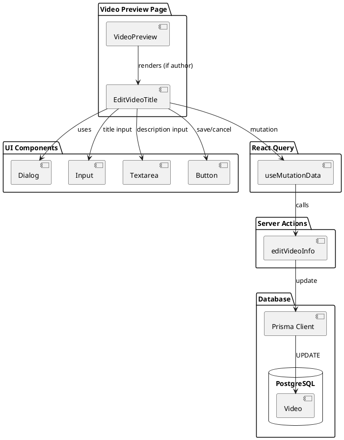
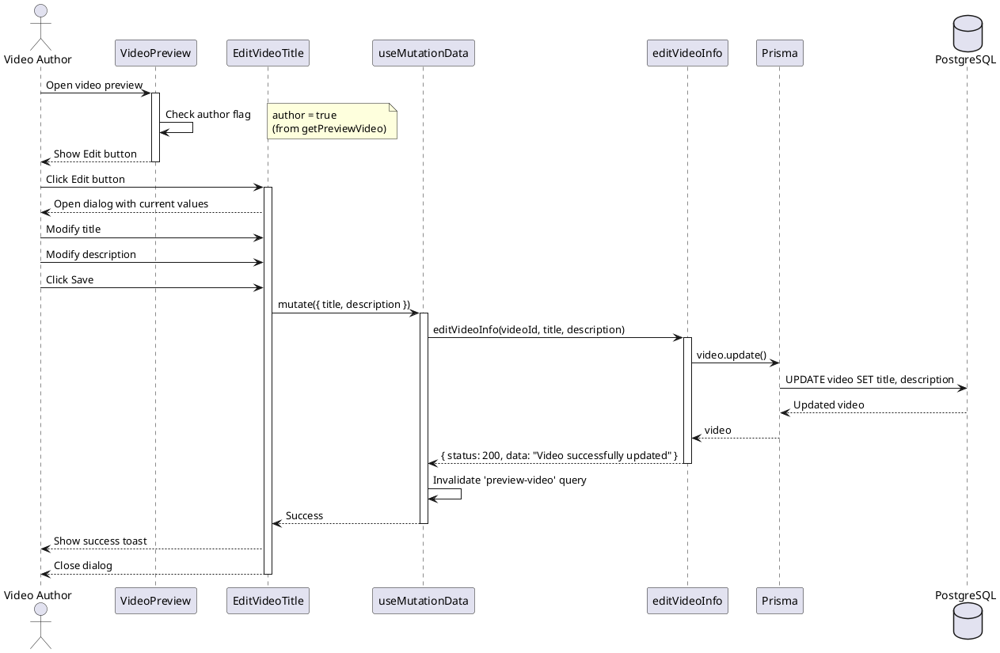
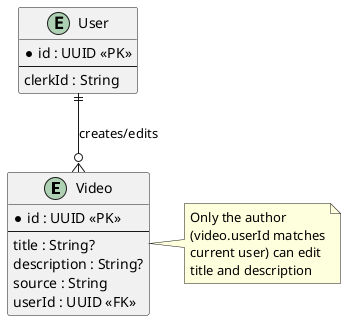

# Feature 9.3: Video Editing

## Features Covered
| #   | Feature/Transaction                               | Actor        |
|-----|---------------------------------------------------|--------------|
| 9.3 | Video author can edit video title and description | Video Author |

---

## Use Case Diagram



---

## Use Case Description

| Field | Description |
|-------|-------------|
| **Use Case ID** | UC-9.3 |
| **Use Case Name** | Edit Video Title and Description |
| **Actor(s)** | Video Author |
| **Description** | Video author modifies the title and/or description of their video. |
| **Preconditions** | 1. User is authenticated<br>2. User is the video author<br>3. Video exists |
| **Postconditions** | 1. Video title/description updated in database |
| **Main Flow** | 1. Author opens video preview<br>2. System verifies authorship (shows edit button)<br>3. Author clicks edit button<br>4. System opens edit dialog with current values<br>5. Author modifies title and/or description<br>6. Author clicks save<br>7. System calls editVideoInfo<br>8. System updates database and shows success toast |
| **Alternative Flows** | A1: Cancel → Close dialog without saving |
| **Exceptions** | E1: Update fails → Show error toast |

---

## Activity Diagram



---

## Component List

### Frontend Components

| Component | File Path | Description | Type |
|-----------|-----------|-------------|------|
| EditVideoTitle | `src/components/global/videos/edit-video-title.tsx` | Edit dialog component | Dialog Component |
| VideoPreview | `src/components/global/videos/video-preview.tsx` | Parent page showing edit button | Page Component |
| Dialog | `src/components/ui/dialog.tsx` | Base dialog wrapper | UI Component |
| Input | `src/components/ui/input.tsx` | Title input field | UI Component |
| Textarea | `src/components/ui/textarea.tsx` | Description textarea | UI Component |

### Backend Components

| Component | File Path | Description | Type |
|-----------|-----------|-------------|------|
| editVideoInfo | `src/actions/workspace.ts` | Updates video metadata | Server Action |

---

## Component/Module Diagram



---

## Sequence Diagram



---

## ERD and Schema



### Authorization Check

```typescript
// In getPreviewVideo:
const author = user.id === video.User?.clerkId

// Edit button only shown when author === true
{author && (
  <EditVideoTitle
    videoId={videoId}
    title={video.title}
    description={video.description}
  />
)}
```

### Editable Fields

| Field | Max Length | Required | Notes |
|-------|------------|----------|-------|
| title | None | No | Falls back to "Untitled Video" |
| description | None | No | Falls back to "No Description" |

