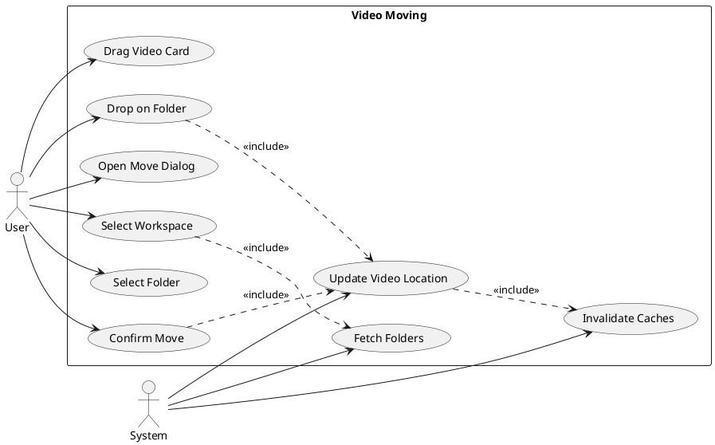
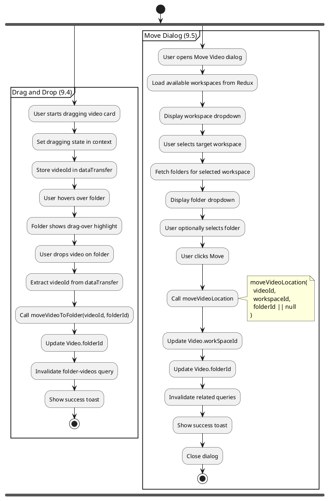
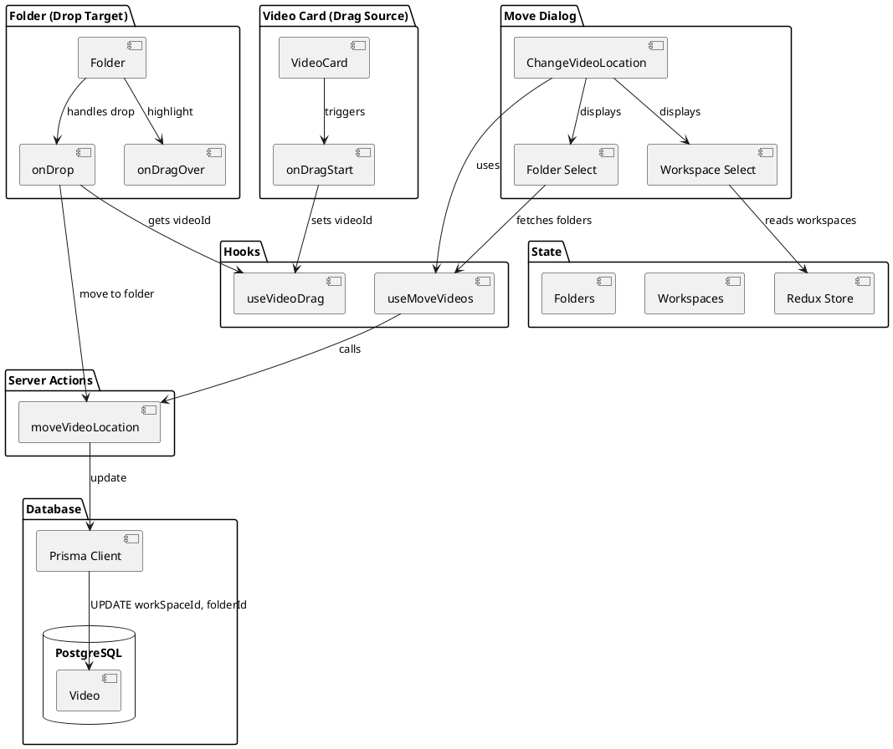
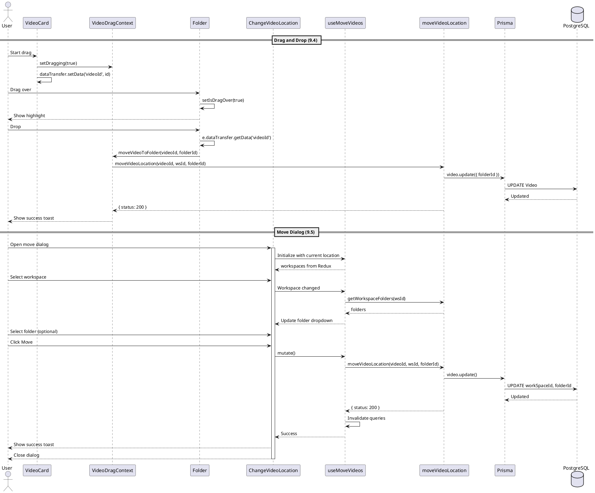
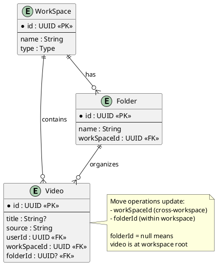

# Features 9.4-9.5: Video Moving

## Features Covered
| #   | Feature/Transaction                                         | Actor |
|-----|-------------------------------------------------------------|-------|
| 9.4 | User can move a video to a different folder (drag and drop) | User  |
| 9.5 | User can move a video to a different workspace              | User  |

---

## Use Case Diagram

---

## Use Case Description

### UC-9.4: Drag and Drop to Folder

| Field | Description |
|-------|-------------|
| **Use Case ID** | UC-9.4 |
| **Use Case Name** | Move Video via Drag and Drop |
| **Actor(s)** | User |
| **Description** | User drags a video card and drops it onto a folder to move it. |
| **Preconditions** | 1. Video exists 2. Target folder exists in same workspace |
| **Postconditions** | 1. Video's folderId updated |
| **Main Flow** | 1. User starts dragging video card 2. System stores videoId in drag context 3. User hovers over folder (visual highlight) 4. User drops on folder 5. System calls moveVideoToFolder 6. System updates video.folderId |

### UC-9.5: Move to Different Workspace

| Field | Description |
|-------|-------------|
| **Use Case ID** | UC-9.5 |
| **Use Case Name** | Move Video Between Workspaces |
| **Actor(s)** | User |
| **Description** | User moves a video to a different workspace using a dialog form. |
| **Preconditions** | 1. Video exists 2. User has access to target workspace |
| **Postconditions** | 1. Video's workSpaceId updated 2. Optional: folderId updated |
| **Main Flow** | 1. User opens move video dialog 2. System shows available workspaces 3. User selects target workspace 4. System fetches folders for selected workspace 5. User optionally selects target folder 6. User confirms move 7. System calls moveVideoLocation |

---

## Activity Diagram

---

## Component List

### Frontend Components

| Component | File Path | Description | Type |
|-----------|-----------|-------------|------|
| VideoCard | `src/components/global/videos/video-card.tsx` | Draggable video card | Drag Source |
| Folder | `src/components/global/folders/folder.tsx` | Drop target for videos | Drop Target |
| ChangeVideoLocation | `src/components/forms/change-video-location/index.tsx` | Move dialog form | Form Component |

### Hooks

| Hook | File Path | Description |
|------|-----------|-------------|
| useMoveVideos | `src/hooks/useFolders.ts` | Manages move form state and mutation |
| useVideoDrag | Context | Drag and drop context provider |

### Backend Components

| Component | File Path | Description | Type |
|-----------|-----------|-------------|------|
| moveVideoLocation | `src/actions/workspace.ts` | Updates video location | Server Action |

---

## Component/Module Diagram

---

## Sequence Diagram

---

## ERD and Schema

### Move Location Types

| Scenario | workSpaceId | folderId |
|----------|-------------|----------|
| Move to workspace root | target workspace | null |
| Move to folder (same workspace) | unchanged | target folder |
| Move to folder (different workspace) | target workspace | target folder |

