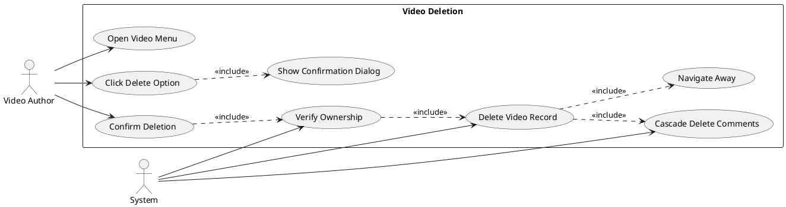
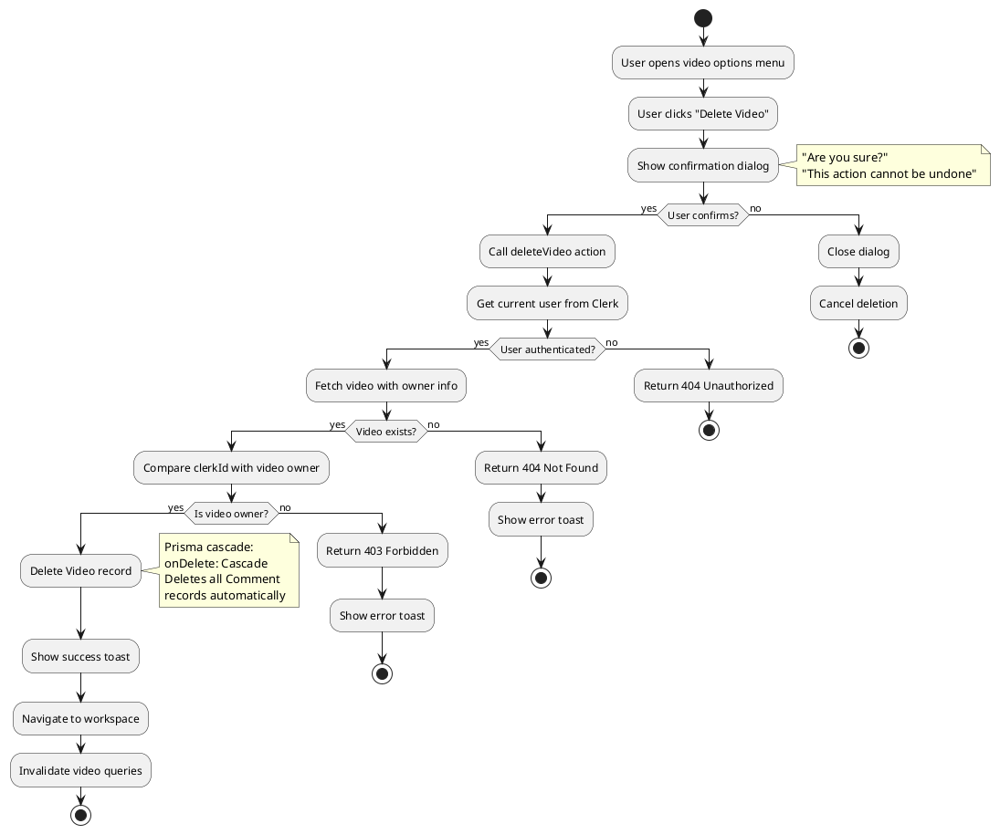
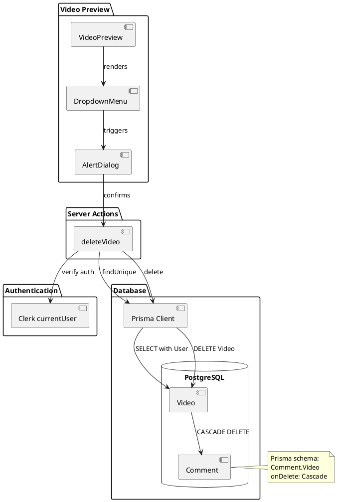
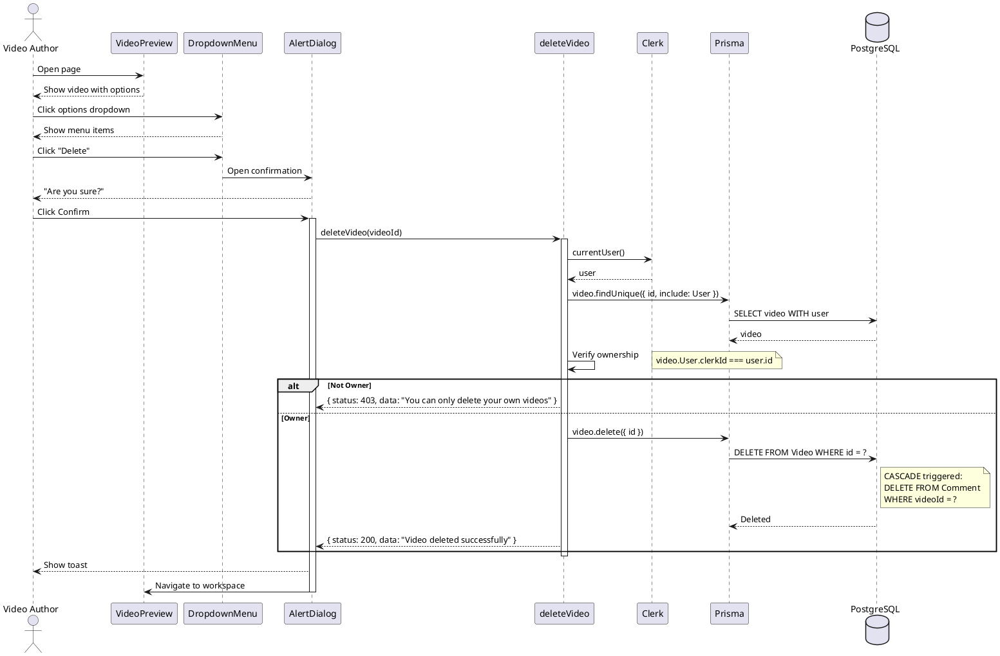
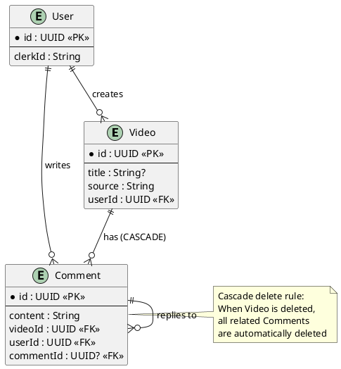

# Feature 9.6: Video Deletion

## Features Covered
| #     | Feature/Transaction                        | Actor        |
|-------|-------------------------------------------|--------------|
| 9.6   | Video author can delete their video       | Video Author |
| 9.6.1 | System cascades deletion of video comments | System       |

---

## Use Case Diagram



---

## Use Case Description

| Field | Description |
|-------|-------------|
| **Use Case ID** | UC-9.6 |
| **Use Case Name** | Delete Video |
| **Actor(s)** | Video Author, System |
| **Description** | Video author permanently deletes their video. System cascades deletion to related comments. |
| **Preconditions** | 1. User is authenticated<br>2. User is the video author<br>3. Video exists |
| **Postconditions** | 1. Video record deleted<br>2. All comments deleted<br>3. User navigated away |
| **Main Flow** | 1. Author opens video dropdown menu<br>2. Author clicks "Delete"<br>3. System shows confirmation dialog<br>4. Author confirms deletion<br>5. System verifies ownership (clerkId match)<br>6. System deletes video record<br>7. Prisma cascades to delete comments (9.6.1)<br>8. System navigates to workspace |
| **Alternative Flows** | A1: Cancel → Close dialog, no deletion |
| **Exceptions** | E1: Not owner → Return 403<br>E2: Video not found → Return 404 |

---

## Activity Diagram



---

## Component List

### Frontend Components

| Component | File Path | Description | Type |
|-----------|-----------|-------------|------|
| VideoPreview | `src/components/global/videos/video-preview.tsx` | Contains delete option | Page Component |
| DropdownMenu | `src/components/ui/dropdown-menu.tsx` | Options menu | UI Component |
| AlertDialog | `src/components/ui/alert-dialog.tsx` | Confirmation dialog | UI Component |

### Backend Components

| Component | File Path | Description | Type |
|-----------|-----------|-------------|------|
| deleteVideo | `src/actions/workspace.ts` | Deletes video with auth check | Server Action |

---

## Component/Module Diagram



---

## Sequence Diagram



---

## ERD and Schema



### Prisma Schema (Cascade)

```prisma
model Comment {
  id        String     @id @default(dbgenerated("gen_random_uuid()")) @db.Uuid
  content   String
  videoId   String?    @db.Uuid
  Video     Video?     @relation(fields: [videoId], references: [id], onDelete: Cascade)
  // ... other fields
}
```

### Authorization Flow

| Step | Check | Response |
|------|-------|----------|
| 1 | User authenticated? | 404 if not |
| 2 | Video exists? | 404 if not |
| 3 | User owns video? | 403 if not |
| 4 | Delete video | 200 on success |

