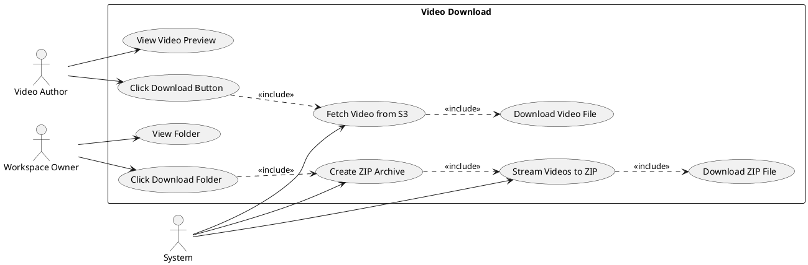
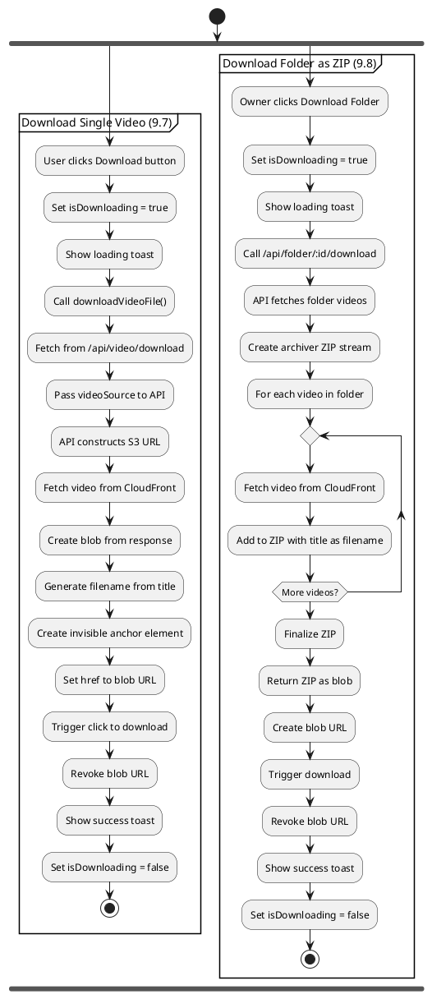
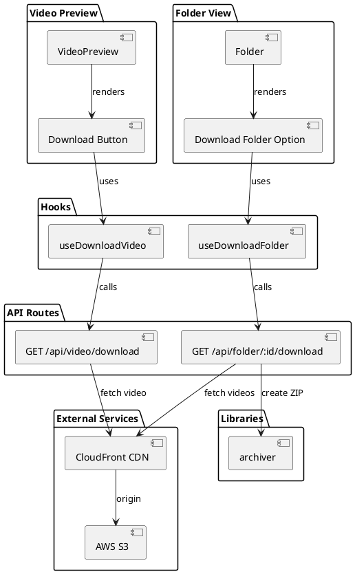
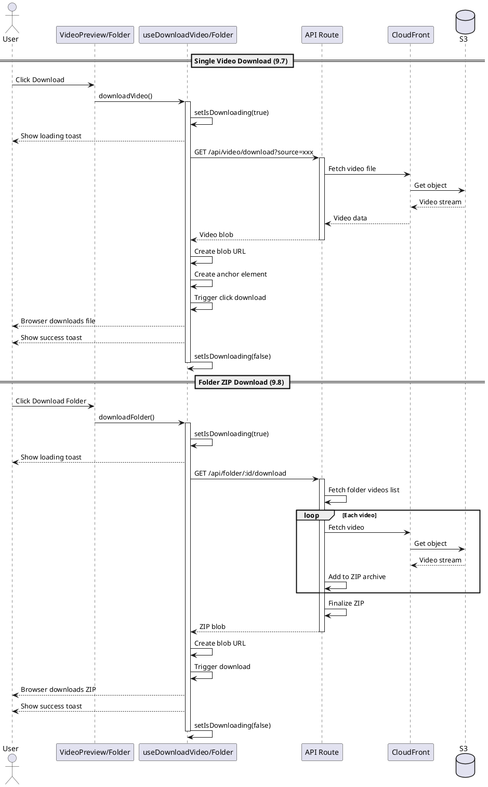
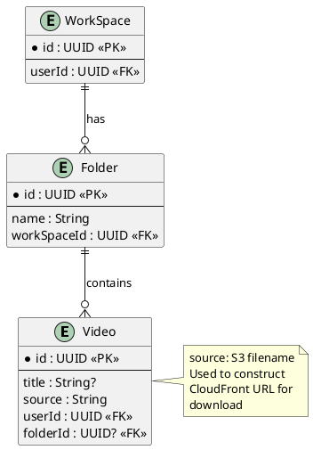

# Features 9.7-9.8: Video Download

## Features Covered
| #   | Feature/Transaction                              | Actor           |
|-----|--------------------------------------------------|-----------------|
| 9.7 | User can download their own video                | Video Author    |
| 9.8 | User can download all videos in a folder as ZIP  | Workspace Owner |

---

## Use Case Diagram



---

## Use Case Description

### UC-9.7: Download Single Video

| Field | Description |
|-------|-------------|
| **Use Case ID** | UC-9.7 |
| **Use Case Name** | Download Video |
| **Actor(s)** | Video Author |
| **Description** | Video author downloads their video file. |
| **Preconditions** | 1. User is video author<br>2. Video exists in S3 |
| **Postconditions** | 1. Video file downloaded to device |
| **Main Flow** | 1. Author views video preview<br>2. Author clicks download button<br>3. System shows loading toast<br>4. System fetches video via download API<br>5. System triggers browser download<br>6. System shows success toast |

### UC-9.8: Download Folder as ZIP

| Field | Description |
|-------|-------------|
| **Use Case ID** | UC-9.8 |
| **Use Case Name** | Download Folder as ZIP |
| **Actor(s)** | Workspace Owner |
| **Description** | Workspace owner downloads all videos in a folder as a ZIP archive. |
| **Preconditions** | 1. User is workspace owner<br>2. Folder has videos |
| **Postconditions** | 1. ZIP file downloaded to device |
| **Main Flow** | 1. Owner views folder<br>2. Owner clicks download option<br>3. System creates ZIP archive<br>4. System streams each video to ZIP<br>5. System downloads ZIP to device |

---

## Activity Diagram



---

## Component List

### Frontend Components

| Component | File Path | Description | Type |
|-----------|-----------|-------------|------|
| VideoPreview | `src/components/global/videos/video-preview.tsx` | Contains download button | Page Component |
| Folder | `src/components/global/folders/folder.tsx` | Contains folder download option | Card Component |

### Hooks

| Hook | File Path | Description |
|------|-----------|-------------|
| useDownloadVideo | `src/hooks/useDownloadVideo.ts` | Single video download state |
| useDownloadFolder | `src/hooks/useDownloadFolder.ts` | Folder ZIP download state |

### API Routes

| Route | File Path | Description |
|-------|-----------|-------------|
| GET /api/video/download | `src/app/api/video/download/route.ts` | Proxies video download |
| GET /api/folder/:id/download | `src/app/api/folder/[id]/download/route.ts` | Creates folder ZIP |

### Utilities

| Utility | File Path | Description |
|---------|-----------|-------------|
| downloadVideoFile | `src/lib/download-utils.ts` | Client-side download helper |

---

## Component/Module Diagram



---

## Sequence Diagram



---

## ERD and Schema



### Download URLs

| Type | URL Pattern |
|------|-------------|
| Single Video | `${CLOUD_FRONT_URL}/${video.source}` |
| Folder ZIP | `/api/folder/${folderId}/download` |

### ZIP File Structure

```
folder-name.zip
├── Video Title 1.webm
├── Video Title 2.mp4
├── Video Title 3.webm
└── ...
```

### File Naming

```typescript
// Single video
const filename = videoTitle
  ? `${videoTitle.replace(/[^a-zA-Z0-9\s-_]/g, '')}.webm`
  : `video-${videoId}.webm`

// ZIP file
const filename = folderName
  ? `${folderName.replace(/[^a-zA-Z0-9\s-_]/g, '')}.zip`
  : `folder-${folderId}.zip`
```

